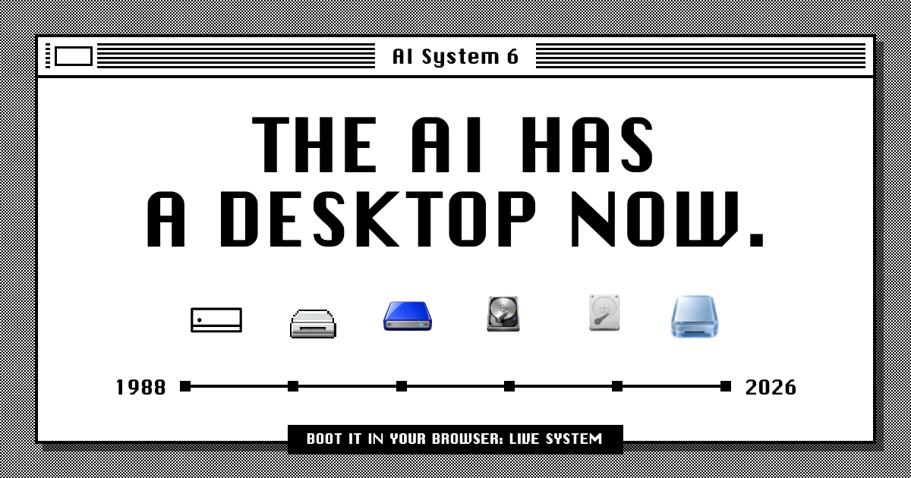
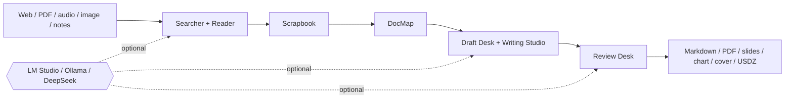

<div align="center">

<samp>1988 OBJECTS / 2026 INTELLIGENCE</samp>

# AI System 6

**The AI has a desktop now.**<br>
A local-first, file-native AI computer inspired by Macintosh System 6.

[**BOOT LIVE SYSTEM**](https://system6.aaronlau.me)&nbsp;&nbsp;&nbsp;[**WATCH THE 50S FILM**](https://www.bilibili.com/video/BV1ht3m6UEDb/)&nbsp;&nbsp;&nbsp;[**ENTER PRODUCT SITE**](https://aisystem6.pages.dev)&nbsp;&nbsp;&nbsp;[**GET MAC BETA**](https://github.com/surfine/AI-System-6/releases/latest)

<sub><a href="README.zh-CN.md">简体中文</a> / <a href="docs/README.md">Docs</a> / <a href="CONTRIBUTING.md">Contribute</a> / <a href="https://github.com/surfine/AI-System-6/stargazers">Star the machine ★</a></sub>

<br><br>

<a href="https://system6.aaronlau.me"></a>

<sub>BOOT IT IN YOUR BROWSER. NO MODEL REQUIRED.</sub>

</div>

## Chat is an app. Not the whole computer.

Chat is excellent at conversation. It is a poor filesystem, workspace,
provenance model, and long-running project surface. AI System 6 restores the
parts of a computer that chat removed.

| A chat product | This computer |
| --- | --- |
| One thread owns the workflow | MultiFinder keeps real working apps open together |
| Context disappears into a prompt | Sources, scraps, maps, drafts, and outputs stay visible |
| Generated text quietly becomes truth | AI output stays temporary until you save, clip, insert, or export it |
| The answer is the endpoint | The endpoint is a file, manuscript, chart, deck, cover, or 3D object |

> A disk tells you what lasts. A floppy tells you what is temporary. A
> Scrapbook contains only what you chose to keep.

## This is the running system

<div align="center">

[](https://system6.aaronlau.me)

<sub>RECORDED FROM THE PRODUCT. NOT A CONCEPT RENDER.</sub>

</div>

## One desk. Six systems.

The files and open windows stay put. The whole computer changes era around
them.

<table>
  <tr>
    <td width="33%" align="center"><br><code>1988 / SYSTEM 6</code></td>
    <td width="33%" align="center"><br><code>1999 / PLATINUM</code></td>
    <td width="33%" align="center"><br><code>2001 / AQUA</code></td>
  </tr>
  <tr>
    <td width="33%" align="center"><br><code>2009 / SNOW LEOPARD</code></td>
    <td width="33%" align="center"><br><code>2014 / YOSEMITE</code></td>
    <td width="33%" align="center"><br><code>2026 / LIQUID GLASS</code></td>
  </tr>
</table>

Every frame is captured from the same live desktop by
`npm run site:capture-frames`. System 6 begins with real System 6.0.8 resources
and observed Macintosh behavior. Later eras own independent, Retina-ready icon
families. This is a time machine with one working state, not six screenshots.

## Sources go in. Files come out.



AI is optional. Provenance is not. The server is a stateless bridge; durable
project state lives in your browser. Credentials never enter project files,
chats, backups, or exports.

## Impossible software for a 1988 computer

| SYSTEM JOB | REAL APPLICATIONS |
| --- | --- |
| **Find and remember** | Searcher searches the web, Reader extracts sources, Time Machine revisits archived pages |
| **Collect and understand** | File Floppy imports, OCRs, and transcribes; Scrapbook keeps chosen evidence; DocMap reveals structure |
| **Write and inspect** | Draft Desk handles the quick route; Writing Studio carries research through manuscript; Review Desk checks the result |
| **Make and ship** | ClioChart builds charts, ClioStage presents decks, Cover Glass renders WebGL type, CMF Studio exports AR-ready USDZ |

The desktop also boots, shuts down, restarts, restores its working session, and
collapses into focused full-screen applications on a phone. The metaphor
survives the small screen instead of becoming a generic mobile dashboard.

## Open the machine

| ENTRY | WHAT IS THERE |
| --- | --- |
| [**Live Desktop**](https://system6.aaronlau.me) | The full browser computer. Start without a model and connect one later. |
| [**50-second Bilibili film**](https://www.bilibili.com/video/BV1ht3m6UEDb/) | Search, source handling, writing, files, and MultiFinder in motion. |
| [**Product site**](https://aisystem6.pages.dev) | The six-era tour, startup and shutdown rituals, mobile experience, and product story. |
| [**Mac beta**](https://github.com/surfine/AI-System-6/releases/latest) | The latest packaged desktop release. |

## The repository is the system diagram

```text
AI-System-6/
├── apps/
│   ├── desktop/       browser computer: OS services, apps, styles, assets
│   └── server/        stateless Node.js bridge and model adapters
├── site/              independently deployable product website
├── platform/
│   ├── macos/         native rewrite and lightweight desktop shell
│   └── web/           production web-release contracts
├── tooling/           build, verify, package, snapshot, release
├── tests/             executable product and architecture contracts
├── docs/              public architecture, development, design evidence
└── internal/          maintainer evidence, active plans, operations
```

These are physical ownership boundaries, not decorative folders. Browser URLs
stay stable (`/app`, `/assets`, `/data`), while source ownership stays under
`apps/desktop`. A repository layout test rejects retired root copies and
compatibility symlinks before they can return.

Read [Architecture](docs/ARCHITECTURE.md),
[Development](docs/DEVELOPMENT.md), and the
[Design Contract](docs/design/DESIGN.md).

## Boot a local machine

Requires Node.js 20+.

```bash
git clone https://github.com/surfine/AI-System-6.git
cd AI-System-6
npm ci
npm start
```

Open [localhost:4173](http://localhost:4173). Then inspect the machinery:

```bash
npm run build          # deterministic desktop bundle
npm test               # executable product contracts
npm run site:check     # official site and product-frame gate
npm run verify:public  # repository, command, asset, and docs gate
```

The public repository is a curated, independently verifiable source snapshot.
Every advertised command must work from a fresh clone.

<details>
<summary><strong>Bring your own intelligence</strong></summary>

| ROUTE | USE IT FOR |
| --- | --- |
| **LM Studio** | local chat, embeddings, discovery, and model loading |
| **Ollama** | local OpenAI-compatible serving |
| **DeepSeek** | built-in cloud configuration |
| **Custom endpoint** | any compatible provider and model |
| **No model** | the desktop and every non-AI tool |

</details>

## Help this computer escape the lab

AI System 6 is MIT licensed. Start with
[CONTRIBUTING.md](CONTRIBUTING.md), open an issue with a reproducible product
contract, or report security problems through [SECURITY.md](SECURITY.md).

<div align="center">

### If AI software should feel like a computer again,

# [★ STAR AI SYSTEM 6](https://github.com/surfine/AI-System-6)

Stars help this strange machine find its builders.

[**LIVE DESKTOP**](https://system6.aaronlau.me)&nbsp;&nbsp;&nbsp;[**BILIBILI FILM**](https://www.bilibili.com/video/BV1ht3m6UEDb/)&nbsp;&nbsp;&nbsp;[**PRODUCT SITE**](https://aisystem6.pages.dev)&nbsp;&nbsp;&nbsp;[**LATEST RELEASE**](https://github.com/surfine/AI-System-6/releases/latest)

<sub>Independent project. Not affiliated with or endorsed by Apple Inc.</sub>

</div>
