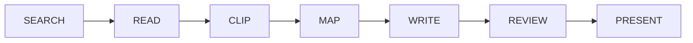

<div align="center">

<samp>LOCAL-FIRST // MODEL-AGNOSTIC // FILE-NATIVE // NO FRONTEND FRAMEWORK</samp>

# AI SYSTEM 6

### The AI has a desktop now.

A Macintosh System 6-inspired workspace where AI can **search, read, map,
write, review, chart, present, and make** — across real apps and visible files.

[](https://system6.aaronlau.me)
[](https://www.bilibili.com/video/BV1ht3m6UEDb/)
[](https://aisystem6.pages.dev)
[](https://github.com/surfine/AI-System-6/releases/latest)

[](https://github.com/surfine/AI-System-6/stargazers)
[](https://github.com/surfine/AI-System-6/releases/latest)
[](https://github.com/surfine/AI-System-6/actions/workflows/ci.yml)
[](LICENSE)
[](README.md)
[](README.zh-CN.md)

[](https://system6.aaronlau.me)

<strong>Recorded from the live system. Not a concept render.</strong><br>
One desk. Six release appearances. Modern AI I/O inside a 1988 object model.

<sub>
<a href="https://system6.aaronlau.me">TRY IT</a> ·
<a href="#why-a-desktop">WHY</a> ·
<a href="#system-map">SYSTEM MAP</a> ·
<a href="#boot-it-locally">RUN LOCAL</a> ·
<a href="docs/README.md">DOCS</a> ·
<a href="CONTRIBUTING.md">CONTRIBUTE</a>
</sub>

</div>

## Why a desktop?

Most AI products hide the work inside one conversation. AI System 6 gives the
work a place to live.

| Chat window | AI System 6 |
| --- | --- |
| Context disappears into a prompt | Sources, scraps, prompts, and outputs stay visible |
| One thread owns the workflow | MultiFinder keeps multiple working apps open together |
| Generated text quietly becomes the document | AI output stays temporary until you save, clip, insert, or export it |
| The model is the product | Bring LM Studio, Ollama, DeepSeek, or another compatible provider |
| The endpoint is another answer | The endpoint is a file, manuscript, chart, deck, cover, or 3D artifact |

> A disk tells you what lasts. A floppy tells you what is temporary. A
> Scrapbook contains only what you chose to keep. The retro interface is not
> the product; it is the constraint that keeps AI work legible.

## The visible route



- **Draft Desk** turns an idea or source into a short draft you can save,
  download, or share.
- **Writing Studio** carries a larger project from research and a Question
  Sheet through outline, section drafts, manuscript, and Review Desk.
- **Searcher, Reader, Time Machine, Scrapbook, and DocMap** keep evidence and
  reasoning on the desk instead of inside an invisible agent maze.
- **ClioChart, ClioStage, Cover Glass, and CMF Studio** turn the same work into
  charts, presentations, visual artifacts, and USDZ.

## Things this 1988 computer should not be able to do

- Run local AI through **LM Studio** or **Ollama**.
- Search the web and revisit archived pages through the Wayback Machine.
- Transcribe audio; OCR images and documents from a File Floppy.
- Turn Markdown data into editable visual projections with **ClioChart**.
- Build and present Markdown slide decks with **ClioStage**.
- Render refractive WebGL typography in **Cover Glass**.
- Edit a 3D product colorway and export USDZ for AR in **CMF Studio**.
- Switch the whole desktop between **System 6, Platinum, Aqua, Snow Leopard,
  Yosemite, and Liquid Glass** without moving the work.

System 6 is the default. The classic interface begins with real System 6.0.8
resources and period Macintosh behavior — never a generic retro redraw.

## System map

```text
AI System 6
├── app/        browser OS: core services, apps, generated registries
├── src/        small stateless Node.js server and provider adapters
├── styles/     one object grammar, six appearance systems
├── assets/     runtime media, fonts, icons, OCR, and 3D payloads
├── shell/      Apple-silicon desktop shell
├── scripts/    deterministic builders and verification gates
├── tests/      executable product, architecture, and release contracts
└── docs/       architecture, development, and design evidence
```

The browser app is plain JavaScript. There is no frontend framework and no
transpiler. Durable project state lives in IndexedDB; the server has no
application database. Boot-critical code is capped at roughly two 1.44 MB
floppy disks, while heavy tools load from a third.

Read the [architecture](docs/ARCHITECTURE.md), [development guide](docs/DEVELOPMENT.md),
and [design evidence](docs/design/DESIGN.md) for the contracts behind the map.

## Boot it locally

Requires Node.js 20 or newer.

```bash
git clone https://github.com/surfine/AI-System-6.git
cd AI-System-6
npm ci
npm start
```

Open [http://localhost:4173](http://localhost:4173). The desktop works without
a model; connect one later in Control Panel.

```bash
npm run build          # deterministic browser bundle
npm test               # executable feature contracts
npm run verify:public  # repository, command, asset, and documentation gate
```

The public repository is a curated, independently verifiable source snapshot.
Internal signing and deployment machinery is intentionally absent; every
command it does expose must work from a fresh clone. See
[Development](docs/DEVELOPMENT.md) for the complete public contract.

## Bring your own model

| Route | Best for |
| --- | --- |
| **LM Studio** | Local chat and embedding models with discovery and loading |
| **Ollama** | Local OpenAI-compatible model serving |
| **DeepSeek** | Built-in cloud configuration |
| **Custom / OpenAI-compatible** | Your own endpoint and model |
| **No model** | Exploring the desktop and non-AI tools |

Projects, references, scraps, and settings remain in the browser. Provider
credentials stay outside project files, chats, backups, and exports.

## Apple silicon beta

Download the [latest Mac beta](https://github.com/surfine/AI-System-6/releases/latest)
for Apple silicon (M1 or later) and macOS 13 or newer. It is a lightweight shell
around the same local-first workspace. The current beta is ad-hoc signed rather
than notarized, so first launch may require **Control-click → Open**.

## Build with us

AI System 6 is MIT licensed. Start with [CONTRIBUTING.md](CONTRIBUTING.md), use
the issue templates, and keep changes small enough that their product contract
can be verified. Security reports follow [SECURITY.md](SECURITY.md).

If this is the kind of AI computer you want to exist, the highest-leverage
contribution takes one click:

<div align="center">

## ★ Star the repository

It tells more builders that visible, local-first AI software is worth making.

<a href="https://www.star-history.com/#surfine/AI-System-6&Date">
  <picture>
    <source media="(prefers-color-scheme: dark)" srcset="https://api.star-history.com/svg?repos=surfine/AI-System-6&type=Date&theme=dark">
    <source media="(prefers-color-scheme: light)" srcset="https://api.star-history.com/svg?repos=surfine/AI-System-6&type=Date">
    
  </picture>
</a>

[**Launch Live Desktop**](https://system6.aaronlau.me) ·
[**Watch on Bilibili**](https://www.bilibili.com/video/BV1ht3m6UEDb/) ·
[**Official Website**](https://aisystem6.pages.dev) ·
[**Latest Release**](https://github.com/surfine/AI-System-6/releases/latest)

<sub>AI System 6 is an independent project and is not affiliated with or endorsed by Apple Inc.</sub>

</div>
