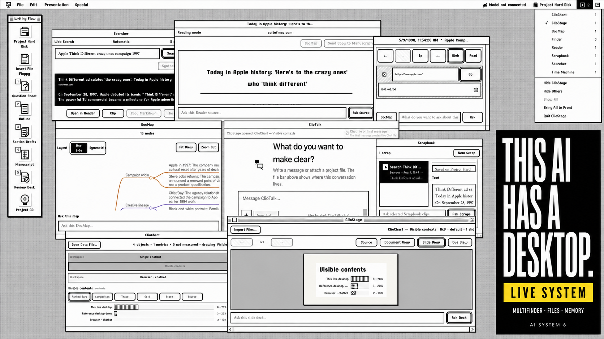

<div align="center">

# AI System 6

### The AI has a desktop now.

A Macintosh System 6-inspired workspace where AI can **search, read, map, write, review, chart, present, and make** — across real apps and visible files.

[](https://system6.aaronlau.me)
[](https://www.bilibili.com/video/BV1ht3m6UEDb/)

[](https://github.com/surfine/AI-System-6/stargazers)
[](LICENSE)
[](#bring-your-own-model)
[](README.md)
[](README.zh-CN.md)

[](https://system6.aaronlau.me)

**This is a live system, not a concept render.** Click the image and use it in your browser.

</div>

## Not another chatbot

Most AI products put every task into one chat window. AI System 6 gives the work a place to live.

| In a chatbot | In AI System 6 |
| --- | --- |
| Context disappears into a prompt | Sources, scraps, prompts, and outputs remain visible |
| One conversation owns the workflow | MultiFinder keeps multiple working apps open together |
| Generated text quietly becomes the document | AI output stays temporary until you save, clip, insert, or export it |
| The model is the product | Use LM Studio, Ollama, DeepSeek, or another OpenAI-compatible provider |
| The endpoint is another answer | The endpoint is a file, manuscript, chart, slide deck, cover, or 3D artifact |

## One desktop. A complete route.

```text
SEARCH → READ → CLIP → MAP → WRITE → REVIEW → PRESENT
```

1. **Searcher** finds sources; **Reader** opens the evidence.
2. **Time Machine** revisits archived pages through the Wayback Machine.
3. **Scrapbook** keeps only the material you deliberately clip.
4. **DocMap** turns research into a visible map of ideas and relationships.
5. **Question Sheet → Outline → Section Drafts → TeachText** carries one manuscript from messy intent to finished prose.
6. **Review Desk** checks factual and structural risk — including generic AI-mouthpiece drift.
7. **ClioChart, ClioStage, and Cover Glass** turn the same work into charts, slides, and a finished visual artifact.

No invisible agent maze. The sources, files, prompts, and handoffs stay on the desk.

## Things this 1988 computer should not be able to do

- **Run modern AI locally** through LM Studio or Ollama.
- **Search and read the web**, including historical snapshots.
- **Transcribe audio and OCR images and documents** from a File Floppy.
- **Turn Markdown data into editable visual projections** with ClioChart.
- **Build and present Markdown slide decks** with ClioStage.
- **Render refractive WebGL typography** in Cover Glass.
- **Edit a 3D iPhone colorway and export USDZ for AR** in CMF Studio.
- **Switch the entire live desktop from Classic to Liquid Glass** without moving the work.

The classic interface is grounded in real System 6.0.8 resources and period Macintosh interaction patterns — not redrawn from memory.

## Bring your own model

AI System 6 is model-agnostic. Pick the route that matches your privacy, hardware, and budget.

| Route | Use it for |
| --- | --- |
| **LM Studio** | Local chat and embedding models with model discovery and loading |
| **Ollama** | Local OpenAI-compatible model serving |
| **DeepSeek** | Built-in cloud provider configuration |
| **Custom / OpenAI-compatible** | Your own compatible endpoint and model |
| **No model** | Explore the desktop and non-AI tools without connecting a provider |

Projects, references, scraps, and settings are stored in your browser. The server is stateless, and provider credentials stay outside project files, chats, backups, and exports.

## Run it locally

```bash
git clone https://github.com/surfine/AI-System-6.git
cd AI-System-6
npm install
npm start
```

Open [http://localhost:4173](http://localhost:4173).

For local AI, start LM Studio, load a chat model, then refresh models in **Control Panel**. Ollama and cloud/OpenAI-compatible routes can be configured there as well.

## Built differently

- **Local-first:** durable project data lives in IndexedDB; the server has no application database.
- **File-native:** Project Hard Disk, File Floppy, Scrapbook, TeachText, and Project CD are working objects, not decorative metaphors.
- **Inspectable:** model inputs, selected skills, harnesses, prompts, and run records are designed to remain visible.
- **Deliberate:** AI may help read, organize, draft, rewrite, and review, but it does not get to silently become the writer.
- **Small by constraint:** the boot-critical browser payload is kept within two 1.44 MB floppy disks.

The browser app is plain JavaScript with a small stateless Node.js server — no frontend framework and no transpiler. See [CLAUDE.md](CLAUDE.md) for architecture, verification, and product contracts.

## Why System 6?

Because a desktop makes state visible. A disk tells you what lasts. A floppy tells you what is temporary. A Scrapbook contains only what you chose to keep. A Trash can makes deletion honest.

The retro interface is not the product. It is the constraint that keeps AI work legible.

---

<div align="center">

If this is the kind of AI computer you want to exist, **star the repository**, try the [live desktop](https://system6.aaronlau.me), and tell us what you would build inside it.

[Live desktop](https://system6.aaronlau.me) · [50-second demo](https://www.bilibili.com/video/BV1ht3m6UEDb/) · [Issues](https://github.com/surfine/AI-System-6/issues)

MIT licensed. AI System 6 is an independent project and is not affiliated with or endorsed by Apple Inc.

</div>
