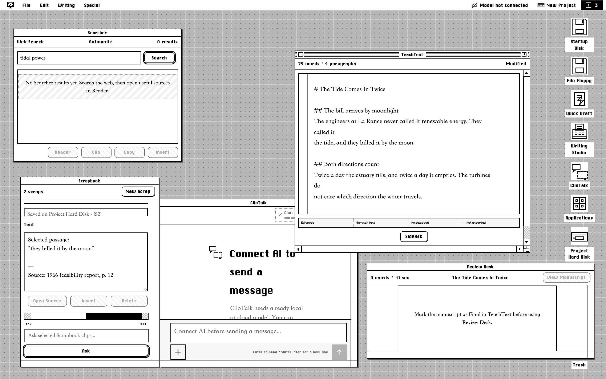
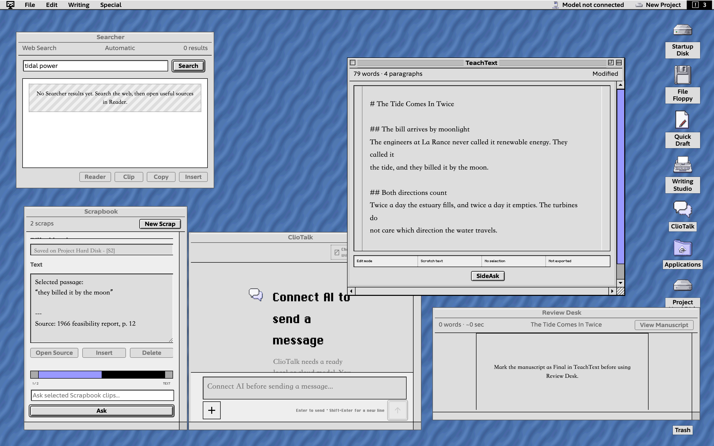
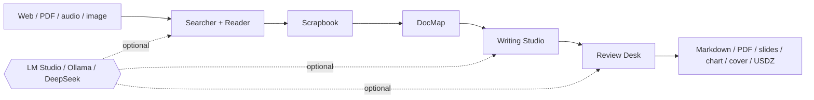

<div align="center">

<samp>1988 OBJECTS / 2026 INTELLIGENCE</samp>

# AI System 6

**A complete AI desktop that runs in a browser tab.**<br>
No framework. No transpiler. No database. Two floppy disks.

[](LICENSE)
[](package.json)
[](#built-under-a-1988-constraint)
[](#bring-your-own-model)
[](https://system6.aaronlau.me)

[**BOOT IT NOW**](https://system6.aaronlau.me)&nbsp;&nbsp;·&nbsp;&nbsp;[**50s FILM**](https://www.bilibili.com/video/BV1ht3m6UEDb/)&nbsp;&nbsp;·&nbsp;&nbsp;[**PRODUCT SITE**](https://aisystem6.pages.dev)&nbsp;&nbsp;·&nbsp;&nbsp;[**MAC BETA**](https://github.com/surfine/AI-System-6/releases/latest)&nbsp;&nbsp;·&nbsp;&nbsp;[简体中文](README.zh-CN.md)

<br>

<a href="https://system6.aaronlau.me"><picture>
  <source media="(prefers-color-scheme: dark)" srcset="site/img/frames/liquid-glass.webp">
  
</picture></a>

<sub>YOUR GITHUB THEME JUST PICKED AN ERA: LIGHT IS 1988, DARK IS 2026.<br>
THERE ARE FOUR MORE INSIDE. NO MODEL REQUIRED TO LOOK AROUND.</sub>

</div>

## Run it in 60 seconds

Requires Node.js 20+. No API key, no account, no model.

```bash
git clone https://github.com/surfine/AI-System-6.git
cd AI-System-6
npm ci
npm start          # http://localhost:4173
```

The desktop boots with every non-AI tool working. Connect LM Studio, Ollama,
DeepSeek, or any OpenAI-compatible endpoint later, from the Control Panel.

```bash
npm run build            # deterministic desktop bundle
npm test                 # executable product contracts
npm run verify:public    # repository, command, asset, and docs gate
```

Or skip the clone and [**boot the live system**](https://system6.aaronlau.me)
in your browser.

## What you are looking at

A desktop operating environment, written as plain JavaScript. 85 source files
are concatenated into one bundle: no framework, no transpiler, no build step
for the app code.

```text
85 JS source files          concatenated, never transpiled
9 runtime dependencies      the server is a stateless bridge, not a backend
153 executable contracts    one per user feature, not per function
6 icon families             drawn per era, not filtered from one set
2,941,297 bytes             the whole desktop, measured on every build
0 databases                 your projects live in your browser
```

Everything durable is a visible object: a disk, a floppy, a scrap, a
manuscript, a Trash can. AI is a tool you point at those objects, and its
output stays temporary until you save, clip, insert, or export it.

## Software a 1988 desktop should not be able to run

<table>
  <tr>
    <td width="50%"><br><sub><b>ClioChart</b> · a Markdown table in the manuscript, projected as an editable chart</sub></td>
    <td width="50%"><br><sub><b>ClioStage</b> · the same manuscript, presented as a deck</sub></td>
  </tr>
  <tr>
    <td width="50%"><br><sub><b>CMF Studio</b> · a 3D colorway, exportable as USDZ for AR</sub></td>
    <td width="50%"><br><sub><b>Cover Glass</b> · refractive WebGL typography</sub></td>
  </tr>
</table>

<div align="center"><sub>FOUR WINDOWS OF THE RUNNING APP, CAPTURED OFFLINE. NO MODEL, NO NETWORK, NO MOCKUP.</sub></div>

Alongside them: **Searcher** and **Reader** for the live web, **Time Machine**
for archived pages, **File Floppy** for imports with OCR and transcription,
**Scrapbook** for evidence you deliberately clipped, **DocMap** for structure,
**Writing Studio** and **TeachText** for the manuscript, and **Review Desk**
for what the draft got wrong.

## One desk. Six systems.

The files and open windows stay put. The whole computer changes era around
them.

<table>
  <tr>
    <td width="33%" align="center"><br><code>1988 / SYSTEM 6</code></td>
    <td width="33%" align="center"><br><code>1999 / PLATINUM</code></td>
    <td width="33%" align="center"><br><code>2002 / AQUA</code></td>
  </tr>
  <tr>
    <td width="33%" align="center"><br><code>2009 / SNOW LEOPARD</code></td>
    <td width="33%" align="center"><br><code>2014 / YOSEMITE</code></td>
    <td width="33%" align="center"><br><code>2026 / LIQUID GLASS</code></td>
  </tr>
</table>

Six frames, one live desktop, captured by `npm run site:capture-frames`.
System 6 starts from real System 6.0.8 resources and observed Macintosh
behavior; later eras own independent, Retina-ready icon families. Nothing here
is a mockup, because a script re-shoots all of it from the running app.

<div align="center">

[](https://system6.aaronlau.me)

</div>

## Built under a 1988 constraint

```text
boot-critical payload   ▓▓▓▓▓▓▓▓▓▓▓▓▓▓▓▓▓▓▓▓▓▓▓▓▓▓░░  2,941,297 bytes
two 1.44 MB floppies    ▓▓▓▓▓▓▓▓▓▓▓▓▓▓▓▓▓▓▓▓▓▓▓▓▓▓▓▓  2,949,120 bytes
heavy tools             load lazily, from a third disk
```

A release gate fails the build when the boot payload outgrows two floppy
disks. It fits, with a corner of the second disk still empty. Every feature
has to earn its bytes against a limit nobody is forcing on us, and the number
above is written by the gate itself, so the claim cannot quietly stop being
true.

## Chat is an app. Not the whole computer.

Chat is excellent at conversation. It is a poor filesystem, workspace,
provenance model, and long-running project surface.

| A chat product | This computer |
| --- | --- |
| One thread owns the workflow | MultiFinder keeps real working apps open together |
| Context disappears into a prompt | Sources, scraps, maps, drafts, and outputs stay visible |
| Generated text quietly becomes truth | AI output stays temporary until you keep it |
| The answer is the endpoint | The endpoint is a file, chart, deck, cover, or 3D object |



> A disk tells you what lasts. A floppy tells you what is temporary. A
> Scrapbook contains only what you chose to keep.

## Bring your own model

| Route | Use it for |
| --- | --- |
| **LM Studio** | local chat, embeddings, discovery, model loading |
| **Ollama** | local OpenAI-compatible serving |
| **DeepSeek** | built-in cloud configuration |
| **Custom endpoint** | any compatible provider and model |
| **No model** | the desktop and every non-AI tool |

Durable project state lives in your browser's IndexedDB. The server is a
stateless bridge with no application database. Credentials never enter project
files, chats, backups, or exports.

## How the repository is laid out

```text
AI-System-6/
├── apps/
│   ├── desktop/       browser computer: OS services, apps, styles, assets
│   └── server/        stateless Node.js bridge and model adapters
├── site/              independently deployable product website
├── platform/          macOS shell and web-release contracts
├── tooling/           build, verify, capture, package, release
├── tests/             executable product and architecture contracts
├── docs/              architecture, development, design evidence
└── internal/          maintainer evidence, plans, operations
```

These are ownership boundaries, not decorative folders: a layout test rejects
retired root copies and compatibility symlinks before they can return.

Read [Architecture](docs/ARCHITECTURE.md), [Development](docs/DEVELOPMENT.md),
and the [Design Contract](docs/design/DESIGN.md).

## Contributing

MIT licensed. Start with [CONTRIBUTING.md](CONTRIBUTING.md), open an issue with
a reproducible product contract, or report security problems through
[SECURITY.md](SECURITY.md). Every advertised command must work from a fresh
clone; the public repository is an independently verifiable source snapshot.

<div align="center">

     

<sub>ONE DISK. SIX ERAS. SAME WORK.</sub>

### If AI software should feel like a computer again,

# [★ STAR AI SYSTEM 6](https://github.com/surfine/AI-System-6)

[**LIVE DESKTOP**](https://system6.aaronlau.me)&nbsp;&nbsp;·&nbsp;&nbsp;[**BILIBILI FILM**](https://www.bilibili.com/video/BV1ht3m6UEDb/)&nbsp;&nbsp;·&nbsp;&nbsp;[**PRODUCT SITE**](https://aisystem6.pages.dev)&nbsp;&nbsp;·&nbsp;&nbsp;[**LATEST RELEASE**](https://github.com/surfine/AI-System-6/releases/latest)

<sub>Independent project. Not affiliated with or endorsed by Apple Inc.</sub>

</div>
