<div align="center">

<samp>1988 OBJECTS / 2026 INTELLIGENCE</samp>

# AI System 6

**A local-first writing desk where the AI never becomes your voice.**<br>
One route from your raw questions to a finished piece. Projects in your browser. A stateless server. Two floppy disks.

[](LICENSE)
[](package.json)
[](#built-under-a-1988-constraint)
[](#bring-your-own-model)
[](https://system6.aaronlau.me)

[**BOOT IT NOW**](https://system6.aaronlau.me)&nbsp;&nbsp;·&nbsp;&nbsp;[**50s FILM**](https://www.bilibili.com/video/BV1ht3m6UEDb/)&nbsp;&nbsp;·&nbsp;&nbsp;[**PRODUCT SITE**](https://aisystem6.pages.dev)&nbsp;&nbsp;·&nbsp;&nbsp;[**MAC BETA**](https://github.com/surfine/AI-System-6/releases/latest)&nbsp;&nbsp;·&nbsp;&nbsp;[简体中文](README.zh-CN.md)

<br>

<a href="https://system6.aaronlau.me"><picture>
  <source media="(prefers-color-scheme: dark)" srcset="site/img/frames/liquid-glass.webp">
  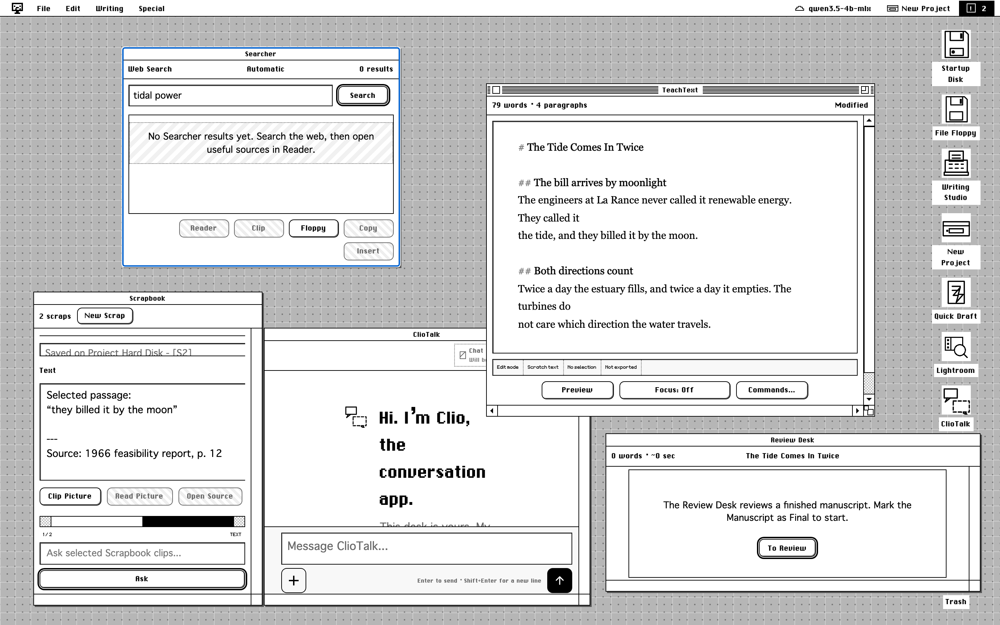
</picture></a>

<sub>YOUR GITHUB THEME JUST PICKED AN ERA: LIGHT IS 1988, DARK IS 2026.<br>
THERE ARE FOUR MORE INSIDE. NO MODEL REQUIRED TO LOOK AROUND.</sub>

</div>

## Contents

- [What this protects](#what-this-protects)
- [Run it in 60 seconds](#run-it-in-60-seconds)
- [The route is the product](#the-route-is-the-product)
- [Chat is an app. Not the whole computer.](#chat-is-an-app-not-the-whole-computer)
- [What the constraint still leaves room for](#what-the-constraint-still-leaves-room-for)
- [It also runs DOOM](#it-also-runs-doom)
- [One desk. Six systems.](#one-desk-six-systems)
- [Built under a 1988 constraint](#built-under-a-1988-constraint)
- [Bring your own model](#bring-your-own-model)
- [How this repository keeps itself honest](#how-this-repository-keeps-itself-honest)
- [How the repository is laid out](#how-the-repository-is-laid-out)
- [Contributing](#contributing)

## What this protects

Writing with a language model is easy. Coming out the other side still sounding
like yourself is not.

AI System 6 is built around one belief: your language, your sources, your
judgment, your feeling for the subject, and your sense of who the piece is for
are the valuable parts. A model will smooth all five into competent, forgettable
prose if you let it hold the pen. So here it does not hold the pen.

- **AI output is temporary** until you save, clip, insert, or export it.
- **You say where a reply lands** — Question Sheet, Outline, the current Section
  Draft, the manuscript, or the Scrapbook — and whether it appends, replaces
  only your selection, or creates something new.
- **Review Desk checks for drift into a model's voice**: over-regular rhythm,
  generic summary language, personal detail flattened out, hedging that reads
  like a press release. It is the last stop for a reason.
- **Your roughness is not a defect.** Hesitation, an unresolved number, a
  personal aside, a sentence that is a little too blunt: these carry judgment,
  and the route is built to keep them rather than sand them off.

The Macintosh System 6 desktop is a **constraint, not the pitch**. Visible
objects, deliberate saving, one writing task at a time. It is there because it
makes every one of the promises above checkable by looking at the screen.

## Run it in 60 seconds

Requires Node.js 24+. No API key, no account, no model.

```bash
git clone https://github.com/surfine/AI-System-6.git
cd AI-System-6
npm ci
npm start          # http://localhost:4173
```

The desktop boots with every non-AI tool working. Connect LM Studio, Ollama,
DeepSeek, or any OpenAI-compatible endpoint later, from the Control Panel.

```bash
npm run build            # deterministic desktop bundle
npm test                 # executable product contracts
npm run verify:public    # repository, command, asset, and docs gate
```

Or skip the clone and [**boot the live system**](https://system6.aaronlau.me)
in your browser. The [Mac beta](https://github.com/surfine/AI-System-6/releases/latest)
carries its own current Node runtime, so there is nothing to install at all.

## The route is the product

```text
Project Hard Disk → File Floppy → Question Sheet → Outline
  → Section Drafts → Manuscript → Review Desk → Project CD
```

Everything else in this repository is a tool you summon onto that route.

| Stop | What it holds |
| --- | --- |
| **Project Hard Disk** | durable project state: references, drafts, clips |
| **File Floppy** | temporary context you mounted: PDFs, pages, audio, images |
| **Question Sheet** | the recipient, your raw questions, what you saw yourself |
| **Outline** | structure in your words; each `##` becomes a draftable section |
| **Section Drafts** | one section at a time, with the editable owner made explicit |
| **Manuscript** | TeachText; read-only while drafting, so nothing rewrites it |
| **Review Desk** | facts, structure, and whether it still sounds like you |
| **Project CD** | finished Markdown and other explicit, read-only handoff exports |

<table>
  <tr>
    <td width="50%">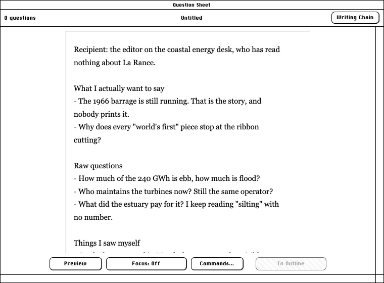<br><sub><b>Question Sheet</b> · the recipient, the raw questions, the objection you expect</sub></td>
    <td width="50%">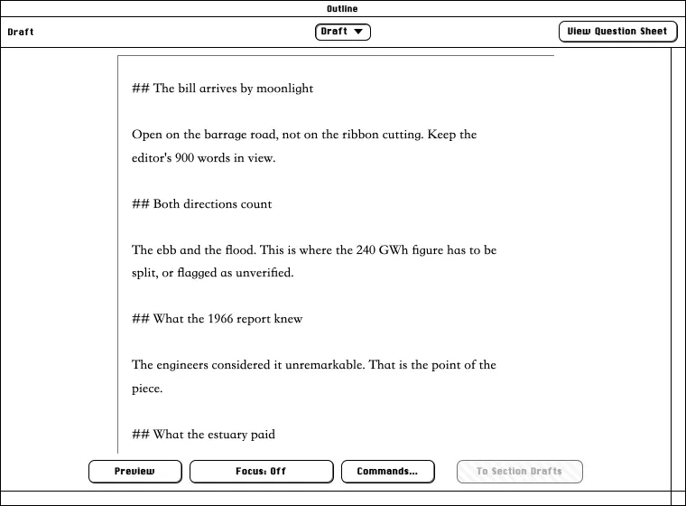<br><sub><b>Outline</b> · four sections, still in the writer's words</sub></td>
  </tr>
  <tr>
    <td width="50%">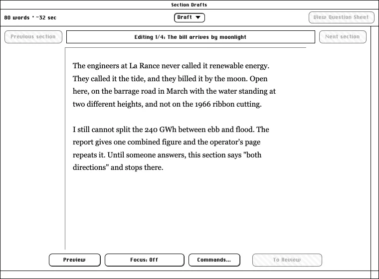<br><sub><b>Section Drafts</b> · the unverified figure stays unverified</sub></td>
    <td width="50%">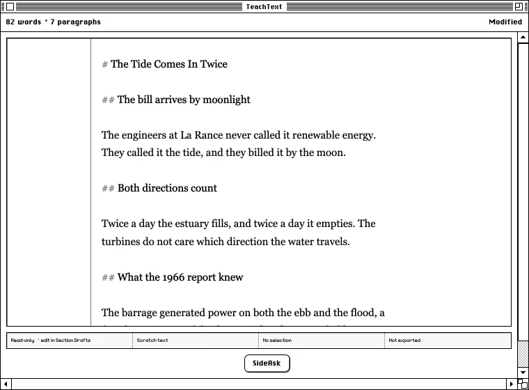<br><sub><b>Manuscript</b> · read-only while the drafts own the text</sub></td>
  </tr>
</table>

<div align="center"><sub>FOUR STOPS, PHOTOGRAPHED IN THE RUNNING APP BY <code>npm run site:capture-route</code>.<br>THE MATERIAL IS TYPED IN AS A WRITER WOULD TYPE IT. NO MODEL WAS CONNECTED.</sub></div>

Alongside the route, summoned when you need them: **Searcher** and **Reader**
for the live web, **Time Machine** for archived pages, **File Floppy** for
imports with OCR and transcription, **Scrapbook** for evidence you deliberately
clipped, **DocMap** for structure, **ClioTalk** for conversation, and desk
accessories that belong to writing — a **Note Pad** whose slips can be sent to
TeachText, the Scrapbook or ClioTalk, a **Dictionary**, and a **Writing Bell**
for one quiet interval. **Image Prompt Studio** turns a short idea into
ready-to-paste GPT-Image and universal prompts; it writes the prompt, never the
picture.

## Chat is an app. Not the whole computer.

Chat is excellent at conversation. It is a poor filesystem, workspace,
provenance model, and long-running project surface.

| A chat product | This computer |
| --- | --- |
| One thread owns the workflow | MultiFinder keeps real working apps open together |
| Context disappears into a prompt | Sources, scraps, maps, drafts, and outputs stay visible |
| Generated text quietly becomes truth | AI output stays temporary until you keep it |
| The answer is the endpoint | The endpoint is a file, chart, deck, cover, or 3D object |

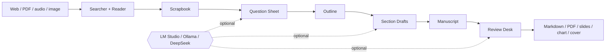
```mermaid
flowchart LR
    A["Web / PDF / audio / image"] --> B["Searcher + Reader"]
    B --> C["Scrapbook"]
    C --> D["Question Sheet"]
    D --> E["Outline"]
    E --> F["Section Drafts"]
    F --> G["Manuscript"]
    G --> H["Review Desk"]
    H --> I["Markdown / PDF / slides / chart / cover"]
    M{{"LM Studio / Ollama / DeepSeek"}} -. "optional" .-> D
    M -. "optional" .-> F
    M -. "optional" .-> H
```

> A disk tells you what lasts. A floppy tells you what is temporary. A
> Scrapbook contains only what you chose to keep.

## What the constraint still leaves room for

The route stays primary, but a real computer can make room for other kinds of
work without turning them into mandatory stops. These tools load only when
summoned, and the writing objects keep the same meaning underneath them.

<table>
  <tr>
    <td width="50%">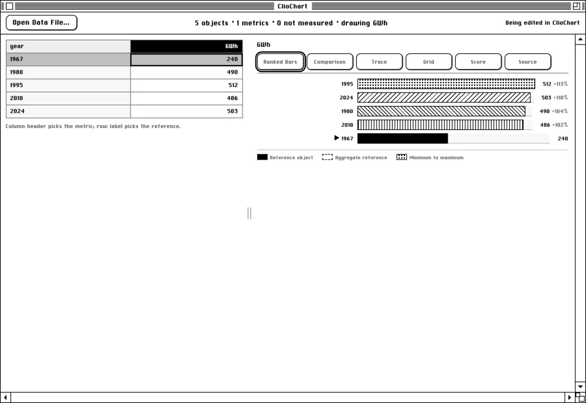<br><sub><b>ClioChart</b> · a Markdown table in the manuscript, projected as an editable chart</sub></td>
    <td width="50%">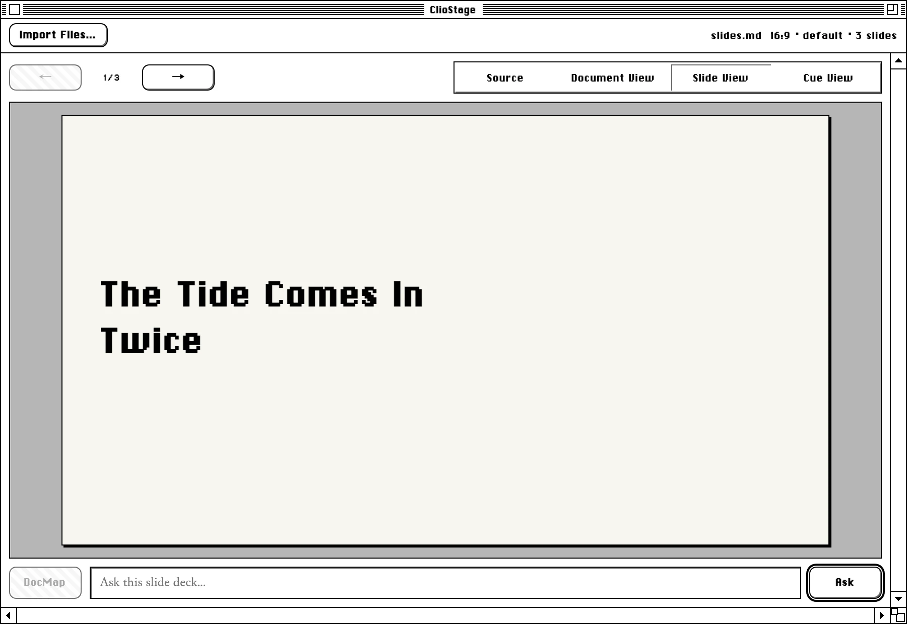<br><sub><b>ClioStage</b> · the same manuscript, presented as a deck</sub></td>
  </tr>
  <tr>
    <td width="50%">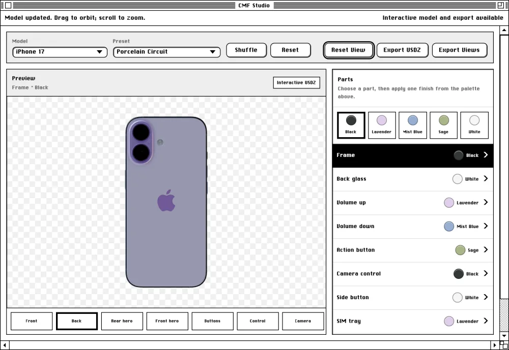<br><sub><b>CMF Studio</b> · a 3D colorway, exportable as USDZ for AR</sub></td>
    <td width="50%">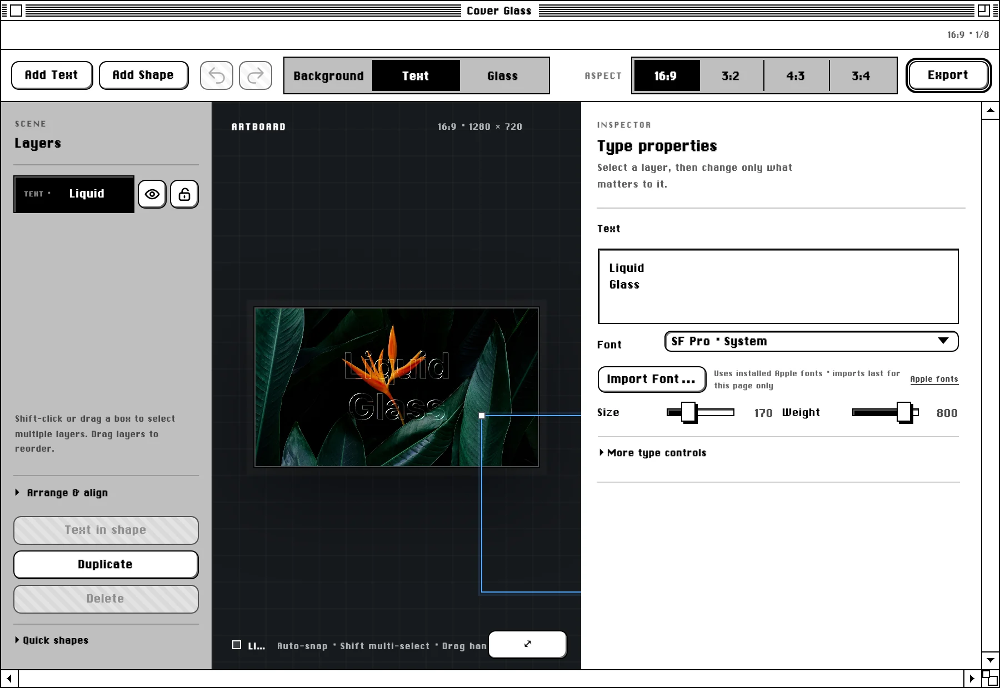<br><sub><b>Cover Glass</b> · refractive WebGL typography</sub></td>
  </tr>
</table>

<p align="center">
  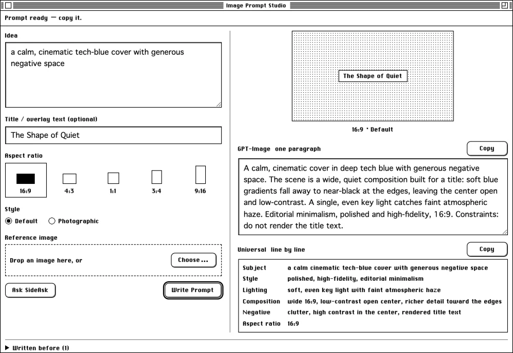
  <br><sub><b>Image Prompt Studio</b> · one idea becomes two ready-to-paste prompts</sub>
</p>

<div align="center"><sub>FIVE WINDOWS OF THE RUNNING APP, CAPTURED OFFLINE. NO MODEL, NO NETWORK, NO MOCKUP.</sub></div>

## It also runs DOOM

Three real games ship on this desktop, in their own windows, next to the
manuscript you were writing.

| Game | What it is |
| --- | --- |
| **Micropolis** | the open-source release of the original SimCity |
| **OpenTTD** | the open-source Transport Tycoon Deluxe, in Chinese, with touch controls |
| **DOOM** | DOOM |

<table>
  <tr>
    <td width="33%">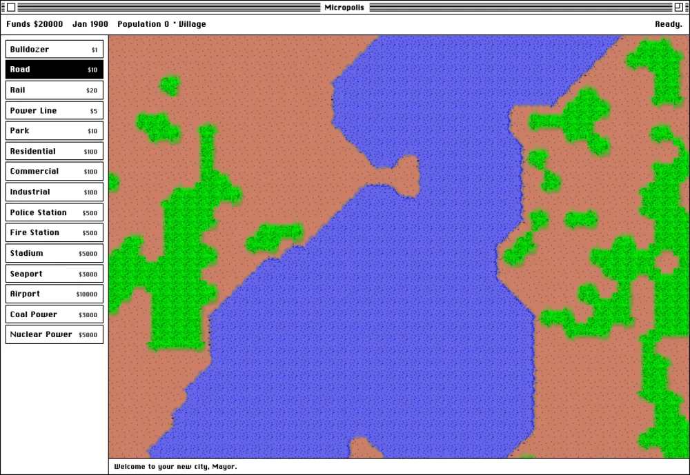<br><sub><b>Micropolis</b> · Jan 1900, $20,000, welcome Mayor</sub></td>
    <td width="33%">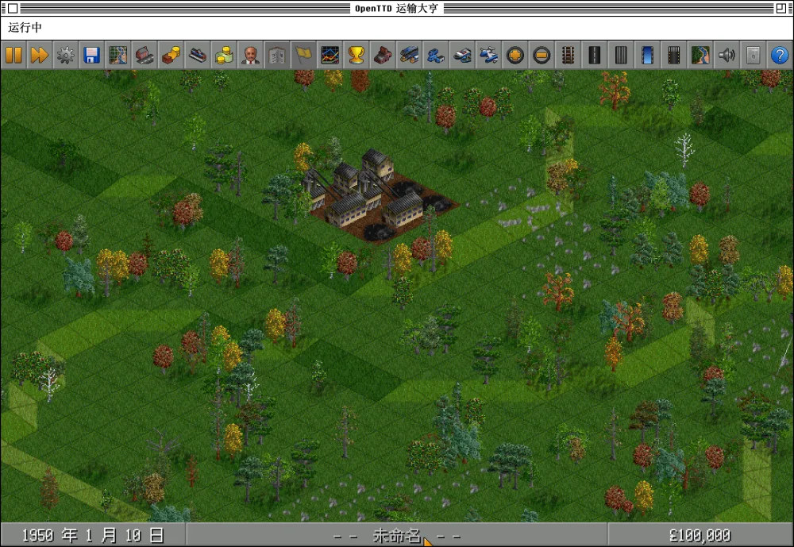<br><sub><b>OpenTTD</b> · 1950, in Chinese, mid-game</sub></td>
    <td width="33%">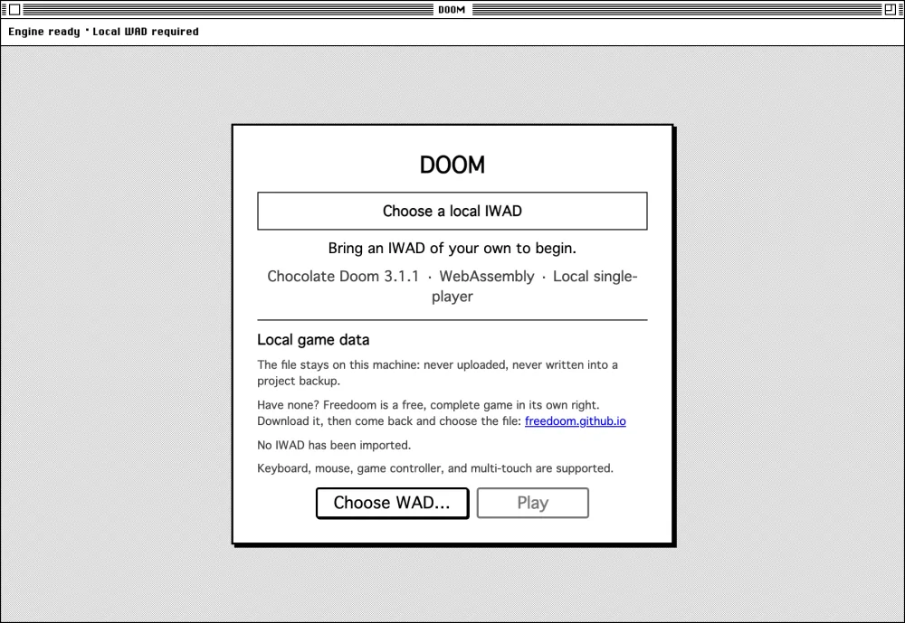<br><sub><b>DOOM</b> · engine ready, bring your own demons</sub></td>
  </tr>
</table>

They are not GIFs of games. They are the games, compiled to WebAssembly and
running in the same MultiFinder that holds Searcher and Review Desk. They prove
the constraint can contain real software; the writing route earns trust
separately, through visible objects, deliberate saving, and receipts for what
actually happened.

## One desk. Six systems.

The files and open windows stay put. The whole computer changes era around
them.

<table>
  <tr>
    <td width="33%" align="center"><br><code>1988 / SYSTEM 6</code></td>
    <td width="33%" align="center">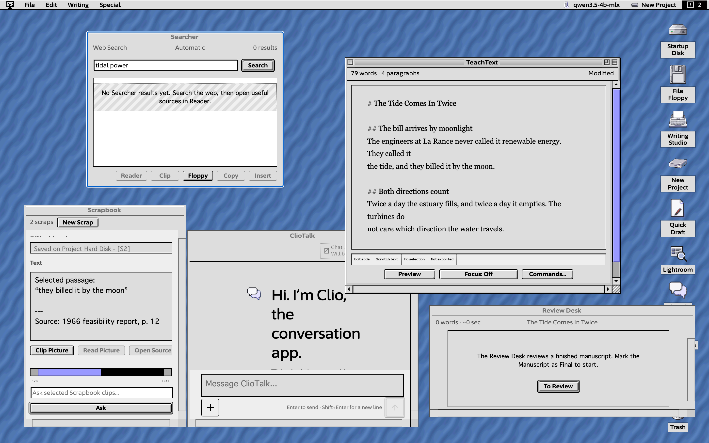<br><code>1999 / PLATINUM</code></td>
    <td width="33%" align="center">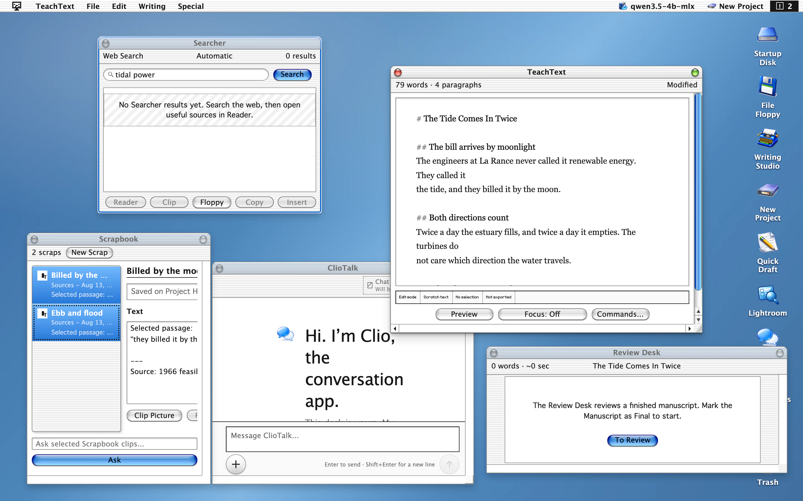<br><code>2002 / AQUA</code></td>
  </tr>
  <tr>
    <td width="33%" align="center">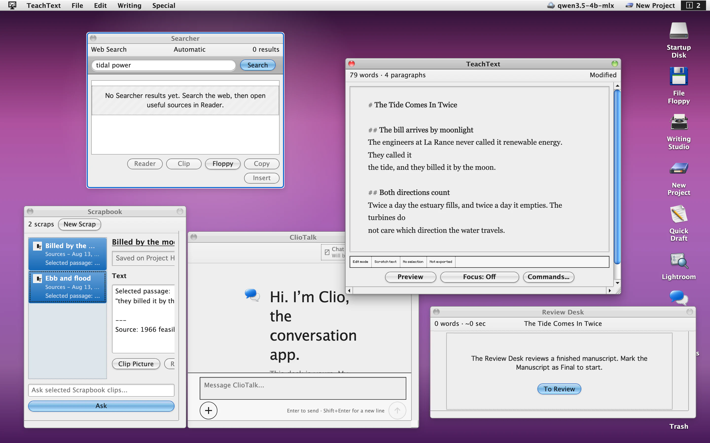<br><code>2009 / SNOW LEOPARD</code></td>
    <td width="33%" align="center">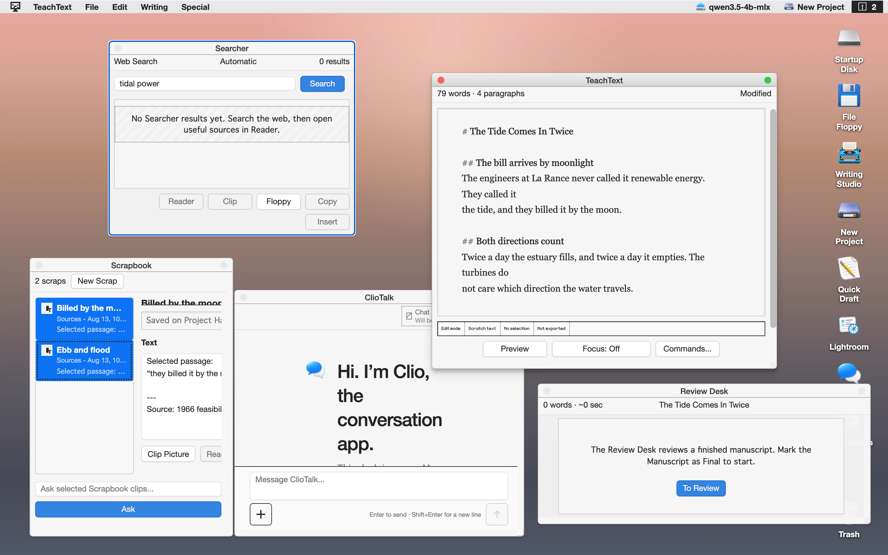<br><code>2014 / YOSEMITE</code></td>
    <td width="33%" align="center">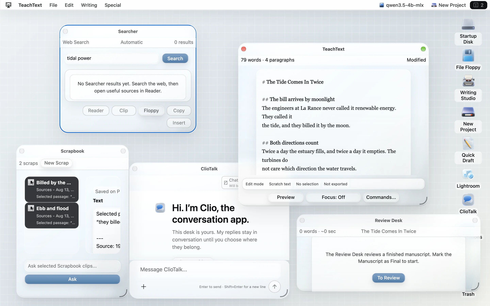<br><code>2026 / LIQUID GLASS</code></td>
  </tr>
</table>

Six frames, one live desktop, captured by `npm run site:capture-frames`.
System 6 starts from real System 6.0.8 resources and observed Macintosh
behavior; later eras own independent, Retina-ready icon families. Nothing here
is a mockup, because a script re-shoots all of it from the running app.

<div align="center">

[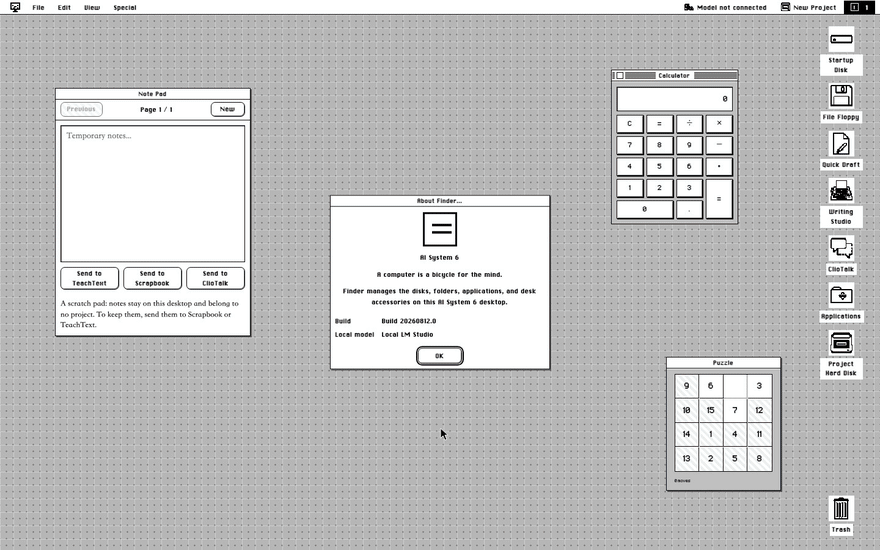](https://system6.aaronlau.me)

</div>

## Built under a 1988 constraint

```text
boot-critical payload   ▓▓▓▓▓▓▓▓▓▓▓▓▓▓▓▓▓▓▓▓▓▓▓▓▓▓░░  2,797,819 bytes
two 1.44 MB floppies    ▓▓▓▓▓▓▓▓▓▓▓▓▓▓▓▓▓▓▓▓▓▓▓▓▓▓▓▓  2,949,120 bytes
heavy tools             load lazily, from a third disk
```

A release gate fails the build when the boot payload outgrows two floppy
disks. It fits, with a corner of the second disk still empty. Every feature
has to earn its bytes against a limit nobody is forcing on us, and the number
above is written by the gate itself, so the claim cannot quietly stop being
true.

## Bring your own model

| Route | Use it for |
| --- | --- |
| **LM Studio** | local chat, embeddings, discovery, model loading |
| **Ollama** | local OpenAI-compatible serving |
| **DeepSeek** | built-in cloud configuration |
| **Custom endpoint** | any compatible provider and model |
| **No model** | the desktop and every non-AI tool |

Durable project state lives in your browser's IndexedDB. The server is a
stateless bridge with no application database. Credentials never enter project
files, chats, backups, or exports.

## How this repository keeps itself honest

Claims rot. These run from a fresh clone and fail the build instead.

| Gate | What it refuses to let happen |
| --- | --- |
| `verify:floppy` | the boot payload growing past two 1.44&nbsp;MB floppy disks |
| `site:check` | this page quoting a byte count the gate never measured |
| `verify:docs` | an English document drifting away from its Chinese mirror |
| `verify:public` | a command advertised here that fails from a fresh clone |

The payload number above is written by `npm run verify:floppy` itself into
`site/data/floppy-budget.json`; the website fetches it and this page quotes it.
On the day that gate was built it caught this README quoting a stale number
three times in one afternoon.

Every product screenshot on this page and on the
[product site](https://aisystem6.pages.dev) is re-shot from the running app by
`npm run site:capture-frames`, `npm run site:capture-route`, and
`tooling/capture-site-proofs.mjs`. Each of those starts the app and photographs
real windows, so there is no art directory of hand-made marketing images to fall
out of date — because there are no hand-made marketing images.

## How the repository is laid out

```text
AI-System-6/
├── apps/
│   ├── desktop/       browser computer: OS services, apps, styles, assets
│   └── server/        stateless Node.js bridge and model adapters
├── site/              independently deployable product website
├── platform/          macOS shell and web-release contracts
├── tooling/           build, verify, capture, package, release
├── tests/             executable product and architecture contracts
├── docs/              architecture, development, design evidence
└── internal/          maintainer evidence, plans, operations
```

These are ownership boundaries, not decorative folders: a layout test rejects
retired root copies and compatibility symlinks before they can return.

Read [Architecture](docs/ARCHITECTURE.md), [Development](docs/DEVELOPMENT.md),
and the [Design Contract](docs/design/DESIGN.md).

## Contributing

Start with [CONTRIBUTING.md](CONTRIBUTING.md), open an issue with a reproducible
product contract, or report security problems through [SECURITY.md](SECURITY.md).
Every advertised command must work from a fresh clone; the public repository is
an independently verifiable source snapshot.

## License

[MIT](LICENSE). Independent project — not affiliated with or endorsed by Apple Inc.

<div align="center">

    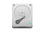 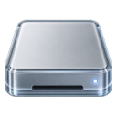

<sub>ONE DISK. SIX ERAS. SAME WORK.</sub>

If AI writing tools should leave your voice alone, **[★ star AI System 6](https://github.com/surfine/AI-System-6)**.

[**LIVE DESKTOP**](https://system6.aaronlau.me)&nbsp;&nbsp;·&nbsp;&nbsp;[**BILIBILI FILM**](https://www.bilibili.com/video/BV1ht3m6UEDb/)&nbsp;&nbsp;·&nbsp;&nbsp;[**PRODUCT SITE**](https://aisystem6.pages.dev)&nbsp;&nbsp;·&nbsp;&nbsp;[**LATEST RELEASE**](https://github.com/surfine/AI-System-6/releases/latest)

</div>
