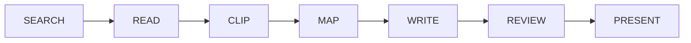

<div align="center">

# AI System 6

### The AI has a desktop now.

A Macintosh System 6-inspired workspace where AI can **search, read, map, write, review, chart, present, and make** — across real apps and visible files.

[](https://system6.aaronlau.me)
[](https://aisystem6.pages.dev)
[](https://github.com/surfine/AI-System-6/releases/latest)
[](https://www.bilibili.com/video/BV1ht3m6UEDb/)

[](https://github.com/surfine/AI-System-6/stargazers)
[](https://github.com/surfine/AI-System-6/releases/latest)
[](LICENSE)
[](#bring-your-own-model)
[](README.md)
[](README.zh-CN.md)

[](https://system6.aaronlau.me)

**Recorded from the live system, not a concept render** — one desk, six release appearances, and then the [official site](https://aisystem6.pages.dev) cycling them too. Click it and use it in your browser.

</div>

## Not another chatbot

Most AI products put every task into one chat window. AI System 6 gives the work a place to live.

| In a chatbot | In AI System 6 |
| --- | --- |
| Context disappears into a prompt | Sources, scraps, prompts, and outputs remain visible |
| One conversation owns the workflow | MultiFinder keeps multiple working apps open together |
| Generated text quietly becomes the document | AI output stays temporary until you save, clip, insert, or export it |
| The model is the product | Use LM Studio, Ollama, DeepSeek, or another OpenAI-compatible provider |
| The endpoint is another answer | The endpoint is a file, manuscript, chart, slide deck, cover, or 3D artifact |

## Write something now, or build something larger

| | |
| --- | --- |
| **Write something now** | **Draft Desk** — idea or material → draft → adjust → deliver |
| **Build something larger** | **Writing Studio** — research → structure → draft → review → publish |

Draft Desk turns a single idea or piece of material into a short draft you can
save, download, or share. Writing Studio carries a longer project from sources
and a Question Sheet through an outline, section drafts, and the Review Desk.
Neither path requires starting from a search.

## One desktop. A complete route.



For a long project, the full desktop route ties research and delivery
together:

1. **Searcher** finds sources; **Reader** opens the evidence.
2. **Time Machine** revisits archived pages through the Wayback Machine.
3. **Scrapbook** keeps only the material you deliberately clip.
4. **DocMap** turns research into a visible map of ideas and relationships.
5. **Question Sheet → Outline → Section Drafts → TeachText** carries one manuscript from messy intent to finished prose.
6. **Review Desk** checks factual and structural risk — including generic AI-mouthpiece drift.
7. **ClioChart, ClioStage, and Cover Glass** turn the same work into charts, slides, and a finished visual artifact.

No invisible agent maze. The sources, files, prompts, and handoffs stay on the desk.

## Things this 1988 computer should not be able to do

- **Run modern AI locally** through LM Studio or Ollama.
- **Search and read the web**, including historical snapshots.
- **Transcribe audio and OCR images and documents** from a File Floppy.
- **Turn Markdown data into editable visual projections** with ClioChart.
- **Build and present Markdown slide decks** with ClioStage.
- **Render refractive WebGL typography** in Cover Glass.
- **Edit a 3D iPhone colorway and export USDZ for AR** in CMF Studio.
- **Switch the entire desktop between the release appearances — System 6, Platinum, Aqua, Snow Leopard, Yosemite, and Liquid Glass** without moving the work.

System 6 is the default appearance. Platinum, Aqua, Snow Leopard, Yosemite, and
Liquid Glass are the release-supported alternatives. The classic interface is
grounded in real System 6.0.8 resources and period Macintosh interaction
patterns — not redrawn from memory.

## Bring your own model

AI System 6 is model-agnostic. Pick the route that matches your privacy, hardware, and budget.

| Route | Use it for |
| --- | --- |
| **LM Studio** | Local chat and embedding models with model discovery and loading |
| **Ollama** | Local OpenAI-compatible model serving |
| **DeepSeek** | Built-in cloud provider configuration |
| **Custom / OpenAI-compatible** | Your own compatible endpoint and model |
| **No model** | Explore the desktop and non-AI tools without connecting a provider |

Projects, references, scraps, and settings are stored in your browser. The server is stateless, and provider credentials stay outside project files, chats, backups, and exports.

## Apple silicon Mac beta

Prefer a real app window? Download the [latest Mac beta](https://github.com/surfine/AI-System-6/releases/latest) for **Apple silicon (M1 or later)** and **macOS 13 or newer**.

The app is a lightweight shell around the same local-first workspace. It starts and stops its bundled local server with the app; projects and model credentials remain on your Mac. The current beta is ad-hoc signed rather than notarized, so the first launch may require **Control-click → Open**.

## Run it locally

```bash
git clone https://github.com/surfine/AI-System-6.git
cd AI-System-6
npm install
npm start
```

Open [http://localhost:4173](http://localhost:4173).

For local AI, start LM Studio, load a chat model, then refresh models in **Control Panel**. Ollama and cloud/OpenAI-compatible routes can be configured there as well.

## What the public repository supports

<details>
<summary><strong>Command surface, CI, and what stays private</strong> (click to expand)</summary>
<br>

This GitHub repository is a curated, public-safe source snapshot, not a mirror
of the maintainer's working tree: internal deployment, signing, packaging, and
native-tooling commands live only in the private source. From a fresh clone,
the supported command surface is:

```bash
npm ci                 # install the exact locked dependencies
npm start              # build the browser bundle, then serve http://localhost:4173
npm run build          # build the browser bundle
npm test               # executable feature contracts
npm run verify:public  # public tree verification (commands, files, CI, docs)
```

`npm run verify:public` fails if any exposed command references a file that is
not in this repository, or if internal-only tooling is present. The CI workflow
in `.github/workflows/ci.yml` runs the same commands the local gates use.
Hosted execution depends on the GitHub account's Actions availability; the
maintainer/private-source release condition is `npm run verify:ship`; it is not
part of the supported public-snapshot command contract. The
browser matrix (`npm run test:e2e`) is an optional diagnostic for humans and
is **not** a release condition: `verify:ship`, `verify:release`, the default
CI, and the release workflow never run Playwright, and a flaky browser test
never blocks a release.

</details>

## Built differently

- **Local-first:** durable project data lives in IndexedDB; the server has no application database.
- **File-native:** Project Hard Disk, File Floppy, Scrapbook, TeachText, and Project CD are working objects, not decorative metaphors.
- **Inspectable:** model inputs, selected skills, harnesses, prompts, and run records are designed to remain visible.
- **Deliberate:** AI may help read, organize, draft, rewrite, and review, but it does not get to silently become the writer.
- **Small by constraint:** a build gate caps the boot-critical browser payload at about two 1.44 MB floppy disks; heavy tools load lazily, from a third disk.

The browser app is plain JavaScript with a small stateless Node.js server — no frontend framework and no transpiler. See [CLAUDE.md](CLAUDE.md) for architecture, verification, and product contracts.

## Why System 6?

Because a desktop makes state visible. A disk tells you what lasts. A floppy tells you what is temporary. A Scrapbook contains only what you chose to keep. A Trash can makes deletion honest.

The retro interface is not the product. It is the constraint that keeps AI work legible.

---

<div align="center">

If this is the kind of AI computer you want to exist, **star the repository**, try the [live desktop](https://system6.aaronlau.me), and tell us what you would build inside it.

<a href="https://www.star-history.com/#surfine/AI-System-6&Date">
  <picture>
    <source media="(prefers-color-scheme: dark)" srcset="https://api.star-history.com/svg?repos=surfine/AI-System-6&type=Date&theme=dark">
    <source media="(prefers-color-scheme: light)" srcset="https://api.star-history.com/svg?repos=surfine/AI-System-6&type=Date">
    
  </picture>
</a>

[Official website](https://aisystem6.pages.dev) · [Live desktop](https://system6.aaronlau.me) · [50-second demo](https://www.bilibili.com/video/BV1ht3m6UEDb/) · [Issues](https://github.com/surfine/AI-System-6/issues)

MIT licensed. AI System 6 is an independent project and is not affiliated with or endorsed by Apple Inc.

</div>
