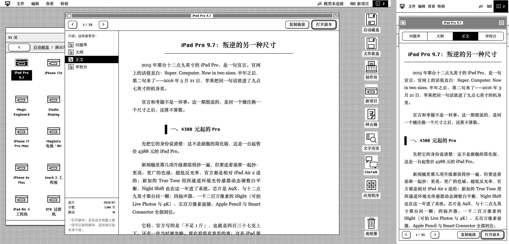
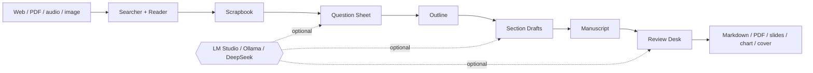

<div align="center">

<samp>1988 OBJECTS / 2026 INTELLIGENCE</samp>

# AI System 6

<!-- doc-claims: verified | audited: 2026-09-18 -->

**A local-first writing desk where the AI never becomes your voice.**<br>
One route from your raw questions to a finished piece. Projects in your browser. A stateless server. Two floppy disks.

[](LICENSE)
[](package.json)
[](#built-under-a-1988-constraint)
[](#bring-your-own-model)
[](https://system6.aaronlau.me)

[**BOOT IT NOW**](https://system6.aaronlau.me)&nbsp;&nbsp;·&nbsp;&nbsp;[**50s FILM**](https://www.bilibili.com/video/BV1ht3m6UEDb/)&nbsp;&nbsp;·&nbsp;&nbsp;[**PRODUCT SITE**](https://aisystem6.pages.dev)&nbsp;&nbsp;·&nbsp;&nbsp;[**MAC BETA**](https://github.com/surfine/AI-System-6/releases/latest)&nbsp;&nbsp;·&nbsp;&nbsp;[简体中文](README.zh-CN.md)

<br>

<a href="https://system6.aaronlau.me"><picture>
  <source media="(prefers-color-scheme: dark)" srcset="site/img/frames/liquid-glass.webp">
  
</picture></a>

<sub>YOUR GITHUB THEME JUST PICKED AN ERA: LIGHT IS 1988, DARK IS 2026.<br>
THERE ARE FOUR MORE INSIDE. NO MODEL REQUIRED TO LOOK AROUND.</sub>

</div>

<div align="center">

**OPEN A SINGLE WINDOW:** [CMF Studio](https://system6.aaronlau.me/go/cmf-studio) · [Bonsai City](https://system6.aaronlau.me/go/bonsai-city) · [Endfield Terminal](https://system6.aaronlau.me/go/endfield-terminal) · [Time Machine](https://system6.aaronlau.me/go/time-machine) · [OpenTTD](https://system6.aaronlau.me/go/openttd) · [DOOM](https://system6.aaronlau.me/go/doom)

**OR READ A FINISHED DISK:** [the whole shelf, opened on the newest](https://system6.aaronlau.me/go/disks) · [After the Bridge Opens](https://system6.aaronlau.me/go/dtk) · [Why the First iPad Had Only 256MB of Memory](https://system6.aaronlau.me/go/ipad1) · [iPhone 12 Pro Max](https://system6.aaronlau.me/go/pm12)

<sub>EVERY APP HAS ONE SHAREABLE ADDRESS, <code>/go/&lt;app-id&gt;</code>. THE DESK OPENS AROUND IT. THE THIRTY-SIX DEMONSTRATION PROJECT DISKS USE THE SAME ADDRESS RULE, AND THE <b>DEMONSTRATION PROJECT DISKS</b> FOLDER ON THE STARTUP DISK (OR <b>FILE › OPEN DEMONSTRATION PROJECT DISKS…</b>) LISTS EVERY ONE, AND <code>/go/disks</code> OPENS IT READING THE NEWEST.</sub>

</div>

## Contents

- [What's new in 1.0.55](#whats-new-in-1055)
- [What this protects](#what-this-protects)
- [Run it in 60 seconds](#run-it-in-60-seconds)
- [The route is the product](#the-route-is-the-product)
- [Chat is an app. Not the whole computer.](#chat-is-an-app-not-the-whole-computer)
- [What the constraint still leaves room for](#what-the-constraint-still-leaves-room-for)
- [Bonsai City](#bonsai-city)
- [One More Tune](#one-more-tune)
- [It also runs DOOM](#it-also-runs-doom)
- [One desk. Twelve systems.](#one-desk-twelve-systems)
- [Built under a 1988 constraint](#built-under-a-1988-constraint)
- [Bring your own model](#bring-your-own-model)
- [How this repository keeps itself honest](#how-this-repository-keeps-itself-honest)
- [How the repository is laid out](#how-the-repository-is-laid-out)
- [Contributing](#contributing)

## Since 1.0.55

- **Twelve appearances.** System 7, Tiger and Lion join the 1988-2026 line,
  and Drawing Board, the unreleased Mac OS 8.5 theme, joins NeXTSTEP as a
  branch. All twelve are regular choices in Special and the Control Panel.
- **Minimize is real, and it has a place to go.** Every Mac OS X era can draw
  its yellow lamp beside Close together with its own Dock, measured value by
  value against the era's captures: Jaguar's plain translucent panel, Snow
  Leopard's glass shelf, Big Sur's floating slab. Both start off: switch on
  Show Dock and minimizing on the Control Panel's General page when you want
  them. With either off nothing is stranded (the Apple menu lists put-away
  windows, and a switched-off minimize rolls them up in place). NeXTSTEP's
  Dock and miniaturize are its own shell and start on: the Dock holds its
  fixed applications, miniwindows sit along the bottom edge. WindowShade stays
  the title-bar double-click in every era.
- **Platinum is Mac OS 9 and NeXTSTEP is 3.3, part by part.** Tabs, bevel
  buttons, list headers, the window frame, scroll bars, sliders, dialogs and
  selected icons were re-measured against running systems; NeXTSTEP's main
  menu, window frame, controls, alert panel and File Viewer likewise, and it
  stays multitasking even in single-Finder mode.
- **Lion's full-screen arrows are full screen.** The window takes the display,
  the Dock steps aside and the menu bar waits at the top edge.
- **The Writing Flow fits its era.** NeXTSTEP hangs it under the main menu as
  a 3.3 panel; Platinum draws it as Mac OS 9's Application Switcher; both can
  close it, and every era can bring it back.
- **Joyride is the first street-level view of Bonsai City.** In its P0 slice,
  you drive a car through a deterministic starter town with chase, cockpit and
  overhead cameras. It is rendered as a 1996 Mac would have drawn it: 640 ×
  480 in 256 colours, or the compact black-and-white mode with Atkinson
  dithering. Keyboard, touch pedals, a steering wheel and a gamepad all drive
  the same read-only city snapshot; the drive never writes into a Bonsai save.
- **Rootline is a complete P1 round, not a picture of a transit map.** Draw and
  edit lines, add trains and carriages, build interchanges and spend the weekly
  reward while the morning and evening peaks turn passenger flow around. Classic
  1-bit and colour appearances, touch gestures, a crowding end state and an
  endless mode all use the same deterministic headless core.
- **Bonsai City can turn a bounded real place into a city.** Its OSM path reads
  a geocoded area through the server relay, maps it onto the same 16-metre grid,
  and can add terrain elevation and optional building footprints. The UI and
  exports carry OpenStreetMap attribution and ODbL provenance; failed or
  incomplete terrain/building layers stay visible instead of becoming invented
  city data.
- **Soundscape can bring an Apple Music link onto your own Mac.** Paste an
  album, song or playlist link and the local host caches the playable result,
  preferring lossless when the optional engine and browser support it and
  falling back honestly to AAC. A VPS or Pages page only asks the paired Mac
  through the loopback bridge; Apple credentials and audio never go to the
  cloud.

## What's new in 1.0.55

System 7, Drawing Board, Tiger and Lion were also included as experimental appearances; the eight regular choices stayed unchanged.

- **NeXTSTEP is the eighth appearance.** The desk Mac OS X descends from, after
  the 3.3 guidelines: a main menu in the corner, scrollers on the left, a Dock
  on the right, and an icon of its own for every object. Pick it from Special.
- **Mac OS X-era Finder windows have a toolbar, and from Snow Leopard on a
  sidebar.** Favorites and Locations navigate the same window; the classic eras
  stay spatial, and a phone keeps one column in every era.
- **A deck can wear any of the desk's eight appearances.** ClioStage's slides
  gained four independent dimensions: the **era** (the same eight appearances
  the desk itself has, 1988 to 2025), the **argument mode** (five: conclusions
  first, story, teaching, visual-led, or neutral briefing), the **page layout**
  (sixteen, from a cover to a comparison matrix), and a **canvas plus reading
  distance** that sets the smallest type a page may use. Each era dresses the
  page as the presentation software of its year did, from an overhead frame in
  1988 to NeXTSTEP's bevelled panel and Platinum's red wedge. The mode and the
  reading distance are asked before generation; the era is picked from real
  miniature previews of your own first page. **Change Era** then restyles a whole
  deck without touching a word of it, and **Print PDF** lays one slide per page.
- **A chart handed to a deck now travels as a drawing.** ClioChart serializes
  the chosen projection into one self-contained SVG — its own patterns, labels,
  values and "not measured" note, nothing external to fetch — and the deck page
  carries it as an image plus the source table in a comment, so the page can be
  saved, reopened, printed and exported without ClioChart being open.
- **CMF Studio lights its colorways the way the product photographs them.**
  iPhone 17 Pro / Max (one entry, two poses), iPhone Air, iPhone 17e, MacBook
  Neo and the folding iPhone Duo, rendered under the official scene's own
  environment, matched part by part, and exported as USDZ for AR.
- **The Duo folds, and you choose what it wears.** A continuous hinge instead
  of a pose switch, inner and outer screen images kept apart, the original
  wallpapers one button away, and a fold video rendered on your own machine.
- **Every app has one address.** `/go/cmf-studio`, `/go/bonsai-city`,
  `/go/doom` and the rest are the single way to hand somebody one window; the
  old bare directories are retired on the server by the installer itself.
- **A finished project travels as a disk, not as a screenshot.** Each of the
  thirty-six disks is a whole Project Hard Disk: question sheet, outline,
  section drafts, manuscript, review record. Each has one address,
  `/go/<route>`, which mounts it and lands on the rendered manuscript.
  [`/go/disks`](https://system6.aaronlau.me/go/disks) opens the **Demonstration Project Disks** folder
  on the Startup Disk instead, reading the newest disk. In the folder a disk is
  named for the object on it; double-click it (or press the space bar) and a
  read-only window shows what the writer left at each stop, the manuscript first,
  with the arrow keys walking the shelf. **Open a Copy** puts an editable copy on
  this computer; the disk itself never changes. Opening the folder reads a 37 KB
  list, and looking at a disk fetches that disk alone. Adding one means an entry
  in `tooling/lib/project-disk-integrity.mjs` (its name and release month),
  `node tooling/build-shared-project-disks.mjs`, one route in the three
  `LAUNCH_ROUTES` tables, and `tests/features/launch-intent.test.mjs` will
  insist the source disk and the shipped copy stay equal.

  

  <details>
  <summary>All thirty-six disks, newest first</summary>

  | Disk | Article (as written) | Released |
  | --- | --- | --- |
  | [iPad Pro 9.7](https://system6.aaronlau.me/go/ipad97) | iPad Pro 9.7：叛逆的另一种尺寸 | 2026/07 |
  | [iPhone 17e](https://system6.aaronlau.me/go/iphone17e) | iPhone 17e 浅粉色：其貌不扬，但很有料 | 2026/06 |
  | [Original iPad](https://system6.aaronlau.me/go/ipad1) | 初代 iPad 为什么只有 256MB 内存 | 2026/06 |
  | [M5 iPad Pro](https://system6.aaronlau.me/go/m5ipad) | 杀掉那个键盘 | 2026/05 |
  | [M5 MacBook Air](https://system6.aaronlau.me/go/m5mba) | M5 MacBook Air：这一次的牙膏，挤在硬盘上 | 2026/03 |
  | [MacBook Neo](https://system6.aaronlau.me/go/mbneo) | MacBook Neo：苹果把 iPhone 芯片放进 Mac 的那一天 | 2026/03 |
  | [Mac Pro (2019)](https://system6.aaronlau.me/go/macpro19) | 大学时的白月光 · Mac Pro (2019) | 2026/03 |
  | [Magic Keyboard (USB-C)](https://system6.aaronlau.me/go/mkb) | Magic Keyboard (USB-C)：确定性也是一种硬件规格 | 2026/01 |
  | [Studio Display](https://system6.aaronlau.me/go/sd) | Studio Display：买断一份安心 | 2026/01 |
  | [Transparent Air Prototypes](https://system6.aaronlau.me/go/airtrans) | 透明探索版 Air：透明不是配色，是工作方法 | 2025/12 |
  | [iPad mini (A17 Pro)](https://system6.aaronlau.me/go/mini7) | iPad mini (A17 Pro)：每天跟着你出门的那一台 | 2025/12 |
  | [iPhone 4S Demo Unit](https://system6.aaronlau.me/go/ip4sdemo) | iPhone 4S Demo：回到过去的钥匙 | 2025/12 |
  | [iPhone Pocket](https://system6.aaronlau.me/go/pocket) | 当 iPhone 穿上三宅一生：一块布，一个口袋，你就是独一无二的你 | 2025/11 |
  | [CDMA iPhone 4](https://system6.aaronlau.me/go/cdma4) | CDMA 版 iPhone 4：最早的「国行 eSIM」iPhone | 2025/10 |
  | [iPhone 17 Pro Max](https://system6.aaronlau.me/go/pm17) | 形式追随功能的一代 · iPhone 17 Pro Max | 2025/10 |
  | [iPhone Air MagSafe Battery](https://system6.aaronlau.me/go/airbattery) | iPhone Air 专用 MagSafe 电池：三代电池，改的是谁给谁充 | 2025/10 |
  | [iPhone 17](https://system6.aaronlau.me/go/iphone17) | iPhone 17 标准版：诚意不是心情，是价格行为 | 2025/10 |
  | [iPhone Air](https://system6.aaronlau.me/go/airact) | iPhone Air：165 克本该是正常手机的重量 | 2025/09 |
  | [MagSafe Leather Sleeve](https://system6.aaronlau.me/go/sleeve) | MagSafe 皮革保护套：苹果是怎么看待手机依赖的？ | 2025/09 |
  | [iPhone 12 Pro Max](https://system6.aaronlau.me/go/pm12) | iPhone 12 Pro Max：开箱一台未激活的，还有苹果最奇葩的手机壳 | 2025/09 |
  | [Portless Apple Watch](https://system6.aaronlau.me/go/noport) | 无接口 Apple Watch：先有安全网，才敢拆掉那个口 | 2025/08 |
  | [iPhone 6s Plus](https://system6.aaronlau.me/go/iphone6sp) | 还有人记得 3D Touch 吗 · iPhone 6s Plus | 2025/08 |
  | [touch 2 Engineering Board](https://system6.aaronlau.me/go/touch2) | touch 2 工程板：一块不是设备的设备 | 2025/08 |
  | [iPhone 11 Pro Max](https://system6.aaronlau.me/go/pm11) | iPhone 11 Pro Max：我觉得最丑的一代 iPhone | 2025/08 |
  | [The Ceramic Apple Watch](https://system6.aaronlau.me/go/ceramic) | 陶瓷 Apple Watch：我的白月光 | 2025/07 |
  | [Project Sympathy](https://system6.aaronlau.me/go/sympathy) | Project Sympathy：iPod 消失了，音乐没有 | 2025/07 |
  | [MagSafe Prototypes](https://system6.aaronlau.me/go/mgscrap) | MagSafe 废案：苹果怎么对待失败的作品 | 2025/06 |
  | [iPhone 16 Prototype](https://system6.aaronlau.me/go/ip16p) | iPhone 16 工程机：竟然有未来产品的细节？ | 2025/06 |
  | [iPad Air 4 Prototype](https://system6.aaronlau.me/go/ipada4) | iPad Air 4 工程机：挖挖苹果内部的工程系统 | 2025/05 |
  | [DTK Transition Kit](https://system6.aaronlau.me/go/dtk) | 未来通车之后 | 2024/12 |
  | [WindowShade](https://system6.aaronlau.me/go/windowshade) | 收起窗口，留下位置：一个比 Mac 还老的双击 | — |
  | [iPad Pro 2018](https://system6.aaronlau.me/go/ipadpro18) | A12X，桌面级性能的预演 | — |
  | [Project Bongo](https://system6.aaronlau.me/go/bongo) | 走向一整块玻璃：从 Project Bongo 看 iPhone 的终极演进 | — |
  | [Liquid Glass](https://system6.aaronlau.me/go/glass) | 玻璃与他们的产地 | — |
  | [WWDC2099](https://system6.aaronlau.me/go/ios19) | WWDC2099：苹果最诚实的标签 | — |
  | [Apple T2 Network Card](https://system6.aaronlau.me/go/t2nic) | Apple T2 网卡：一块卡上的两台设备 | — |

  </details>
- **The public site can host a guest.** Turn the bridge on and another agent
  connects to your desk over the internet, through an invitation that names
  it, under the same tool contract, permissions and Review Desk approvals as
  on your Mac.
- **Bring a walk back to the desk.** Quick Draft accepts a pasted transcript,
  picks out the words before spoken marks, and asks before adding it to File
  Floppy. Your words stay intact; nothing is inserted into the manuscript.
- **The source tools work together.** Reader keeps reading progress; Scrapbook
  separates selecting from editing; DocMap lets you select a branch before
  asking about it. Searcher supports keyboard selection, and Time Machine
  keeps its archive controls with the page.
- **One More Tune: a quiz about the music Apple put in its ads.** Every
  question plays itself, because the sound *is* the question. Answer, and the
  reveal opens the original — in a window of its own, centered on the desk —
  and dresses the whole desk in the era the card belongs to, then hands your
  appearance back. The sound is a store preview, and when a network cannot
  reach the store, this desk's own host relays the same file, so the game is
  playable by ear anywhere. A white-label record and ten track positions keep
  the phone round on one screen; continuing a saved round restores all ten
  questions at the place you reached.
  A second game, Relay, asks who took the handoff instead: six presenter
  clues per round, each one opened costing a point, and the answer kept on the
  server until you choose. A third, Next Act, asks what a keynote line was
  doing and which chapter followed it: ten written questions a round, no sound
  at all, and every answer opens its explanation and the transcript position it
  rests on — including the cases where one phrase has two checked uses and the
  first explanation would otherwise hand over the second question. Forty-one
  Apple-history questions across Relay and Next Act were checked against the
  pages they cite and passed three owner reviews before entering rotation.

Every beta has [its own release notes](https://github.com/surfine/AI-System-6/releases).

## What this protects

Writing with a language model is easy. Coming out the other side still sounding
like yourself is not.

AI System 6 is built around one belief: your language, your sources, your
judgment, your feeling for the subject, and your sense of who the piece is for
are the valuable parts. A model will smooth all five into competent, forgettable
prose if you let it hold the pen. So here it does not hold the pen.

- **AI output is temporary** until you save, clip, insert, or export it.
- **You say where a reply lands** — Question Sheet, Outline, the current Section
  Draft, the manuscript, or the Scrapbook — and whether it appends, replaces
  only your selection, or creates something new.
- **Review Desk checks for drift into a model's voice**: over-regular rhythm,
  generic summary language, personal detail flattened out, hedging that reads
  like a press release. It is the last stop for a reason.
- **Your roughness is not a defect.** Hesitation, an unresolved number, a
  personal aside, a sentence that is a little too blunt: these carry judgment,
  and the route is built to keep them rather than sand them off.

The Macintosh System 6 desktop is a **constraint, not the pitch**. Visible
objects, deliberate saving, one writing task at a time. It is there because it
makes every one of the promises above checkable by looking at the screen.

## Run it in 60 seconds

Requires Node.js 24+. No API key, no account, no model.

```bash
git clone https://github.com/surfine/AI-System-6.git
cd AI-System-6
npm ci
npm start          # http://localhost:4173
```

The desktop boots with every non-AI tool working. Connect LM Studio, Ollama,
DeepSeek, or any OpenAI-compatible endpoint later, from the Control Panel.

```bash
npm run build            # deterministic desktop bundle
npm test                 # executable product contracts
npm run verify:public    # repository, command, asset, and docs gate
```

Or skip the clone and [**boot the live system**](https://system6.aaronlau.me)
in your browser. The [Mac beta](https://github.com/surfine/AI-System-6/releases/latest)
carries its own current Node runtime, so there is nothing to install at all.

## The route is the product

```text
Project Hard Disk → File Floppy → Question Sheet → Outline
  → Section Drafts → Manuscript → Review Desk → Project CD
```

Everything else in this repository is a tool you summon onto that route.

| Stop | What it holds |
| --- | --- |
| **Project Hard Disk** | durable project state: references, drafts, clips |
| **File Floppy** | temporary context you mounted: PDFs, pages, audio, images |
| **Question Sheet** | the recipient, your raw questions, what you saw yourself |
| **Outline** | structure in your words; each `##` becomes a draftable section |
| **Section Drafts** | one section at a time, with the editable owner made explicit |
| **Manuscript** | TeachText; read-only while drafting, so nothing rewrites it |
| **Review Desk** | facts, structure, and whether it still sounds like you |
| **Project CD** | finished Markdown and other explicit, read-only handoff exports |

<table>
  <tr>
    <td width="50%"><br><sub><b>Question Sheet</b> · the recipient, the raw questions, the objection you expect</sub></td>
    <td width="50%"><br><sub><b>Outline</b> · four sections, still in the writer's words</sub></td>
  </tr>
  <tr>
    <td width="50%"><br><sub><b>Section Drafts</b> · the unverified figure stays unverified</sub></td>
    <td width="50%"><br><sub><b>Manuscript</b> · read-only while the drafts own the text</sub></td>
  </tr>
</table>

<div align="center"><sub>FOUR STOPS, PHOTOGRAPHED IN THE RUNNING APP BY <code>npm run site:capture-route</code>.<br>THE MATERIAL IS TYPED IN AS A WRITER WOULD TYPE IT. NO MODEL WAS CONNECTED.</sub></div>

Alongside the route, summoned when you need them: **Searcher** and **Reader**
for the live web, **Time Machine** for archived pages, **File Floppy** for
imports with OCR and transcription, **Scrapbook** for evidence you deliberately
clipped, **DocMap** for structure, **ClioTalk** for conversation, and desk
accessories that belong to writing — a **Note Pad** whose slips can be sent to
TeachText, the Scrapbook or ClioTalk, a **Dictionary**, and a **Writing Bell**
for one quiet interval. **Image Prompt Studio** turns a short idea into
ready-to-paste GPT-Image and universal prompts; it writes the prompt, never the
picture.

## Chat is an app. Not the whole computer.

Chat is excellent at conversation. It is a poor filesystem, workspace,
provenance model, and long-running project surface.

| A chat product | This computer |
| --- | --- |
| One thread owns the workflow | MultiFinder keeps real working apps open together |
| Context disappears into a prompt | Sources, scraps, maps, drafts, and outputs stay visible |
| Generated text quietly becomes truth | AI output stays temporary until you keep it |
| The answer is the endpoint | The endpoint is a file, chart, deck, cover, or 3D object |


```mermaid
flowchart LR
    A["Web / PDF / audio / image"] --> B["Searcher + Reader"]
    B --> C["Scrapbook"]
    C --> D["Question Sheet"]
    D --> E["Outline"]
    E --> F["Section Drafts"]
    F --> G["Manuscript"]
    G --> H["Review Desk"]
    H --> I["Markdown / PDF / slides / chart / cover"]
    M{{"LM Studio / Ollama / DeepSeek"}} -. "optional" .-> D
    M -. "optional" .-> F
    M -. "optional" .-> H
```

> A disk tells you what lasts. A floppy tells you what is temporary. A
> Scrapbook contains only what you chose to keep.

## What the constraint still leaves room for

The route stays primary, but a real computer can make room for other kinds of
work without turning them into mandatory stops. These tools load only when
summoned, and the writing objects keep the same meaning underneath them.

<table>
  <tr>
    <td width="50%"><br><sub><b>ClioChart</b> · a Markdown table in the manuscript, projected as an editable chart</sub></td>
    <td width="50%"><br><sub><b>ClioStage</b> · the same manuscript, presented as a deck</sub></td>
  </tr>
  <tr>
    <td width="50%"><br><sub><b>CMF Studio</b> · a 3D colorway, exportable as USDZ for AR</sub></td>
    <td width="50%"><br><sub><b>Cover Glass</b> · refractive WebGL typography</sub></td>
  </tr>
</table>

<p align="center">
  
  <br><sub><b>Image Prompt Studio</b> · one idea becomes two ready-to-paste prompts</sub>
</p>

<div align="center"><sub>FIVE WINDOWS OF THE RUNNING APP, CAPTURED OFFLINE. NO MODEL, NO NETWORK, NO MOCKUP.</sub></div>

## Bonsai City

Bonsai City is the desk's own city builder, written for AI System 6 rather
than ported from somewhere else. Lay roads, rail and subway, zone the blocks, and a
city grows around them.

- **Three map sizes.** 64², 96² and 128², with pacing tuned for each.
- **A city that works.** Transport and public services move people; power,
  police, fire, schools and clinics each cover the blocks around them, and the
  data views show where they fall short.
- **Advisers, not autopilot.** They tell you what the city is missing; the
  decisions stay yours.
- **Saves stay with you.** Cities are saved in your browser. A Micropolis city
  can be brought in.
- **Day and night in 3D.** The 3D view changes from day to night, and the 2D
  map is one switch away.
- **Real places, with their paperwork attached.** A bounded OSM import can seed
  a new city on the same 16-metre grid, with optional elevation and building
  layers. OpenStreetMap attribution and ODbL provenance travel with the city;
  incomplete optional layers remain explicitly incomplete.

<p align="center">
  
</p>

<div align="center"><sub>THE EXAMPLE MID-SIZE CITY, 1903, POPULATION 1,245, CAPTURED FROM THE RUNNING APP. <a href="https://system6.aaronlau.me/go/bonsai-city">BUILD A CITY</a></sub></div>

## One More Tune

A quiz about the music Apple put in its ads. Every question plays itself,
because the sound *is* the question: hear a few bars, name the ad.

- **One record, ten tracks.** The round sits on a white-label record with ten
  track positions, so a phone round fits on one screen; a saved round comes
  back with all ten questions at the place you reached.
- **The reveal visits the era.** Answer, and the original opens in a window of
  its own while the whole desk wears the appearance of the year the card
  belongs to, then hands your appearance back.
- **Two keynote rounds.** Relay follows the people who handed the stage to one
  another; Next Act asks what a famous line was doing and what came after it.
- **Honest sound.** The music is the store's own promotional preview. An
  unofficial quiz, made by a fan.

<p align="center">
  
</p>

<div align="center"><sub>A ROUND IN LIQUID GLASS, CAPTURED FROM THE RUNNING APP. <a href="https://system6.aaronlau.me/?launch=one-more-tune">PLAY A ROUND</a></sub></div>

## It also runs DOOM

Six games ship on this desktop, each in its own window next to the manuscript
you were writing: three open-source classics, Bonsai City, and two original
games that share its city data boundaries.

| Game | What it is |
| --- | --- |
| **Micropolis** | the open-source release of the original SimCity |
| **OpenTTD** | the open-source Transport Tycoon Deluxe, in Chinese, with touch controls |
| **DOOM** | DOOM |
| **Bonsai City** | our own city builder: 64², 96² and 128² maps, working transport and public services, local saves, and a 3D city that changes from day to night |
| **Rootline** | a deterministic transit round: draw lines, carry passengers through the peaks, choose weekly rewards, and survive a crowding clock or keep building in Endless mode |
| **Joyride** | a 1996-style street drive through a Bonsai starter town, with colour or black-and-white rendering and keyboard, touch or gamepad controls |

<table>
  <tr>
    <td width="33%"><br><sub><b>Micropolis</b> · Jan 1900, $20,000, welcome Mayor</sub></td>
    <td width="33%"><br><sub><b>OpenTTD</b> · 1950, in Chinese, mid-game</sub></td>
    <td width="33%"><br><sub><b>DOOM</b> · engine ready, bring your own demons</sub></td>
  </tr>
</table>

They are not GIFs of games. They are the games, compiled to WebAssembly and
running in the same MultiFinder that holds Searcher and Review Desk. They prove
the constraint can contain real software; the writing route earns trust
separately, through visible objects, deliberate saving, and receipts for what
actually happened.

## One desk. Twelve systems.

The files and open windows stay put. The whole computer changes era around
them.

<table>
  <tr>
    <td width="33%" align="center"><br><code>1988 / SYSTEM 6</code></td>
    <td width="33%" align="center"><br><code>1991 / SYSTEM 7</code></td>
    <td width="33%" align="center"><br><code>1999 / PLATINUM</code></td>
  </tr>
  <tr>
    <td width="33%" align="center"><br><code>2002 / AQUA</code></td>
    <td width="33%" align="center"><br><code>2005 / TIGER</code></td>
    <td width="33%" align="center"><br><code>2009 / SNOW LEOPARD</code></td>
  </tr>
  <tr>
    <td width="33%" align="center"><br><code>2011 / LION</code></td>
    <td width="33%" align="center"><br><code>2014 / YOSEMITE</code></td>
    <td width="33%" align="center"><br><code>2020 / BIG SUR</code></td>
  </tr>
  <tr>
    <td width="33%" align="center"><br><code>2026 / LIQUID GLASS</code></td>
    <td width="33%" align="center"><br><code>1995 / NEXTSTEP · BRANCH</code></td>
    <td width="33%" align="center"><br><code>1998 / DRAWING BOARD · BRANCH</code></td>
  </tr>
</table>

Twelve frames, one live desktop, captured by `npm run site:capture-frames`.
System 6 starts from real System 6.0.8 resources and observed Macintosh
behavior; later eras own independent, Retina-ready icon families. Nothing here
is a mockup, because a script re-shoots all of it from the running app.

<div align="center">

[](https://system6.aaronlau.me)

</div>

## Built under a 1988 constraint

```text
boot-critical payload   ▓▓▓▓▓▓▓▓▓▓▓▓▓▓▓▓▓▓▓▓▓▓▓▓▓▓░░  2,727,636 bytes
two 1.44 MB floppies    ▓▓▓▓▓▓▓▓▓▓▓▓▓▓▓▓▓▓▓▓▓▓▓▓▓▓▓▓  2,949,120 bytes
heavy tools             load lazily, from a third disk
```

A release gate fails the build when the boot payload outgrows two floppy
disks. It fits, with a corner of the second disk still empty. Every feature
has to earn its bytes against a limit nobody is forcing on us, and the number
above is written by the gate itself, so the claim cannot quietly stop being
true.

## Bring your own model

| Route | Use it for |
| --- | --- |
| **LM Studio** | local chat, embeddings, discovery, model loading |
| **Ollama** | local OpenAI-compatible serving |
| **DeepSeek** | built-in cloud configuration |
| **Custom endpoint** | any compatible provider and model |
| **No model** | the desktop and every non-AI tool |

Durable project state lives in your browser's IndexedDB. The server is a
stateless bridge with no application database. Credentials never enter project
files, chats, backups, or exports.

## How this repository keeps itself honest

Claims rot. These run from a fresh clone and fail the build instead.

| Gate | What it refuses to let happen |
| --- | --- |
| `verify:floppy` | the boot payload growing past two 1.44&nbsp;MB floppy disks |
| `site:check` | this page quoting a byte count the gate never measured |
| `verify:docs` | an English document drifting away from its Chinese mirror |
| `verify:public` | a command advertised here that fails from a fresh clone |

The payload number above is written by `npm run verify:floppy` itself into
`site/data/floppy-budget.json`; the website fetches it and this page quotes it.
On the day that gate was built it caught this README quoting a stale number
three times in one afternoon.

Every product screenshot on this page and on the
[product site](https://aisystem6.pages.dev) is re-shot from the running app by
`npm run site:capture-frames`, `npm run site:capture-route`, and
`tooling/capture-site-proofs.mjs`. Each of those starts the app and photographs
real windows, so there is no art directory of hand-made marketing images to fall
out of date — because there are no hand-made marketing images.

## How the repository is laid out

```text
AI-System-6/
├── apps/
│   ├── desktop/       browser computer: OS services, apps, styles, assets
│   └── server/        stateless Node.js bridge and model adapters
├── site/              independently deployable product website
├── platform/          macOS shell and web-release contracts
├── tooling/           build, verify, capture, package, release
├── tests/             executable product and architecture contracts
├── docs/              architecture, development, design evidence
└── internal/          maintainer evidence, plans, operations
```

These are ownership boundaries, not decorative folders: a layout test rejects
retired root copies and compatibility symlinks before they can return.

Read [Architecture](docs/ARCHITECTURE.md), [Development](docs/DEVELOPMENT.md),
and the [Design Contract](docs/design/DESIGN.md).

## Contributing

Start with [CONTRIBUTING.md](CONTRIBUTING.md), open an issue with a reproducible
product contract, or report security problems through [SECURITY.md](SECURITY.md).
Every advertised command must work from a fresh clone; the public repository is
an independently verifiable source snapshot.

## License

[MIT](LICENSE). Independent project — not affiliated with or endorsed by Apple Inc.

<div align="center">

     

<sub>ONE DISK. EIGHT ERAS. SAME WORK.</sub>

If AI writing tools should leave your voice alone, **[★ star AI System 6](https://github.com/surfine/AI-System-6)**.

[**LIVE DESKTOP**](https://system6.aaronlau.me)&nbsp;&nbsp;·&nbsp;&nbsp;[**BILIBILI FILM**](https://www.bilibili.com/video/BV1ht3m6UEDb/)&nbsp;&nbsp;·&nbsp;&nbsp;[**PRODUCT SITE**](https://aisystem6.pages.dev)&nbsp;&nbsp;·&nbsp;&nbsp;[**LATEST RELEASE**](https://github.com/surfine/AI-System-6/releases/latest)

</div>

<!-- claim-check: npm run site:check | site/data/floppy-budget.json (bytes 2945088, budget 2954624, written by verify:floppy) | npm run verify:floppy, verify:docs, verify:public | site/img/frames (twelve appearances) -->
