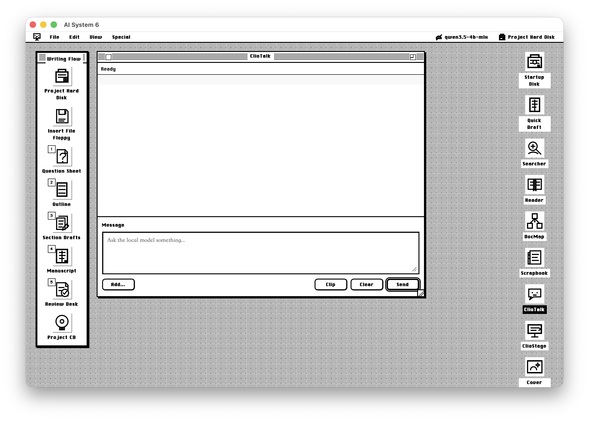

<!-- canonical-source: README.md -->
<!-- source-sha256: c2beacd5f6a52f7398227d7ee26c6de5b7a6601d2492c51d70ca122619083549 -->

<h1 align="center">AI System 6</h1>

<p align="center">
  一个从资料出发的本地优先写作桌面。<br>
  让摘录、草稿、审校和导出重新成为看得见的对象。
</p>

<p align="center">
  <a href="https://system6.aaronlau.me"><strong>打开在线版</strong></a>
  ·
  <a href="https://www.bilibili.com/video/BV1Bw726uE9g/">观看演示</a>
  ·
  <a href="README.md">English</a>
  ·
  <a href="README.zh-CN.md">简体中文</a>
</p>

<p align="center">
  <a href="https://system6.aaronlau.me"></a>
  
  
</p>

<p align="center">
  <a href="https://www.bilibili.com/video/BV1Bw726uE9g/">
    
  </a><br>
  <sub>点击截图可观看 B 站演示。</sub>
</p>

英文版为准。本文档仅供人类参考。

AI System 6 是一个本地优先的写作桌面，适合那些要围着资料做事的人。查资料、摘句子、搭结构、改稿和导出各有位置，不必全挤进一个聊天框。

它借用了 Macintosh System 6 的克制感：小窗口、清楚的对象、主动保存，一次只处理一件事。复古只是约束，真正想守住的是写作者自己的语气、来源、判断和交付意图。

## 为什么是桌面

- **工作看得见。** 资料、摘录、草稿、对话和导出都是可以回来继续处理的对象。
- **AI 先保持临时。** 模型可以阅读、整理、起草和审校，但只有在你明确操作之后，结果才会进入项目。
- **最后判断仍在作者手里。** 系统围绕证据、修改和交付来组织，而不是追求无摩擦地产出更多文字。

## 写作路线

```text
Project Hard Disk -> File Floppy -> Question Sheet -> Outline
-> Section Drafts -> Manuscript -> Review Desk -> Project CD
```

每一站只做一件事。ClioTalk 和 SideAsk 可以在途中帮忙；Reader、Scrapbook、TeachText、Review Desk 和 Project CD 则让工作始终落在看得见的文件上。

## 试试看

最快的入口是 [在线版](https://system6.aaronlau.me)。

也可以在本地运行公开源码：

```sh
git clone https://github.com/surfine/AI-System-6.git
cd AI-System-6
npm install
npm start
```

然后打开 `http://localhost:4173`。

## 模型与数据

AI System 6 可以连接 LM Studio 兼容的本地端点，也支持用户自行配置的云模型。密钥只在运行时提供，不写进仓库。“本地优先”是默认方向，并不意味着所有可选模型都能离线运行。

## 公开仓库的边界

这里维护的是一份公开安全版源码快照，包括 app 源码、服务端路由、测试和本地开发需要的小型资源。

私人草稿、浏览器数据、凭据、生成 bundle、构建产物、包缓存、大型抓取语料和原始私有 Git 历史都不在其中。

项目仍在持续开发，一些界面和工作方式还处于实验阶段，之后可能继续调整。

## License

目前还没有选择开源许可证。在正式加入 license 之前，代码可以用于查看和协作，但默认不授予复用权利。
