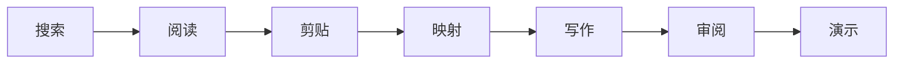

<!-- canonical-source: README.md -->
<!-- source-sha256: e6b041395700858ebca4b387d791c7ec80b0548cf3df82df1d5dc87c685110b1 -->

> 英文版为准 ・ 仅供人类参考

<div align="center">

<samp>本地优先 // 模型无关 // 文件原生 // 无前端框架</samp>

# AI SYSTEM 6

### AI 现在有桌面了。

一个以 Macintosh System 6 为灵感的工作空间：AI 可以在真实应用与可见文件之间
**搜索、阅读、映射、写作、审阅、制图、演示和创造**。

[](https://system6.aaronlau.me)
[](https://www.bilibili.com/video/BV1ht3m6UEDb/)
[](https://aisystem6.pages.dev)
[](https://github.com/surfine/AI-System-6/releases/latest)

[](https://github.com/surfine/AI-System-6/stargazers)
[](https://github.com/surfine/AI-System-6/releases/latest)
[](https://github.com/surfine/AI-System-6/actions/workflows/ci.yml)
[](LICENSE)
[](README.md)
[](README.zh-CN.md)

[](https://system6.aaronlau.me)

<strong>录自真实运行中的系统，不是概念渲染。</strong><br>
一张桌面，六套正式外观；把现代 AI 输入输出放进 1988 年的对象模型。

<sub>
<a href="https://system6.aaronlau.me">立即体验</a> ·
<a href="#为什么要用桌面">为什么</a> ·
<a href="#系统地图">系统地图</a> ·
<a href="#在本地启动">本地运行</a> ·
<a href="docs/README.zh-CN.md">文档</a> ·
<a href="CONTRIBUTING.zh-CN.md">参与贡献</a>
</sub>

</div>

## 为什么要用桌面？

大多数 AI 产品把工作藏进一段对话。AI System 6 给工作一个真正存在的地方。

| 聊天窗口 | AI System 6 |
| --- | --- |
| 上下文消失在提示词里 | 来源、剪贴、提示词和输出始终可见 |
| 一条对话独占整个流程 | MultiFinder 让多个工作应用同时保持打开 |
| 生成文字悄悄变成文档 | 只有保存、剪贴、插入或导出后，AI 输出才会成为持久内容 |
| 模型本身就是产品 | 可接入 LM Studio、Ollama、DeepSeek 或其他兼容服务 |
| 终点还是一个回答 | 终点是文件、手稿、图表、演示文稿、封面或 3D 成品 |

> 硬盘告诉你什么会留下，软盘告诉你什么只是临时材料；Scrapbook 只包含你主动
> 留下的东西。复古界面不是产品本身，而是让 AI 工作保持清晰可读的约束。

## 可见的完整路线



- **钟点稿**把一个想法或一份材料变成可保存、下载或分享的短稿。
- **创作坊**让大型项目从研究和问题纸，走过大纲、章节草稿、手稿与审阅台。
- **搜索器、阅读器、时光机、Scrapbook 与文档地图**把证据和推理留在桌面上，
  而不是藏进看不见的 agent 迷宫。
- **ClioChart、ClioStage、玻璃封面与配色工作台**把同一份工作转成图表、演示、
  视觉成品和 USDZ。

## 这台 1988 年的电脑本不该会这些

- 通过 **LM Studio** 或 **Ollama** 运行本地 AI。
- 搜索网页，并通过 Wayback Machine 重访历史页面。
- 从文件软盘转写音频、OCR 图片和文档。
- 用 **ClioChart** 把 Markdown 数据变成可编辑的视觉投影。
- 用 **ClioStage** 制作并播放 Markdown 演示文稿。
- 在**玻璃封面**中渲染折射式 WebGL 字体。
- 在**配色工作台**编辑 3D 产品配色并导出 AR 所需的 USDZ。
- 在 **System 6、Platinum、Aqua、Snow Leopard、Yosemite 与 Liquid Glass**
  之间切换整张桌面，同时不移动任何工作内容。

System 6 是默认外观。经典界面从真实的 System 6.0.8 资源和当时的 Macintosh
行为出发，绝不是泛化的复古重绘。

## 系统地图

```text
AI System 6
├── app/        浏览器操作系统：核心服务、应用、生成注册表
├── src/        小型无状态 Node.js 服务和模型适配层
├── styles/     一套对象语法、六套外观系统
├── assets/     运行时媒体、字体、图标、OCR 与 3D 载荷
├── shell/      Apple Silicon 桌面外壳
├── scripts/    确定性的构建器与验证门禁
├── tests/      可执行的产品、架构与发布契约
└── docs/       架构、开发与设计证据
```

浏览器应用使用原生 JavaScript，没有前端框架，也没有转译器。持久项目状态保存在
IndexedDB，服务端没有应用数据库。启动关键代码被限制在大约两张 1.44 MB 软盘内，
重型工具则从“第三张软盘”懒加载。

进一步阅读[架构](docs/ARCHITECTURE.zh-CN.md)、[开发指南](docs/DEVELOPMENT.zh-CN.md)
和[设计证据](docs/design/DESIGN.zh-CN.md)。

## 在本地启动

需要 Node.js 20 或更新版本。

```bash
git clone https://github.com/surfine/AI-System-6.git
cd AI-System-6
npm ci
npm start
```

打开 [http://localhost:4173](http://localhost:4173)。没有模型也能使用桌面，之后再到
「控制面板」连接即可。

```bash
npm run build          # 确定性生成浏览器 bundle
npm test               # 可执行的功能契约
npm run verify:public  # 仓库、命令、资产与文档门禁
```

公开仓库是一份经过整理、可独立验证的源码快照。内部签名与部署机械刻意不公开；它所
暴露的每一条命令都必须能在全新 clone 中运行。完整约定见
[开发指南](docs/DEVELOPMENT.zh-CN.md)。

## 接入你自己的模型

| 路线 | 适合场景 |
| --- | --- |
| **LM Studio** | 本地对话、embedding、模型发现和加载 |
| **Ollama** | 本地 OpenAI 兼容模型服务 |
| **DeepSeek** | 内置云端配置 |
| **自定义 / OpenAI 兼容** | 你自己的 endpoint 与模型 |
| **无模型** | 探索桌面与非 AI 工具 |

项目、引用、剪贴和设置保留在浏览器中；提供商凭证不会写入项目文件、对话、备份或导出。

## Apple Silicon 测试版

在[最新 Release](https://github.com/surfine/AI-System-6/releases/latest)下载适用于
Apple Silicon（M1 或更新）与 macOS 13 或更新版本的 Mac 测试版。它只是同一套本地
优先工作空间的轻量外壳。目前采用 ad-hoc 签名而非公证，首次启动可能需要
**按住 Control 点击 → 打开**。

## 和我们一起构建

AI System 6 采用 MIT 许可证。请先阅读
[CONTRIBUTING.zh-CN.md](CONTRIBUTING.zh-CN.md)，通过 issue 模板提交问题，并让每次
改动小到可以明确验证它对应的产品契约。安全报告请遵循
[SECURITY.zh-CN.md](SECURITY.zh-CN.md)。

如果你也想让这样的 AI 电脑存在，最高杠杆的贡献只需要一次点击：

<div align="center">

## ★ 给仓库一颗星

它会让更多构建者看到：可见、本地优先的 AI 软件值得被认真做出来。

<a href="https://www.star-history.com/#surfine/AI-System-6&Date">
  <picture>
    <source media="(prefers-color-scheme: dark)" srcset="https://api.star-history.com/svg?repos=surfine/AI-System-6&type=Date&theme=dark">
    <source media="(prefers-color-scheme: light)" srcset="https://api.star-history.com/svg?repos=surfine/AI-System-6&type=Date">
    
  </picture>
</a>

[**打开实时桌面**](https://system6.aaronlau.me) ·
[**在 B 站观看**](https://www.bilibili.com/video/BV1ht3m6UEDb/) ·
[**产品官网**](https://aisystem6.pages.dev) ·
[**最新 Release**](https://github.com/surfine/AI-System-6/releases/latest)

<sub>AI System 6 是独立项目，与 Apple Inc. 无隶属或背书关系。</sub>

</div>
