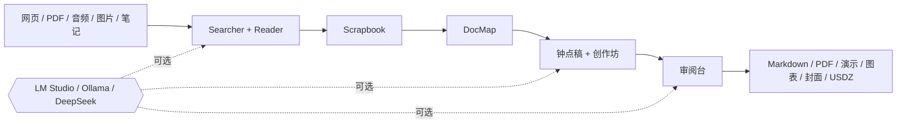

<!-- canonical-source: README.md -->
<!-- source-sha256: 15e3d1919911d693e09c5ee703550626e4c365b9390b5271be0ba70224a057a2 -->

> 英文版为准 / 仅供人类参考

<div align="center">

<samp>1988 年的对象 / 2026 年的智能</samp>

# AI System 6

**AI 现在有桌面了。**<br>
一台以 Macintosh System 6 为灵感、本地优先、以文件为原生对象的 AI 电脑。

[**启动实时系统**](https://system6.aaronlau.me)&nbsp;&nbsp;&nbsp;[**观看 50 秒短片**](https://www.bilibili.com/video/BV1ht3m6UEDb/)&nbsp;&nbsp;&nbsp;[**进入产品官网**](https://aisystem6.pages.dev)&nbsp;&nbsp;&nbsp;[**下载 MAC 测试版**](https://github.com/surfine/AI-System-6/releases/latest)

<sub><a href="README.md">English</a> / <a href="docs/README.zh-CN.md">文档</a> / <a href="CONTRIBUTING.zh-CN.md">参与贡献</a> / <a href="https://github.com/surfine/AI-System-6/stargazers">给这台机器一颗星 ★</a></sub>

<br><br>

<a href="https://system6.aaronlau.me"><picture>
  <source media="(prefers-color-scheme: dark)" srcset="site/img/frames/liquid-glass.webp">
  
</picture></a>

<sub>你的 GITHUB 主题刚刚选好了时代：浅色是 1988，深色是 2026。<br>
里面还有四个时代。在浏览器里启动它。不需要先连接模型。</sub>

</div>

## Chat 只是一个 App，不是整台电脑

Chat 很适合谈话，却不适合充当文件系统、工作空间、来源记录与长期项目界面。
AI System 6 把 Chat 删掉的电脑能力放了回来。

| 聊天产品 | 这台电脑 |
| --- | --- |
| 一条对话独占流程 | MultiFinder 让真实工作应用同时保持打开 |
| 上下文消失在提示词里 | 来源、剪贴、地图、草稿和输出始终可见 |
| 生成文字悄悄变成真相 | 只有保存、剪贴、插入或导出后，AI 输出才会持久化 |
| 回答就是终点 | 终点是文件、手稿、图表、演示、封面或 3D 对象 |

> 硬盘告诉你什么会留下，软盘告诉你什么只是临时材料。Scrapbook 只包含你主动留下的东西。

## 这是正在运行的系统

<div align="center">

[](https://system6.aaronlau.me)

<sub>录自真实产品，不是概念渲染。</sub>

</div>

## 一张桌面，六套系统

文件和已打开的窗口从不移动，整台电脑在它们周围改变时代。

<table>
  <tr>
    <td width="33%" align="center"><br><code>1988 / SYSTEM 6</code></td>
    <td width="33%" align="center"><br><code>1999 / PLATINUM</code></td>
    <td width="33%" align="center"><br><code>2002 / AQUA</code></td>
  </tr>
  <tr>
    <td width="33%" align="center"><br><code>2009 / SNOW LEOPARD</code></td>
    <td width="33%" align="center"><br><code>2014 / YOSEMITE</code></td>
    <td width="33%" align="center"><br><code>2026 / LIQUID GLASS</code></td>
  </tr>
</table>

每一帧都由 `npm run site:capture-frames` 从同一张实时桌面抓取。System 6
从真实的 System 6.0.8 资源与实测 Macintosh 行为出发；后来的时代拥有各自独立、
适配 Retina 的图标家族。这是一台共享工作状态的时间机器，不是六张效果图。

<div align="center"><sub>本页每一个桌面像素都是真实系统捕获。没有任何示意图。</sub></div>

## 来源进入，文件出来



AI 是可选项，来源记录不是。服务器只是一座无状态桥梁，项目的持久状态留在你的
浏览器里。凭据不会进入项目文件、聊天、备份或导出物。

## 一台 1988 年电脑不该会的软件

| 系统任务 | 真实应用 |
| --- | --- |
| **查找与记忆** | Searcher 搜索网页，Reader 提取来源，Time Machine 重访历史页面 |
| **收集与理解** | 文件软盘导入、OCR 和转写；Scrapbook 保存选中的证据；DocMap 展开结构 |
| **写作与检查** | 钟点稿负责短路线；创作坊把研究带到手稿；审阅台检查结果 |
| **制作与交付** | ClioChart 制作图表，ClioStage 演示文稿，玻璃封面渲染 WebGL 字体，配色工作台导出可用于 AR 的 USDZ |

这张桌面也会启动、关机、重启并恢复工作现场。在手机上，它会收束成一个个聚焦的
全屏应用，而不是变成普通的移动端仪表板。

## 桌面两张软盘就能启动。你的模型不行。

```text
系统软盘预算 ────────────────────────────────── 2 × 1.44 MB

启动关键载荷      ▓▓▓▓▓▓▓▓▓▓▓▓▓▓▓▓▓▓▓▓▓▓▓▓▓▓▓░  约占预算 99%
硬性上限          2,978,000 字节，由发布门禁强制执行
重型工具          惰性加载，来自第三张盘
```

当启动关键的浏览器载荷超出约两张 1.44&nbsp;MB 软盘时，发布流水线直接失败。
约束本身就是产品。

## 打开这台机器

| 入口 | 你会看到什么 |
| --- | --- |
| [**实时桌面**](https://system6.aaronlau.me) | 完整的浏览器电脑。无需模型即可启动，需要时再连接。 |
| [**B 站 50 秒短片**](https://www.bilibili.com/video/BV1ht3m6UEDb/) | 搜索、来源处理、写作、文件与 MultiFinder 的真实运动。 |
| [**产品官网**](https://aisystem6.pages.dev) | 六时代漫游、启动与关机仪式、移动端体验和完整产品故事。 |
| [**Mac 测试版**](https://github.com/surfine/AI-System-6/releases/latest) | 最新的桌面打包版本。 |

## 仓库就是系统图

```text
AI-System-6/
├── apps/
│   ├── desktop/       浏览器电脑：系统服务、应用、样式、资源
│   └── server/        无状态 Node.js 桥梁与模型适配器
├── site/              可独立部署的产品官网
├── platform/
│   ├── macos/         原生重写与轻量桌面壳
│   └── web/           生产 Web 发版契约
├── tooling/           构建、验证、打包、快照、发布
├── tests/             可执行的产品与架构契约
├── docs/              公开架构、开发说明与设计证据
└── internal/          维护者证据、有效计划与运维手册
```

这些是物理所有权边界，不是装饰性文件夹。浏览器 URL 保持稳定
（`/app`、`/assets`、`/data`），源码所有权则固定在 `apps/desktop`。
仓库布局测试会阻止退役的根目录副本和兼容性软链接重新出现。

继续阅读[架构](docs/ARCHITECTURE.zh-CN.md)、
[开发指南](docs/DEVELOPMENT.zh-CN.md)与
[设计契约](docs/design/DESIGN.zh-CN.md)。

## 在本机启动一台

需要 Node.js 20 或以上版本。

```bash
git clone https://github.com/surfine/AI-System-6.git
cd AI-System-6
npm ci
npm start
```

打开 [localhost:4173](http://localhost:4173)，然后检查这台机器的内部结构：

```bash
npm run build          # 确定性桌面构建
npm test               # 可执行产品契约
npm run site:check     # 官网与真实产品帧门禁
npm run verify:public  # 仓库、命令、资源与文档门禁
```

公开仓库是一份经过筛选、可独立验证的源码快照。每一条公开命令都必须能从全新克隆运行。

<details>
<summary><strong>带上你自己的智能</strong></summary>

| 路线 | 用途 |
| --- | --- |
| **LM Studio** | 本地聊天、Embedding、发现与模型加载 |
| **Ollama** | 本地 OpenAI 兼容服务 |
| **DeepSeek** | 内置云端配置 |
| **自定义端点** | 任意兼容的服务与模型 |
| **不用模型** | 桌面和全部非 AI 工具 |

</details>

## 帮这台电脑逃出实验室

AI System 6 采用 MIT 许可证。你可以从
[CONTRIBUTING.zh-CN.md](CONTRIBUTING.zh-CN.md) 开始，以可复现的产品契约提交
Issue；安全问题请按 [SECURITY.zh-CN.md](SECURITY.zh-CN.md) 报告。

<div align="center">

     

<sub>同一块硬盘。六个时代。同一份工作。</sub>

### 如果 AI 软件应该重新像一台电脑，

# [★ 给 AI SYSTEM 6 一颗星](https://github.com/surfine/AI-System-6)

每一颗星都能帮助这台奇怪的机器找到它的建造者。

[**实时桌面**](https://system6.aaronlau.me)&nbsp;&nbsp;&nbsp;[**B 站短片**](https://www.bilibili.com/video/BV1ht3m6UEDb/)&nbsp;&nbsp;&nbsp;[**产品官网**](https://aisystem6.pages.dev)&nbsp;&nbsp;&nbsp;[**最新版本**](https://github.com/surfine/AI-System-6/releases/latest)

<sub>独立项目，与 Apple Inc. 无隶属或背书关系。</sub>

</div>
