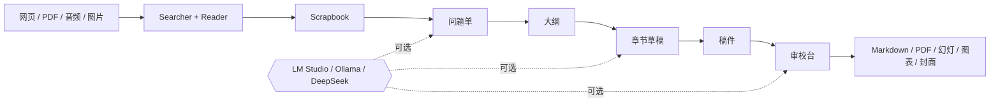

<!-- canonical-source: README.md -->
<!-- source-sha256: 0d98f54f0f922e12850c8e8fafe5a9f7f16f5ce09164c7becef4292639c9df61 -->

> 英文版为准 / 仅供人类参考

<div align="center">

<samp>1988 年的对象 / 2026 年的智能</samp>

# AI System 6

**一张本地优先的写作桌，AI 永远不会变成你的嗓音。**<br>
从你粗糙的问题到一篇能交出去的稿子，只有一条路线。项目留在浏览器，服务端不留项目。两张软盘。

[](LICENSE)
[](package.json)
[](#在一个-1988-年的约束下建造)
[](#自带模型)
[](https://system6.aaronlau.me)

[**立即启动**](https://system6.aaronlau.me)&nbsp;&nbsp;·&nbsp;&nbsp;[**50 秒影片**](https://www.bilibili.com/video/BV1ht3m6UEDb/)&nbsp;&nbsp;·&nbsp;&nbsp;[**产品官网**](https://aisystem6.pages.dev/zh-CN.html)&nbsp;&nbsp;·&nbsp;&nbsp;[**Mac 测试版**](https://github.com/surfine/AI-System-6/releases/latest)&nbsp;&nbsp;·&nbsp;&nbsp;[English](README.md)

<br>

<a href="https://system6.aaronlau.me"><picture>
  <source media="(prefers-color-scheme: dark)" srcset="site/img/frames/liquid-glass.webp">
  
</picture></a>

<sub>你的 GITHUB 主题刚刚替你选好了时代：浅色是 1988，深色是 2026。<br>
里面还有四套。只是随便看看的话，不需要任何模型。</sub>

</div>

## 目录

- [它保护的是什么](#它保护的是什么)
- [60 秒跑起来](#60-秒跑起来)
- [路线就是产品](#路线就是产品)
- [聊天是一个应用，不是整台计算机](#聊天是一个应用不是整台计算机)
- [约束仍然容得下什么](#约束仍然容得下什么)
- [它还能跑 DOOM](#它还能跑-doom)
- [一张桌子，六个系统](#一张桌子六个系统)
- [在一个 1988 年的约束下建造](#在一个-1988-年的约束下建造)
- [自带模型](#自带模型)
- [这个仓库如何让自己保持诚实](#这个仓库如何让自己保持诚实)
- [仓库是怎么摆的](#仓库是怎么摆的)
- [参与贡献](#参与贡献)

## 它保护的是什么

用语言模型写东西很容易。难的是从另一头出来时，听上去还像你自己。

AI System 6 建立在一个判断上：你的语言、你的来源、你的判断、你对这件事的感受，
以及你心里那个"这篇是写给谁的"，才是有价值的部分。只要你把笔交出去，模型会把这五样
一起磨平成一段得体但转头就忘的文字。所以在这里，笔不在它手上。

- **AI 的产出是临时的**，直到你存下、剪下、插入或导出为止。
- **落到哪里由你说了算** —— 问题单、大纲、当前的章节草稿、稿件，还是 Scrapbook；
  以及它是追加、只替换你选中的那一段，还是新建一份。
- **审校台会检查你有没有滑进模型的腔调**：节奏过于齐整、通用的总结语气、
  个人细节被抹平、读起来像新闻稿的模糊措辞。它排在最后一站是有原因的。
- **你的粗糙不是缺陷。** 犹豫、一个还没核实的数字、一句私人的旁白、一句说得有点太直的话：
  这些都带着判断，这条路线是为了留住它们，而不是把它们打磨掉。

Macintosh System 6 桌面是**约束，不是卖点**。看得见的对象、要动手才会保存、一次只做
一件写作的事。它在这里，是因为它让上面每一条承诺都能靠看屏幕来核实。

## 60 秒跑起来

需要 Node.js 24+。不需要 API key，不需要账号，不需要模型。

```bash
git clone https://github.com/surfine/AI-System-6.git
cd AI-System-6
npm ci
npm start          # http://localhost:4173
```

桌面启动后，所有不依赖 AI 的工具都能用。之后可以在控制面板里接上 LM Studio、Ollama、
DeepSeek，或任何兼容 OpenAI 的端点。

```bash
npm run build            # 确定性的桌面 bundle
npm test                 # 可执行的产品契约
npm run verify:public    # 仓库、命令、资源与文档门禁
```

或者干脆不用克隆，直接在浏览器里
[**启动线上系统**](https://system6.aaronlau.me)。
[Mac 测试版](https://github.com/surfine/AI-System-6/releases/latest)
自带当前的 Node 运行时，什么都不用装。

## 路线就是产品

```text
项目硬盘 → 文件软盘 → 问题单 → 大纲
  → 章节草稿 → 正文 → 审校台 → 项目光盘
```

这个仓库里其他所有东西，都是你召唤到这条路线上的工具。

| 站点 | 它装着什么 |
| --- | --- |
| **项目硬盘** | 持久的项目状态：参考资料、草稿、剪贴 |
| **文件软盘** | 你挂上去的临时上下文：PDF、网页、音频、图片 |
| **问题单** | 收件人、你原始的问题、你自己看到的东西 |
| **大纲** | 用你的话写的结构；每个 `##` 都能变成一节草稿 |
| **章节草稿** | 一次一节，并且明确谁才是可编辑的那一方 |
| **稿件** | TeachText；起草期间是只读的，所以没有东西能改写它 |
| **审校台** | 事实、结构，以及它是否还像你写的 |
| **项目光盘** | 完成的 Markdown 与其他明确生成的只读交付物 |

<table>
  <tr>
    <td width="50%"><br><sub><b>问题单</b> · 收件人、原始问题、你预料到的反驳</sub></td>
    <td width="50%"><br><sub><b>大纲</b> · 四节，仍然是写作者自己的话</sub></td>
  </tr>
  <tr>
    <td width="50%"><br><sub><b>章节草稿</b> · 没核实的数字就让它没核实着</sub></td>
    <td width="50%"><br><sub><b>稿件</b> · 起草期由章节草稿持有正文，稿件只读</sub></td>
  </tr>
</table>

<div align="center"><sub>四个站点，由 <code>npm run site:capture-route</code> 在运行中的应用里拍下。<br>里面的材料是照写作者的写法敲进去的。没有连接任何模型。</sub></div>

在路线旁边，需要时召唤：**Searcher** 和 **Reader** 上活的网页、**Time Machine** 看存档页面、
**文件软盘**做带 OCR 和转写的导入、**Scrapbook** 存你特意剪下来的证据、**DocMap** 看结构、
**ClioTalk** 做对话，还有属于写作的桌面附件 —— 便签本（它的纸条可以送去 TeachText、
Scrapbook 或 ClioTalk）、字典，以及给一个安静写作区间用的写作铃。**图片提示词工作室**
把一句想法写成可直接粘贴的 GPT-Image 与通用提示词；它只写提示词，从不替你画图。

## 聊天是一个应用。不是整台计算机。

聊天很擅长对话。但它是个糟糕的文件系统、糟糕的工作区、糟糕的出处模型，
也是个糟糕的长期项目界面。

| 一个聊天产品 | 这台计算机 |
| --- | --- |
| 一条会话主导整个流程 | MultiFinder 让真正在干活的应用同时开着 |
| 上下文消失进提示词里 | 来源、剪贴、图谱、草稿和产出都摆在明处 |
| 生成的文字悄悄变成事实 | AI 产出保持临时，直到你留下它 |
| 答案就是终点 | 终点是一个文件、图表、幻灯、封面或 3D 对象 |



> 硬盘告诉你什么是长久的。软盘告诉你什么是临时的。Scrapbook 里只有你选择留下的东西。

## 约束仍然容得下什么

写作路线始终在前，但真正的计算机也可以为其他工作留出位置，而不把它们变成必经站。
这些工具只在被召唤时加载，底下的写作对象仍然保持同样的意义。

<table>
  <tr>
    <td width="50%"><br><sub><b>ClioChart</b> · 稿件里的 Markdown 表格，投影成可编辑的图表</sub></td>
    <td width="50%"><br><sub><b>ClioStage</b> · 同一份稿件，作为演示放出来</sub></td>
  </tr>
  <tr>
    <td width="50%"><br><sub><b>配色工作台</b> · 3D 配色，可导出 USDZ 用于 AR</sub></td>
    <td width="50%"><br><sub><b>玻璃封面</b> · 折射式 WebGL 字体</sub></td>
  </tr>
</table>

<p align="center">
  
  <br><sub><b>图片提示词工作室</b> · 一个想法变成两条可直接粘贴的提示词</sub>
</p>

<div align="center"><sub>运行中应用的五个窗口，离线拍摄。没有模型，没有网络，没有摆拍。</sub></div>

## 它还能跑 DOOM

三个真正的游戏就装在这台桌面上，各有各的窗口，就在你刚才写的稿子旁边。

| 游戏 | 它是什么 |
| --- | --- |
| **Micropolis** | 初代 SimCity 的开源发行版 |
| **OpenTTD** | 开源版《运输大亨豪华版》，中文，带触控操作 |
| **DOOM** | DOOM |

<table>
  <tr>
    <td width="33%"><br><sub><b>Micropolis</b> · 1900 年 1 月，$20,000，欢迎你，市长</sub></td>
    <td width="33%"><br><sub><b>OpenTTD</b> · 1950 年，中文，中局</sub></td>
    <td width="33%"><br><sub><b>DOOM</b> · 引擎就绪，恶魔自带</sub></td>
  </tr>
</table>

它们不是游戏的动图。它们就是那些游戏，编译成 WebAssembly，和 Searcher、审校台运行在
同一个 MultiFinder 里。它们证明这套约束装得下真正的软件；写作路线的可信，则来自可见对象、
明确保存，以及每一件真正发生过的事都有回执。

## 一张桌子。六个系统。

文件和打开的窗口留在原地。整台计算机在它们周围换了时代。

<table>
  <tr>
    <td width="33%" align="center"><br><code>1988 / SYSTEM 6</code></td>
    <td width="33%" align="center"><br><code>1999 / PLATINUM</code></td>
    <td width="33%" align="center"><br><code>2002 / AQUA</code></td>
  </tr>
  <tr>
    <td width="33%" align="center"><br><code>2009 / SNOW LEOPARD</code></td>
    <td width="33%" align="center"><br><code>2014 / YOSEMITE</code></td>
    <td width="33%" align="center"><br><code>2026 / LIQUID GLASS</code></td>
  </tr>
</table>

六帧画面，一台活的桌面，由 `npm run site:capture-frames` 拍下。System 6 从真实的
System 6.0.8 资源和实际观察到的 Macintosh 行为出发；后面几个时代各有独立的、
适配 Retina 的图标家族。这里没有一张是摆拍，因为有一个脚本会从运行中的应用里
把它们全部重拍一遍。

<div align="center">

[](https://system6.aaronlau.me)

</div>

## 在一个 1988 年的约束下建造

```text
启动关键载荷            ▓▓▓▓▓▓▓▓▓▓▓▓▓▓▓▓▓▓▓▓▓▓▓▓▓▓░░  2,919,604 字节
两张 1.44 MB 软盘       ▓▓▓▓▓▓▓▓▓▓▓▓▓▓▓▓▓▓▓▓▓▓▓▓▓▓▓▓  2,949,120 字节
重型工具                按需懒加载，从第三张盘上来
```

当启动载荷超过两张软盘时，一道发布门禁会让构建失败。它装得下，第二张盘还空着一角。
每个功能都得在一条没人强迫我们设的限制面前挣够自己的字节；而上面那个数字是门禁自己
写下的，所以这句话不会悄悄变成假话。

## 自带模型

| 路线 | 用来做什么 |
| --- | --- |
| **LM Studio** | 本地对话、嵌入、发现、加载模型 |
| **Ollama** | 本地的 OpenAI 兼容服务 |
| **DeepSeek** | 内置的云端配置 |
| **自定义端点** | 任何兼容的提供方和模型 |
| **不用模型** | 桌面本身和所有不依赖 AI 的工具 |

持久的项目状态存在你浏览器的 IndexedDB 里。服务端是一座无状态的桥，没有应用数据库。
凭据不会进入项目文件、对话、备份或导出。

## 这个仓库如何让自己保持诚实

说法会烂掉。下面这些从一次全新克隆就能跑，并且会直接让构建失败。

| 门禁 | 它不允许发生什么 |
| --- | --- |
| `verify:floppy` | 启动载荷涨过两张 1.44&nbsp;MB 软盘 |
| `site:check` | 这个页面引用一个门禁从没量过的字节数 |
| `verify:docs` | 一份英文文档和它的中文镜像脱节 |
| `verify:public` | 这里宣传的命令在全新克隆里跑不通 |

上面那个载荷数字，是 `npm run verify:floppy` 自己写进
`site/data/floppy-budget.json` 的；官网去取它，这个页面引用它。这道门禁建好的当天，
它就抓到这份 README 在一个下午里三次引用了过期的数字。

这个页面和[产品官网](https://aisystem6.pages.dev)上的每一张产品截图，都由
`npm run site:capture-frames`、`npm run site:capture-route` 和
`tooling/capture-site-proofs.mjs` 从运行中的应用重新拍摄。它们每一个都会把应用启动起来、
拍下真实的窗口，所以不存在一个会过期的手工营销图目录 —— 因为根本没有手工营销图。

## 仓库是怎么摆的

```text
AI-System-6/
├── apps/
│   ├── desktop/       浏览器计算机：系统服务、应用、样式、资源
│   └── server/        无状态的 Node.js 桥与模型适配器
├── site/              可独立部署的产品官网
├── platform/          macOS 外壳与 web 发布契约
├── tooling/           构建、校验、采集、打包、发布
├── tests/             可执行的产品与架构契约
├── docs/              架构、开发、设计证据
└── internal/          维护者的证据、计划、运维
```

这些是归属边界，不是好看的文件夹：有一个布局测试会在退役的根目录副本和兼容软链接
回来之前就把它们拒掉。

请阅读[架构](docs/ARCHITECTURE.md)、[开发](docs/DEVELOPMENT.md)
和[设计契约](docs/design/DESIGN.md)。

## 参与贡献

从 [CONTRIBUTING.md](CONTRIBUTING.md) 开始，用一条可复现的产品契约开 issue，
或通过 [SECURITY.md](SECURITY.md) 报告安全问题。这里宣传的每一条命令都必须在全新克隆里
能跑通；公开仓库是一份可独立验证的源码快照。

## 许可证

[MIT](LICENSE)。独立项目，与 Apple Inc. 无从属或背书关系。

<div align="center">

     

<sub>一块硬盘。六个时代。同一份工作。</sub>

如果 AI 写作工具应该放过你的嗓音，就 **[★ 给 AI System 6 加星](https://github.com/surfine/AI-System-6)**。

[**线上桌面**](https://system6.aaronlau.me)&nbsp;&nbsp;·&nbsp;&nbsp;[**哔哩哔哩影片**](https://www.bilibili.com/video/BV1ht3m6UEDb/)&nbsp;&nbsp;·&nbsp;&nbsp;[**产品官网**](https://aisystem6.pages.dev)&nbsp;&nbsp;·&nbsp;&nbsp;[**最新版本**](https://github.com/surfine/AI-System-6/releases/latest)

</div>
