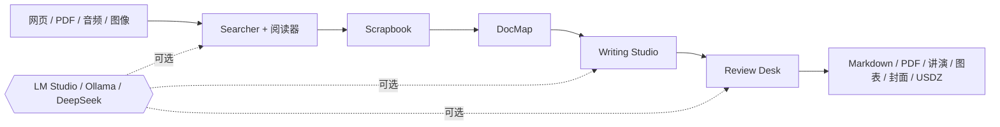

<!-- canonical-source: README.md -->
<!-- source-sha256: 1bc300e4f8e982a73a409f21c05b8135867d18a710a7cea3b05aec0900f0fb2d -->

> 英文版为准 / 仅供人类参考

<div align="center">

<samp>1988 年的对象 / 2026 年的智能</samp>

# AI System 6

**一台完整的 AI 桌面，跑在一个浏览器标签页里。**<br>
没有框架。没有转译器。没有数据库。两张软盘。

[](LICENSE)
[](package.json)
[](#在一个-1988-年的约束下建造)
[](#自带模型)
[](https://system6.aaronlau.me)

[**立即启动**](https://system6.aaronlau.me)&nbsp;&nbsp;·&nbsp;&nbsp;[**50 秒影片**](https://www.bilibili.com/video/BV1ht3m6UEDb/)&nbsp;&nbsp;·&nbsp;&nbsp;[**产品官网**](https://aisystem6.pages.dev)&nbsp;&nbsp;·&nbsp;&nbsp;[**Mac 测试版**](https://github.com/surfine/AI-System-6/releases/latest)&nbsp;&nbsp;·&nbsp;&nbsp;[English](README.md)

<br>

<a href="https://system6.aaronlau.me"><picture>
  <source media="(prefers-color-scheme: dark)" srcset="site/img/frames/liquid-glass.webp">
  
</picture></a>

<sub>你的 GITHUB 主题刚刚替你选好了时代：浅色是 1988，深色是 2026。<br>
里面还有四个时代。不接模型也能进去逛。</sub>

</div>

## 60 秒跑起来

需要 Node.js 20+。不需要 API key，不需要账号，不需要模型。

```bash
git clone https://github.com/surfine/AI-System-6.git
cd AI-System-6
npm ci
npm start          # http://localhost:4173
```

桌面启动后，所有不依赖 AI 的工具都能直接用。之后想接模型，再去「控制面板」里连
LM Studio、Ollama、DeepSeek 或任何 OpenAI 兼容端点。

```bash
npm run build            # 确定性的桌面 bundle
npm test                 # 可执行的产品契约
npm run verify:public    # 仓库、命令、资源与文档门禁
```

不想克隆，就直接在浏览器里[**启动 Live System**](https://system6.aaronlau.me)。

## 你正在看的是什么

一套桌面操作环境，用纯 JavaScript 写成。85 个源文件拼接成一个 bundle：没有框架，
没有转译器，应用代码没有构建步骤。

```text
85 个 JS 源文件        直接拼接，从不转译
9 个运行时依赖         服务端是无状态桥接，不是后端
153 条可执行契约       一个用户功能一条，不是一个函数一条
6 套图标家族           按时代分别绘制，不是一套滤镜出来的
2,940,197 字节         整台桌面，每次构建实测
0 个数据库             你的项目存在你自己的浏览器里
```

所有持久的东西都是看得见的对象：一块硬盘、一张软盘、一段摘录、一份手稿、一个废纸篓。
AI 是你指向这些对象的工具，它的产出在你保存、摘录、插入或导出之前始终是临时的。

## 一台 1988 年的桌面不该跑得动的软件

<table>
  <tr>
    <td width="50%"><br><sub><b>ClioChart</b> · 手稿里的一张 Markdown 表格，投影成可编辑的图</sub></td>
    <td width="50%"><br><sub><b>ClioStage</b> · 同一份手稿，变成一套讲演</sub></td>
  </tr>
  <tr>
    <td width="50%"><br><sub><b>配色工作台</b> · 一套 3D 配色，可导出 USDZ 用于 AR</sub></td>
    <td width="50%"><br><sub><b>玻璃封面</b> · 折射式 WebGL 字体</sub></td>
  </tr>
</table>

<div align="center"><sub>运行中应用的四扇窗口，全部离线捕获。没有模型，没有联网，没有示意图。</sub></div>

与它们并列的还有：**Searcher** 和 **阅读器** 负责实时网络，**Time Machine** 打开
存档页面，**文件软盘** 负责导入、OCR 与转写，**Scrapbook** 只保存你主动摘录的证据，
**DocMap** 负责结构，**Writing Studio** 与 **TeachText** 负责手稿，**Review Desk**
负责指出草稿哪里不对。

## 同一张桌面，六套系统

文件和打开的窗口原地不动，整台电脑在它们周围换代。

<table>
  <tr>
    <td width="33%" align="center"><br><code>1988 / SYSTEM 6</code></td>
    <td width="33%" align="center"><br><code>1999 / PLATINUM</code></td>
    <td width="33%" align="center"><br><code>2002 / AQUA</code></td>
  </tr>
  <tr>
    <td width="33%" align="center"><br><code>2009 / SNOW LEOPARD</code></td>
    <td width="33%" align="center"><br><code>2014 / YOSEMITE</code></td>
    <td width="33%" align="center"><br><code>2026 / LIQUID GLASS</code></td>
  </tr>
</table>

六张帧，同一张实时桌面，由 `npm run site:capture-frames` 捕获。System 6 从真实的
System 6.0.8 资源和实测 Macintosh 行为出发；后来的时代各自拥有独立、适配 Retina
的图标家族。这里没有一张是示意图，因为有脚本会从运行中的应用重新拍摄全部画面。

<div align="center">

[](https://system6.aaronlau.me)

</div>

## 在一个 1988 年的约束下建造

```text
启动关键载荷      ▓▓▓▓▓▓▓▓▓▓▓▓▓▓▓▓▓▓▓▓▓▓▓▓▓▓░░  2,940,197 字节
两张 1.44 MB 软盘  ▓▓▓▓▓▓▓▓▓▓▓▓▓▓▓▓▓▓▓▓▓▓▓▓▓▓▓▓  2,949,120 字节
重型工具          惰性加载，来自第三张盘
```

启动载荷一旦超出两张软盘，发布门禁就让构建失败。它装得下，第二张盘还空着一角。
每个功能都得在一个没人强迫我们遵守的上限里挣自己的字节数；上面这个数字由门禁本身
写出，所以这句话不会悄悄变成假话。

## 聊天是一个应用，不是整台电脑

聊天很擅长对话。它不适合当文件系统、工作区、出处模型，也撑不住长期项目。

| 聊天产品 | 这台电脑 |
| --- | --- |
| 一条会话独占整个工作流 | MultiFinder 让多个真实应用同时开着 |
| 上下文消失在提示词里 | 来源、摘录、地图、草稿和产出始终可见 |
| 生成的文字悄悄变成事实 | AI 产出在你留下它之前始终是临时的 |
| 答案就是终点 | 终点是一份文件、图表、讲演、封面或 3D 对象 |



> 硬盘告诉你什么会留下。软盘告诉你什么是临时的。Scrapbook 里只有你选择保留的东西。

## 自带模型

| 路线 | 用途 |
| --- | --- |
| **LM Studio** | 本地对话、嵌入、模型发现与加载 |
| **Ollama** | 本地 OpenAI 兼容服务 |
| **DeepSeek** | 内置云端配置 |
| **自定义端点** | 任何兼容的提供商与模型 |
| **不接模型** | 桌面本身，以及每一个非 AI 工具 |

持久的项目状态存在你浏览器的 IndexedDB 里。服务端是一个无状态桥接，没有应用数据库。
凭据从不进入项目文件、对话、备份或导出。

## 仓库是怎么分的

```text
AI-System-6/
├── apps/
│   ├── desktop/       浏览器电脑：系统服务、应用、样式、资源
│   └── server/        无状态 Node.js 桥接与模型适配
├── site/              可独立部署的产品官网
├── platform/          macOS 外壳与 Web 发布契约
├── tooling/           构建、验证、捕获、打包、发布
├── tests/             可执行的产品与架构契约
├── docs/              架构、开发、设计证据
└── internal/          维护者证据、计划、运维
```

这些是所有权边界，不是装饰性的文件夹：有一条布局测试会在退役的根目录副本和兼容性
符号链接回潮之前就拒绝它们。

延伸阅读：[架构](docs/ARCHITECTURE.md)、[开发](docs/DEVELOPMENT.md)、
[设计契约](docs/design/DESIGN.md)。

## 参与贡献

MIT 许可。请从 [CONTRIBUTING.md](CONTRIBUTING.md) 开始，用一条可复现的产品契约提
issue，或通过 [SECURITY.md](SECURITY.md) 报告安全问题。每一条对外声明的命令都必须
能从一次全新克隆跑通；公开仓库是一份可独立验证的源码快照。

<div align="center">

     

<sub>同一块硬盘。六个时代。同一份工作。</sub>

### 如果 AI 软件应该重新像一台电脑，

# [★ 给 AI SYSTEM 6 点个 STAR](https://github.com/surfine/AI-System-6)

[**LIVE DESKTOP**](https://system6.aaronlau.me)&nbsp;&nbsp;·&nbsp;&nbsp;[**BILIBILI 影片**](https://www.bilibili.com/video/BV1ht3m6UEDb/)&nbsp;&nbsp;·&nbsp;&nbsp;[**产品官网**](https://aisystem6.pages.dev)&nbsp;&nbsp;·&nbsp;&nbsp;[**最新发布**](https://github.com/surfine/AI-System-6/releases/latest)

<sub>独立项目。与 Apple Inc. 无关联，也未获其背书。</sub>

</div>
