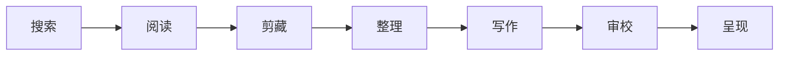

<!-- canonical-source: README.md -->
<!-- source-sha256: f426ea83bfc6fac6978b340a628b9e9da3d99c59b415b55337baa954ed34c3bf -->

<div align="center">

# AI System 6

### 现在，AI 有了一张桌面。

一套受 Macintosh System 6 启发的工作环境：让 AI 在真正的应用和看得见的文件之间完成**搜索、阅读、整理、写作、审校、制图、演示与创作**。

[](https://system6.aaronlau.me)
[](https://aisystem6.pages.dev)
[](https://github.com/surfine/AI-System-6/releases/latest)
[](https://www.bilibili.com/video/BV1ht3m6UEDb/)

[](https://github.com/surfine/AI-System-6/stargazers)
[](https://github.com/surfine/AI-System-6/releases/latest)
[](LICENSE)
[](#使用自己的模型)
[](README.md)
[](README.zh-CN.md)

[](https://system6.aaronlau.me)

**录自真正运行的系统，不是概念动画** —— 同一张桌面，六套正式外观；影片后半段是[官方网站](https://aisystem6.pages.dev)页面自己在轮换。点击即可在浏览器中使用。

</div>

英文版为准。本文档仅供人类参考。

## 不是又一个聊天框

大多数 AI 产品把所有任务塞进同一个聊天窗口。AI System 6 则给工作一个真正存在的地方。

| 在聊天框中 | 在 AI System 6 中 |
| --- | --- |
| 上下文消失在提示词里 | 来源、剪藏、提示词与输出始终可见 |
| 一段对话承包整个流程 | MultiFinder 让多个工作应用同时留在桌面上 |
| 生成文字悄悄变成正文 | AI 输出默认临时，只有保存、剪藏、插入或导出后才会留下 |
| 模型本身就是产品 | 自由选择 LM Studio、Ollama、DeepSeek 或其他 OpenAI 兼容服务 |
| 最终得到另一个回答 | 最终得到文件、文章、图表、幻灯片、封面或 3D 成品 |

## 现在写一篇，或者做一件更大的事

| | |
| --- | --- |
| **现在写一篇** | **Draft Desk** — 想法或素材 → 草稿 → 调整 → 交付 |
| **做一件更大的事** | **Writing Studio** — 研究 → 结构 → 草稿 → 审校 → 发布 |

Draft Desk 把单个想法或一份素材变成可保存、可下载、可分享的短文。Writing
Studio 则让更长的项目从来源与问题单出发，经过大纲、分节草稿和审校台完成。
两条路径都不必从搜索开始。

## 一张桌面，一条完整路径



对于长项目，完整桌面路径把研究与交付串在一起：

1. **Searcher** 寻找来源，**Reader** 打开证据。
2. **Time Machine** 通过 Wayback Machine 回到历史网页。
3. **Scrapbook** 只保留用户亲手挑选的材料。
4. **DocMap** 把研究内容变成看得见的观点与关系图。
5. **问题单 → 大纲 → 分节草稿 → TeachText** 让同一篇文章从混乱想法走向完成稿。
6. **审校台** 检查事实与结构风险，也检查泛化的“AI 代言感”。
7. **ClioChart、ClioStage 与 Cover Glass** 把同一份工作继续做成图表、演示文稿和视觉成品。

没有藏在后台的智能体迷宫。来源、文件、提示词与交接过程都留在桌面上。

## 这台 1988 年的电脑本不该做到这些

- 通过 **LM Studio 或 Ollama 在本地运行现代 AI**。
- **搜索与阅读互联网**，包括历史网页快照。
- 从文件软盘导入资料，完成**音频转写与图片、文档 OCR**。
- 使用 ClioChart 将 **Markdown 数据变成可编辑的可视化投影**。
- 使用 ClioStage **制作和播放 Markdown 演示文稿**。
- 在 Cover Glass 中**渲染带折射效果的 WebGL 文字**。
- 在 CMF Studio 中**编辑 3D iPhone 配色并导出用于 AR 的 USDZ**。
- 在不移动任何工作的前提下，让整个桌面在**六套正式外观 System 6、Platinum、Aqua、Snow Leopard、Yosemite 与 Liquid Glass** 之间切换。

System 6 是默认外观，Platinum、Aqua、Snow Leopard、Yosemite 与 Liquid Glass
是正式支持的替代外观。经典界面依据真实的 System 6.0.8 资源和同时代
Macintosh 交互方式制作，而非凭记忆重新绘制。

## 使用自己的模型

AI System 6 不绑定模型。可以按照隐私、硬件与预算选择不同通路。

| 通路 | 用途 |
| --- | --- |
| **LM Studio** | 本地聊天与 Embedding 模型，支持模型发现和加载 |
| **Ollama** | 本地 OpenAI 兼容模型服务 |
| **DeepSeek** | 内置云端服务配置 |
| **自定义 / OpenAI 兼容** | 使用自己的兼容接口与模型 |
| **不连接模型** | 直接体验桌面和非 AI 工具 |

项目、参考资料、剪藏和设置保存在浏览器本地。服务端不保存状态，模型凭据不会进入项目文件、聊天、备份或导出内容。

## Apple silicon Mac 测试版

如果更喜欢独立的应用窗口，可以下载[最新版 Mac 测试版](https://github.com/surfine/AI-System-6/releases/latest)。它只面向 **Apple silicon（M1 或更新芯片）**，系统要求为 **macOS 13 或更高版本**。

Mac 版是同一套本地优先工作环境的轻量外壳。应用会自行启动和关闭内置的本地服务，项目资料和模型凭据仍留在你的 Mac 上。目前测试版采用临时签名，尚未经过 Apple 公证；第一次启动时，可能需要按住 Control 点按应用，再选择“打开”。

## 本地运行

```bash
git clone https://github.com/surfine/AI-System-6.git
cd AI-System-6
npm install
npm start
```

打开 [http://localhost:4173](http://localhost:4173)。

如需使用本地 AI，请先启动 LM Studio、加载聊天模型，再到**控制面板**刷新模型。Ollama、云端与 OpenAI 兼容通路也可以在那里配置。

## 公开仓库实际支持的命令

<details>
<summary><strong>命令面、CI 与私有部分</strong>（点击展开）</summary>
<br>

这个 GitHub 仓库是经过整理的公开安全源码快照，不是维护者工作区的镜像：内部部署、签名、打包与原生工具命令只留在私有源码中。全新克隆后，实际受支持的命令如下：

```bash
npm ci                 # 安装锁定的依赖
npm start              # 构建浏览器包，然后启动 http://localhost:4173
npm run build          # 构建浏览器包
npm test               # 可执行的功能契约测试
npm run verify:public  # 公开仓库自洽验证（命令、文件、CI、文档）
```

只要有任何公开命令引用了本仓库不存在的文件，或出现了仅限内部的工具，`npm run verify:public` 就会失败。`.github/workflows/ci.yml` 中的 CI 运行的是与本地门禁相同的命令。`npm run verify:ship` 是维护者私有源树门禁，不属于公开 snapshot 支持的命令契约。
浏览器矩阵（`npm run test:e2e`）是给人类用的可选诊断，**不是**发版条件：
`verify:ship`、`verify:release`、默认 CI 和发版流程都不会运行 Playwright，
一次 flaky 的浏览器测试永远不会阻塞发版。

</details>

## 不一样的构建方式

- **本地优先：** 持久项目数据保存在 IndexedDB，服务端没有应用数据库。
- **基于文件：** 项目硬盘、文件软盘、Scrapbook、TeachText 和项目光盘是真正的工作对象，而不是装饰。
- **可以检查：** 模型输入、选中的 Skill、Harness、提示词与运行记录都应保持可见。
- **刻意保留：** AI 可以协助阅读、整理、起草、改写和审校，但不能悄悄变成作者本人。
- **以小为约束：** 构建门禁把启动所需的浏览器核心内容限制在约两张 1.44 MB 软盘的体量；重量级工具从“第三张软盘”按需加载。

浏览器端采用原生 JavaScript，配合一个小型、无状态的 Node.js 服务；没有前端框架或转译器。架构、验证方式与产品约束见 [CLAUDE.md](CLAUDE.md)。

## 为什么是 System 6？

因为桌面让状态变得可见。硬盘告诉你什么会长期保留；软盘告诉你什么只是临时材料；Scrapbook 只装下你决定留下的内容；垃圾桶则让删除变得诚实。

复古界面不是产品，而是让 AI 工作保持清楚的约束。

---

<div align="center">

如果你也想让这样的 AI 电脑真正存在，欢迎为仓库点下 **Star**、体验[在线桌面](https://system6.aaronlau.me)，并告诉我们你想在里面创造什么。

<a href="https://www.star-history.com/#surfine/AI-System-6&Date">
  <picture>
    <source media="(prefers-color-scheme: dark)" srcset="https://api.star-history.com/svg?repos=surfine/AI-System-6&type=Date&theme=dark">
    <source media="(prefers-color-scheme: light)" srcset="https://api.star-history.com/svg?repos=surfine/AI-System-6&type=Date">
    
  </picture>
</a>

[官方网站](https://aisystem6.pages.dev) · [在线桌面](https://system6.aaronlau.me) · [50 秒演示](https://www.bilibili.com/video/BV1ht3m6UEDb/) · [Issues](https://github.com/surfine/AI-System-6/issues)

MIT 许可证。AI System 6 是独立项目，与 Apple Inc. 不存在从属或背书关系。

</div>
