<!-- canonical-source: README.md -->
<!-- source-sha256: 57630c77b61ef22ac8d9e6dcbccd87f9fb0ff112d9162d1b29993ce26db99df2 -->

> 英文版为准 / 仅供人类参考

<div align="center">

<samp>1988 年的对象 / 2026 年的智能</samp>

# AI System 6

**一张本地优先的写作桌，AI 永远不会变成你的嗓音。**<br>
从你粗糙的问题到一篇能交出去的稿子，只有一条路线。项目留在浏览器，服务端不留项目。两张软盘。

[](LICENSE)
[](package.json)
[](#在一个-1988-年的约束下建造)
[](#自带模型)
[](https://system6.aaronlau.me)

[**立即启动**](https://system6.aaronlau.me)&nbsp;&nbsp;·&nbsp;&nbsp;[**50 秒影片**](https://www.bilibili.com/video/BV1ht3m6UEDb/)&nbsp;&nbsp;·&nbsp;&nbsp;[**产品官网**](https://aisystem6.pages.dev/zh-CN.html)&nbsp;&nbsp;·&nbsp;&nbsp;[**Mac 测试版**](https://github.com/surfine/AI-System-6/releases/latest)&nbsp;&nbsp;·&nbsp;&nbsp;[English](README.md)

<br>

<a href="https://system6.aaronlau.me"><picture>
  <source media="(prefers-color-scheme: dark)" srcset="site/img/frames/liquid-glass.webp">
  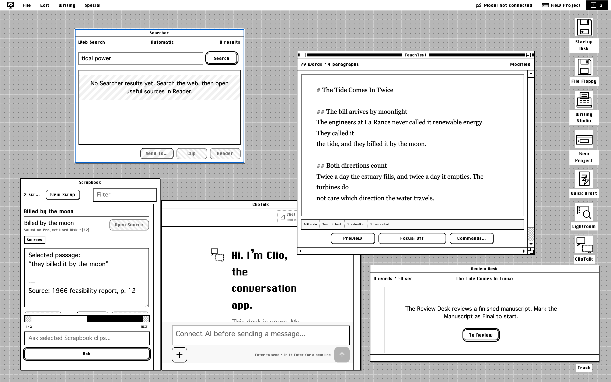
</picture></a>

<sub>你的 GITHUB 主题刚刚替你选好了时代：浅色是 1988，深色是 2026。<br>
里面还有四套。只是随便看看的话，不需要任何模型。</sub>

</div>

<div align="center">

**直接打开一个窗口：** [配色工作台](https://system6.aaronlau.me/go/cmf-studio) · [盆景城市](https://system6.aaronlau.me/go/bonsai-city) · [终末地终端](https://system6.aaronlau.me/go/endfield-terminal) · [时间机器](https://system6.aaronlau.me/go/time-machine) · [OpenTTD](https://system6.aaronlau.me/go/openttd) · [DOOM](https://system6.aaronlau.me/go/doom)

**或者读一块写完的盘：** [整个书架，停在最新一块](https://system6.aaronlau.me/go/disks) · [未来通车之后](https://system6.aaronlau.me/go/dtk) · [初代 iPad 为什么只有 256MB 内存](https://system6.aaronlau.me/go/ipad1) · [iPhone 12 Pro Max](https://system6.aaronlau.me/go/pm12)

<sub>每个应用都有唯一一个可分享的地址 <code>/go/&lt;app-id&gt;</code>。桌面围绕它打开；三十六块演示用项目硬盘用的是同一条地址规则，<b>启动磁盘上的「演示用项目硬盘」文件夹（File 菜单的同一项）</b>会把它们全部列出来，<code>/go/disks</code> 打开它时停在最新一块的正文上。</sub>

</div>

## 目录

- [1.0.56 有什么新东西](#1056-有什么新东西)
- [它保护的是什么](#它保护的是什么)
- [60 秒跑起来](#60-秒跑起来)
- [路线就是产品](#路线就是产品)
- [聊天是一个应用，不是整台计算机](#聊天是一个应用不是整台计算机)
- [约束仍然容得下什么](#约束仍然容得下什么)
- [盆景城市](#盆景城市)
- [One More Tune](#one-more-tune)
- [它还能跑 DOOM](#它还能跑-doom)
- [一张桌子，十二个系统](#一张桌子十二个系统)
- [在一个 1988 年的约束下建造](#在一个-1988-年的约束下建造)
- [自带模型](#自带模型)
- [这个仓库如何让自己保持诚实](#这个仓库如何让自己保持诚实)
- [仓库是怎么摆的](#仓库是怎么摆的)
- [参与贡献](#参与贡献)

## 1.0.56 有什么新东西

- **十二套外观。** System 7、Tiger 与 Lion 加入 1988–2026 这条线；没有发布过的
  Mac OS 8.5 主题 Drawing Board 与 NeXTSTEP 一起作为岔路。十二套都是「特别」菜单和
  控制面板里的正式选项。
- **最小化是真的，而且有去处。** 每个 Mac OS X 时代都能在关闭灯旁边画出黄灯，并带上
  自己的 Dock，逐项对照各时代截图量出来：Jaguar 素净的半透明面板、Snow Leopard 的
  玻璃搁架、Big Sur 悬浮的圆角板。两者默认都关着，需要时在控制面板的「通用」页打开
  「显示 Dock」和最小化。任何一个关掉都不会困住窗口（苹果菜单列出收起的窗口，关掉
  最小化时它们会原地收起）。NeXTSTEP 的 Dock 与 miniaturize 属于它自己的外壳，默认
  开着：Dock 只放固定程序，miniwindow 沿底边排开。各时代双击标题栏仍是 WindowShade。
- **Platinum 就是 Mac OS 9，NeXTSTEP 就是 3.3，一个部件一个部件地对。** 标签页、
  斜面按钮、列表表头、窗框、滚动条、滑块、对话框和选中的图标都重新对照真机量过；
  NeXTSTEP 的主菜单、窗框、控件、警告面板和 File Viewer 也一样，而且即使在单 Finder
  模式下它也保持多任务。
- **Lion 的全屏箭头就是全屏。** 窗口占满屏幕，Dock 让开，菜单栏在屏幕顶端等着。
- **写作流程贴合各自的时代。** NeXTSTEP 把它挂在主菜单下方，做成 3.3 的面板；
  Platinum 画成 Mac OS 9 的程序切换器；两者都能关闭，每个时代都能取回。
- **盆景城市、根线与兜风现在共用一个世界：盆地。** 同一座城市、同一份日历、
  同一批名字，无论在哪份存档里打开都一样。鹤洲 · 1952 就是那个做出来的例子——
  一座带桥、两座火车站、一个平交道口和一条地铁的江边小镇——兜风开的就是它，
  或者任何一份盆景城市存档，在街面高度上跑，而不是一座私有的演示小镇。
- **根线把地铁、BRT 与巴士规划成同一部交通字典。** 在底栏切换模式，或者按 M；
  铺一条大道，让 BRT 跑在它的中央车道上，花掉一份每周大道奖励，而一条附近没有桥
  的线路仍然过不了江。站点、票价和花盆自己的日历，都来自盆景城市与兜风看到的那
  同一座城市。
- **兜风跑的是根线规划出来的线路。** 一张照片现在会把花盆的印章、城区和日期盖进
  相册，而这次驾驶会从你上一次开的那只花盆开始，而不是从头再来。键盘、触控油门、
  方向盘和游戏手柄驱动的都是同一份只读城市快照；这次驾驶永远不会写进盆景城市存档。
- **盆景城市现在能把一块有边界的真实地方变成城市。** OSM 路径经服务器代理读取
  地理编码区域，映射到同一套 16 米网格，把这个地方自己的街道名和车站名带进存档，
  还能选择地形高程和建筑轮廓。界面和导出物都带 OpenStreetMap 署名与 ODbL 来源；
  高程或建筑层失败、缺失时，会明确显示缺失，不会悄悄编造城市数据。
- **Cover Glass 多了一份 Aqua 配方，小尺寸封面在导出前先检查。** 配方里加入了一圈
  反射混合描边和一次小尺寸检查，导出失败会明说出来，而不是一声不响。4× 导出不再
  渲染进一个被钳住的绘图缓冲区，打开 Post Blur 时，主体可以整个沉在整张封面的水下。
- **明文加入「游戏」文件夹。** 一部代笔人与海图师的中文原创视觉小说，现在有超分
  背景板与最终角色立绘，只在它的窗口打开时加载，存档留在本机。文件、故事与调试
  在菜单栏里；窗口不再带一条空的状态栏。
- **Soundscape 可以把 Apple Music 链接带到你自己的 Mac。** 粘贴专辑、单曲或歌单链接，
  本机获取并缓存浏览器能播放的结果；有可选无损引擎且浏览器支持时优先无损，否则诚实
  退回 AAC。VPS 或 Pages 只经由 loopback 桥请求已经配对的 Mac，Apple 凭据与音频不会
  进入云端。
- **「窗口」菜单只出现在 Mac OS X 及以后的外观里。** Aqua、Tiger、Snow Leopard、
  Lion、Yosemite、Big Sur 与 Liquid Glass 增加一个「窗口」菜单：所有窗口…、卷起与
  展开、靠左排列、靠右排列、铺满、还原排列、带回画面，以及置顶 / 取消置顶。经典与
  NeXTSTEP 一脉的外观（System 6、System 7、Platinum、Drawing Board 与 NeXTSTEP）
  没有这个菜单，它们保留自己找回收起窗口的方式。
- **「所有窗口…」列出每一个打开的窗口，并把你选中的那个恢复原状。** 这份列表跨越所有
  应用，用搜索框筛选，且不打断正在组字的输入法；方向键只移动列表光标，不重排列表；
  选中的窗口按它真实的状态恢复：被隐藏的应用会重新显示，最小化的窗口从 Dock 回来，
  其余情况则把窗口带到前面。按 Escape 关闭并交还焦点；第一次打开时才加载。⌘` 在前台
  应用的打开窗口间走一圈；你亲手卷起的窗口在这一圈里保持卷起。
- **收起的窗口可以先看一眼，甩一下就能排布。** 把指针停在一个卷起窗口的标题栏上约
  220 毫秒，会出现一次临时的只读预览，它不写入任何内容，移开指针或开始真正的操作就
  结束；右键会把它交给排列菜单。按住标题栏拖动后一甩，走的是与菜单同一条卷起、展开
  和铺满的命令路径。
- **窗口回到你离开它的地方。** 无论在进入全屏、WindowShade、Hide、Dock 最小化，还是
  回到某个项目之后，窗口的位置、尺寸与层级都会保持；一个被收起又取回的窗口，会回到
  你离开它的那一点，而不是某个默认位置。

## 它保护的是什么

用语言模型写东西很容易。难的是从另一头出来时，听上去还像你自己。

AI System 6 建立在一个判断上：你的语言、你的来源、你的判断、你对这件事的感受，
以及你心里那个"这篇是写给谁的"，才是有价值的部分。只要你把笔交出去，模型会把这五样
一起磨平成一段得体但转头就忘的文字。所以在这里，笔不在它手上。

- **AI 的产出是临时的**，直到你存下、剪下、插入或导出为止。
- **落到哪里由你说了算** —— 问题单、大纲、当前的章节草稿、稿件，还是 Scrapbook；
  以及它是追加、只替换你选中的那一段，还是新建一份。
- **审校台会检查你有没有滑进模型的腔调**：节奏过于齐整、通用的总结语气、
  个人细节被抹平、读起来像新闻稿的模糊措辞。它排在最后一站是有原因的。
- **你的粗糙不是缺陷。** 犹豫、一个还没核实的数字、一句私人的旁白、一句说得有点太直的话：
  这些都带着判断，这条路线是为了留住它们，而不是把它们打磨掉。

Macintosh System 6 桌面是**约束，不是卖点**。看得见的对象、要动手才会保存、一次只做
一件写作的事。它在这里，是因为它让上面每一条承诺都能靠看屏幕来核实。

## 60 秒跑起来

需要 Node.js 24+。不需要 API key，不需要账号，不需要模型。

```bash
git clone https://github.com/surfine/AI-System-6.git
cd AI-System-6
npm ci
npm start          # http://localhost:4173
```

桌面启动后，所有不依赖 AI 的工具都能用。之后可以在控制面板里接上 LM Studio、Ollama、
DeepSeek，或任何兼容 OpenAI 的端点。

```bash
npm run build            # 确定性的桌面 bundle
npm test                 # 可执行的产品契约
npm run verify:public    # 仓库、命令、资源与文档门禁
```

或者干脆不用克隆，直接在浏览器里
[**启动线上系统**](https://system6.aaronlau.me)。
[Mac 测试版](https://github.com/surfine/AI-System-6/releases/latest)
自带当前的 Node 运行时，什么都不用装。

## 路线就是产品

```text
项目硬盘 → 文件软盘 → 问题单 → 大纲
  → 章节草稿 → 正文 → 审校台 → 项目光盘
```

这个仓库里其他所有东西，都是你召唤到这条路线上的工具。

写作流程接受自由笔记，把 AI 生成大纲与起草放在编辑器旁，章节可以直接跳转。文章显示字数，口播稿另外显示预计时长；窄窗口里，下一步单独占一行。审校台可以直接返回全文编辑，并明确标出保存到项目光盘。正文保存成功才进入审校；保存期间切换文稿，也不会把旧稿写进新标签。

| 站点 | 它装着什么 |
| --- | --- |
| **项目硬盘** | 持久的项目状态：参考资料、草稿、剪贴 |
| **文件软盘** | 你挂上去的临时上下文：PDF、网页、音频、图片 |
| **问题单** | 收件人、你原始的问题、你自己看到的东西 |
| **大纲** | 用你的话写的结构；每个 `##` 都能变成一节草稿 |
| **章节草稿** | 一次一节，并且明确谁才是可编辑的那一方 |
| **稿件** | TeachText；起草期间是只读的，所以没有东西能改写它 |
| **审校台** | 事实、结构，以及它是否还像你写的 |
| **项目光盘** | 完成的 Markdown 与其他明确生成的只读交付物 |

<table>
  <tr>
    <td width="50%">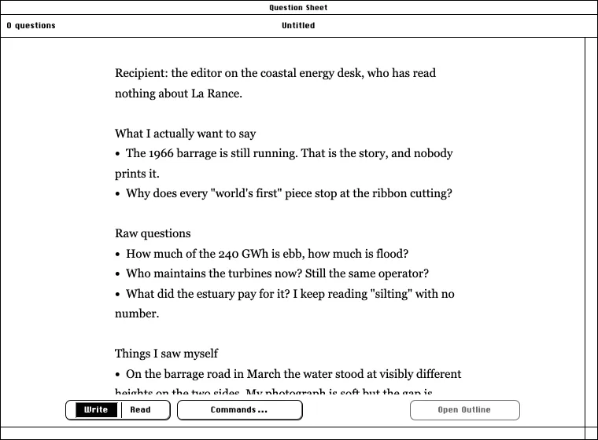<br><sub><b>问题单</b> · 收件人、原始问题、你预料到的反驳</sub></td>
    <td width="50%">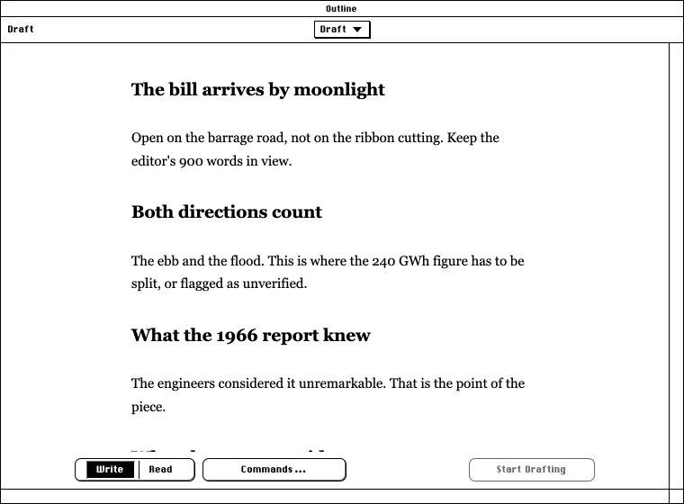<br><sub><b>大纲</b> · 四节，仍然是写作者自己的话</sub></td>
  </tr>
  <tr>
    <td width="50%">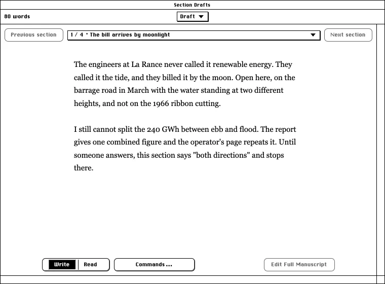<br><sub><b>章节草稿</b> · 没核实的数字就让它没核实着</sub></td>
    <td width="50%">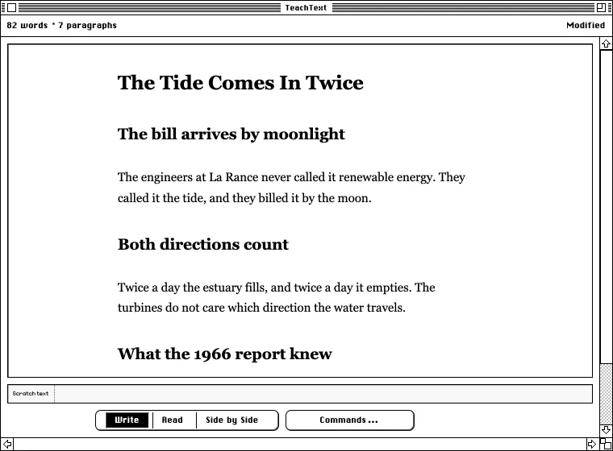<br><sub><b>稿件</b> · 起草期由章节草稿持有正文，稿件只读</sub></td>
  </tr>
</table>

<div align="center"><sub>四个站点，由 <code>npm run site:capture-route</code> 在运行中的应用里拍下。<br>里面的材料是照写作者的写法敲进去的。没有连接任何模型。</sub></div>

在路线旁边，需要时召唤：**Searcher** 和 **Reader** 上活的网页、**Time Machine** 看存档页面、
**文件软盘**做带 OCR 和转写的导入、**Scrapbook** 存你特意剪下来的证据、**DocMap** 看结构、
**ClioTalk** 做对话，还有属于写作的桌面附件 —— 便签本（它的纸条可以送去 TeachText、
Scrapbook 或 ClioTalk）、字典，以及给一个安静写作区间用的写作铃。**图片提示词工作室**
把一句想法写成可直接粘贴的 GPT-Image 与通用提示词；它只写提示词，从不替你画图。

## 聊天是一个应用。不是整台计算机。

聊天很擅长对话。但它是个糟糕的文件系统、糟糕的工作区、糟糕的出处模型，
也是个糟糕的长期项目界面。

| 一个聊天产品 | 这台计算机 |
| --- | --- |
| 一条会话主导整个流程 | MultiFinder 让真正在干活的应用同时开着 |
| 上下文消失进提示词里 | 来源、剪贴、图谱、草稿和产出都摆在明处 |
| 生成的文字悄悄变成事实 | AI 产出保持临时，直到你留下它 |
| 答案就是终点 | 终点是一个文件、图表、幻灯、封面或 3D 对象 |

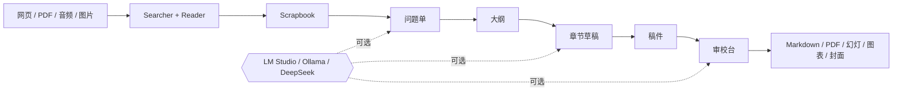
```mermaid
flowchart LR
    A["网页 / PDF / 音频 / 图片"] --> B["Searcher + Reader"]
    B --> C["Scrapbook"]
    C --> D["问题单"]
    D --> E["大纲"]
    E --> F["章节草稿"]
    F --> G["稿件"]
    G --> H["审校台"]
    H --> I["Markdown / PDF / 幻灯 / 图表 / 封面"]
    M{{"LM Studio / Ollama / DeepSeek"}} -. "可选" .-> D
    M -. "可选" .-> F
    M -. "可选" .-> H
```

> 硬盘告诉你什么是长久的。软盘告诉你什么是临时的。Scrapbook 里只有你选择留下的东西。

## 约束仍然容得下什么

写作路线始终在前，但真正的计算机也可以为其他工作留出位置，而不把它们变成必经站。
这些工具只在被召唤时加载，底下的写作对象仍然保持同样的意义。

<table>
  <tr>
    <td width="50%">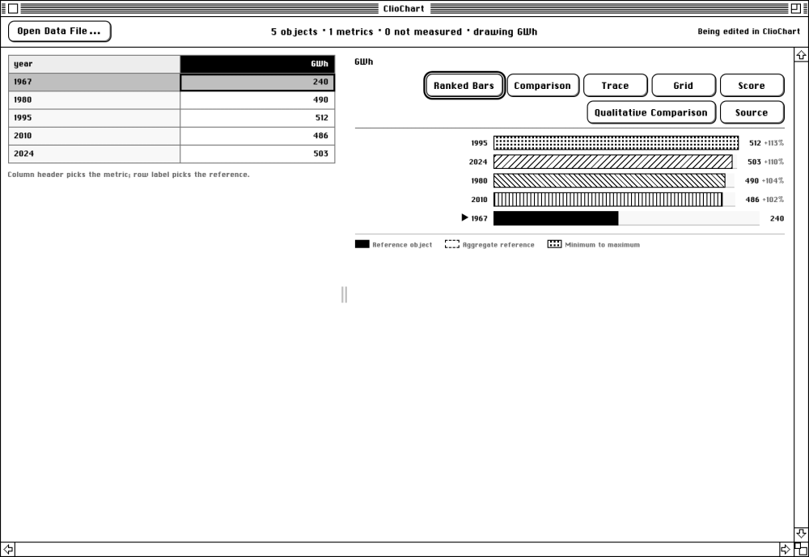<br><sub><b>ClioChart</b> · 稿件里的 Markdown 表格，投影成可编辑的图表</sub></td>
    <td width="50%">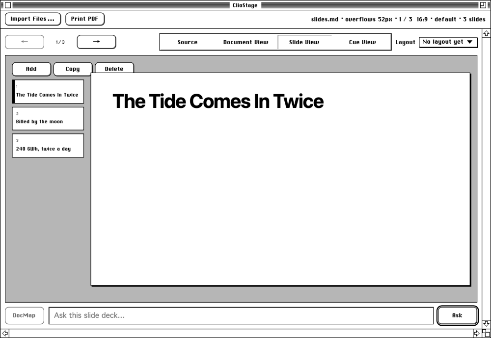<br><sub><b>ClioStage</b> · 同一份稿件，作为演示放出来</sub></td>
  </tr>
  <tr>
    <td width="50%">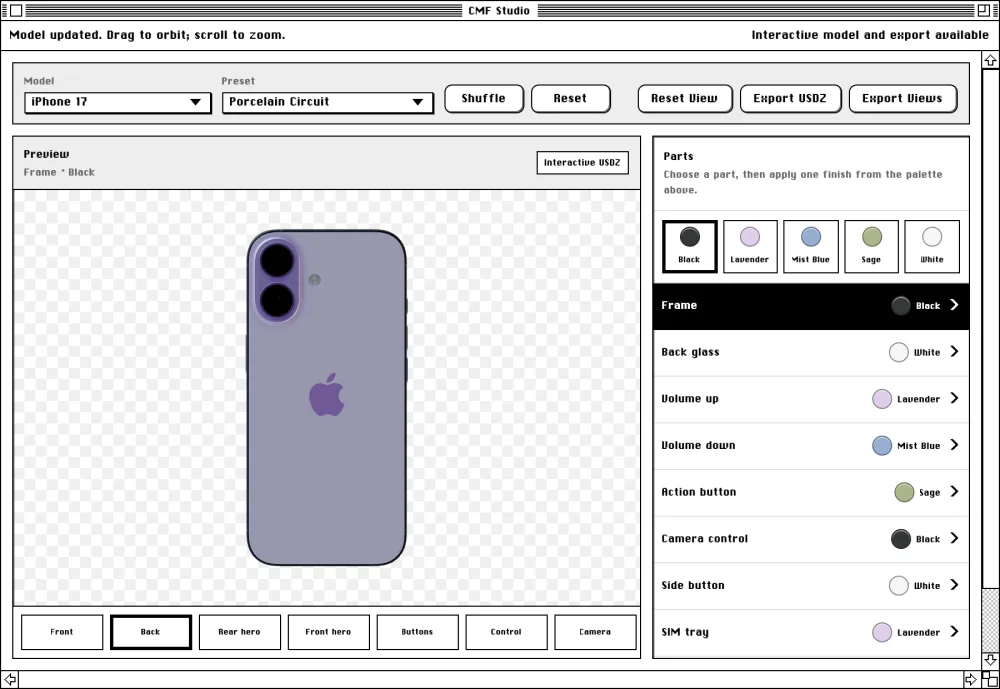<br><sub><b>配色工作台</b> · 3D 配色，可导出 USDZ 用于 AR</sub></td>
    <td width="50%">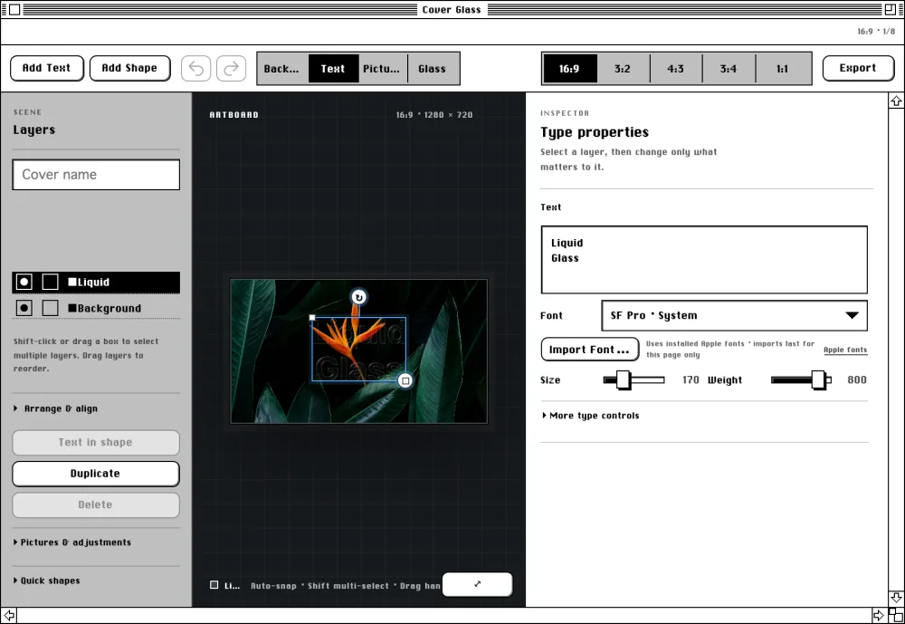<br><sub><b>玻璃封面</b> · 折射式 WebGL 字体</sub></td>
  </tr>
</table>

<p align="center">
  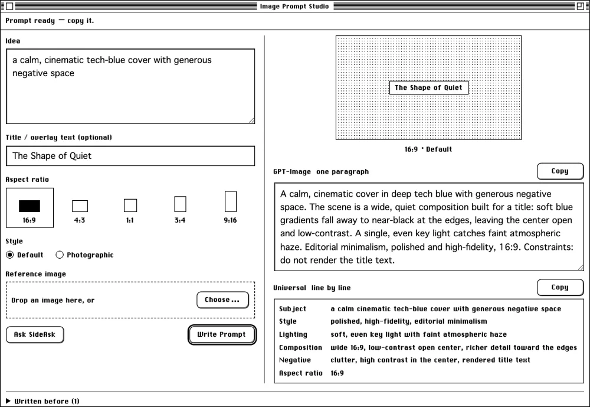
  <br><sub><b>图片提示词工作室</b> · 一个想法变成两条可直接粘贴的提示词</sub>
</p>

<div align="center"><sub>运行中应用的五个窗口，离线拍摄。没有模型，没有网络，没有摆拍。</sub></div>

## 盆景城市

盆景城市（Bonsai City）是这张桌面自己的城市建造游戏，为 AI System 6 而写，
不是从别处移植来的。铺路、架铁路和地铁、划分街区，城市就围着它们长起来。

- **三种地图尺寸。** 64²、96²、128²，节奏按尺寸分别调过。
- **城市真的在运转。** 交通和公共服务会把人运来运去；电力、警察、消防、学校和诊所各管周围的街区，数据视图会标出哪里覆盖不到。
- **顾问提醒，不替你玩。** 他们告诉你城市还缺什么，决定仍然是你的。
- **存档留在你手里。** 城市保存在你自己的浏览器里，也可以把 Micropolis 里的城市带进来。
- **3D 里有昼夜。** 3D 视图会从白天变到夜晚，一个开关就能回到 2D 地图。
- **真实地点也带着来源。** 受边界限制的 OSM 导入可以在同一套 16 米网格上起一座新城，
  可选高程和建筑图层。OpenStreetMap 署名与 ODbL 来源会跟着城市走；可选图层不完整时，
  界面会明确告诉你不完整。

<p align="center">
  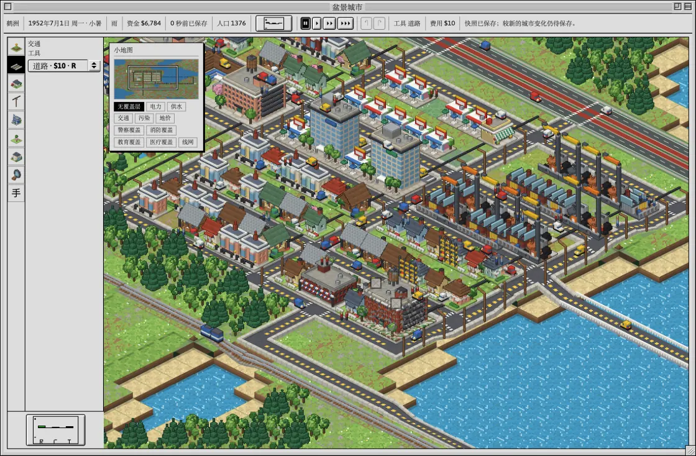
</p>

<div align="center"><sub>示例中型城市，1903 年，人口 1,245，拍摄自运行中的应用。<a href="https://system6.aaronlau.me/go/bonsai-city">建一座城</a></sub></div>

## One More Tune

一个关于苹果广告配乐的问答游戏。每道题都会自己响起来，因为声音本身就是题目：听几小节，猜出是哪支广告。

- **一张唱片，十个曲目。** 一局放在一张白标唱片上，有十个曲目位置，手机上一屏就放得下；继续一局存档时，十道题都停在你离开的地方。
- **揭晓时回到那个年代。** 答完，原版广告在自己的窗口里打开，整张桌面换上这张卡片所属年份的外观，看完再把你的外观还给你。
- **两轮发布会题。** Relay 讲在台上交棒的人；Next Act 问一句名言当时在做什么、后来发生了什么。
- **声音来源清楚。** 音乐来自商店的官方推广试听。这是一个粉丝做的非官方问答。

<p align="center">
  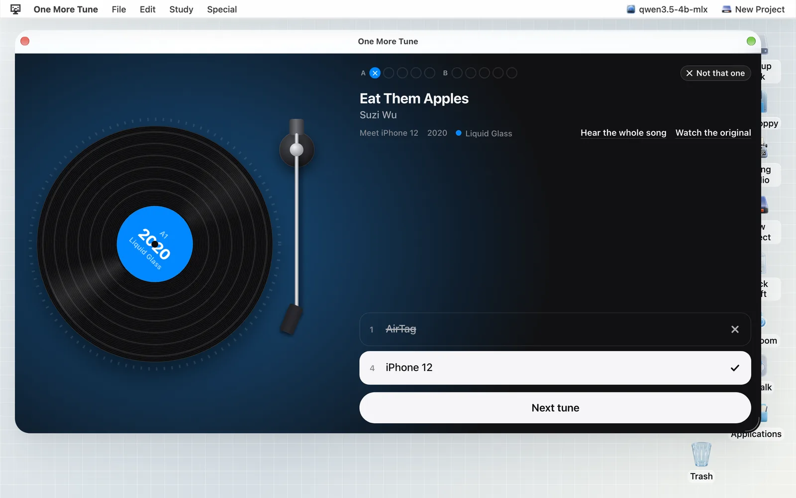
</p>

<div align="center"><sub>Liquid Glass 外观下的一局，拍摄自运行中的应用。<a href="https://system6.aaronlau.me/?launch=one-more-tune">玩一局</a></sub></div>

## 它还能跑 DOOM

七个游戏装在这台桌面上，各有各的窗口，就在你刚才写的稿子旁边：三款开源经典、盆景城市、两款共享城市边界的原创游戏，以及中文视觉小说《明文》。

| 游戏 | 它是什么 |
| --- | --- |
| **Micropolis** | 初代 SimCity 的开源发行版 |
| **OpenTTD** | 开源版《运输大亨豪华版》，中文，带触控操作 |
| **DOOM** | DOOM |
| **明文** | 代笔人与海图师的中文原创视觉小说；打开窗口时加载，存档留在本机 |
| **盆景城市** | 我们自己做的城市建造游戏：64²、96²、128² 地图，参与城市发展的交通与公共服务，本地存档，以及昼夜变化的 3D 城市 |
| **根线** | 确定性的公共交通一局：画线、在高峰里运送乘客、挑每周奖励，在挤爆倒计时前撑住，或切到无尽模式慢慢修 |
| **兜风** | 1996 年风格的街面驾驶，在盆景起步小镇里开车，支持彩色或黑白画面，以及键盘、触控和游戏手柄 |

<table>
  <tr>
    <td width="33%">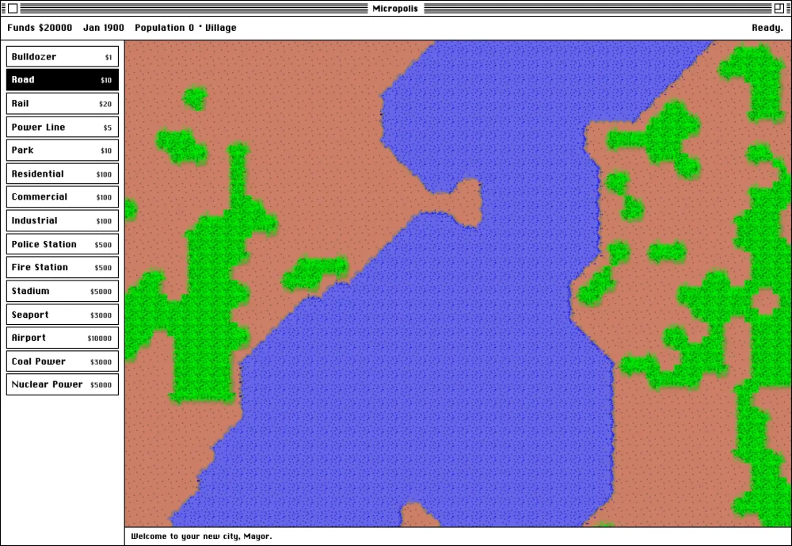<br><sub><b>Micropolis</b> · 1900 年 1 月，$20,000，欢迎你，市长</sub></td>
    <td width="33%">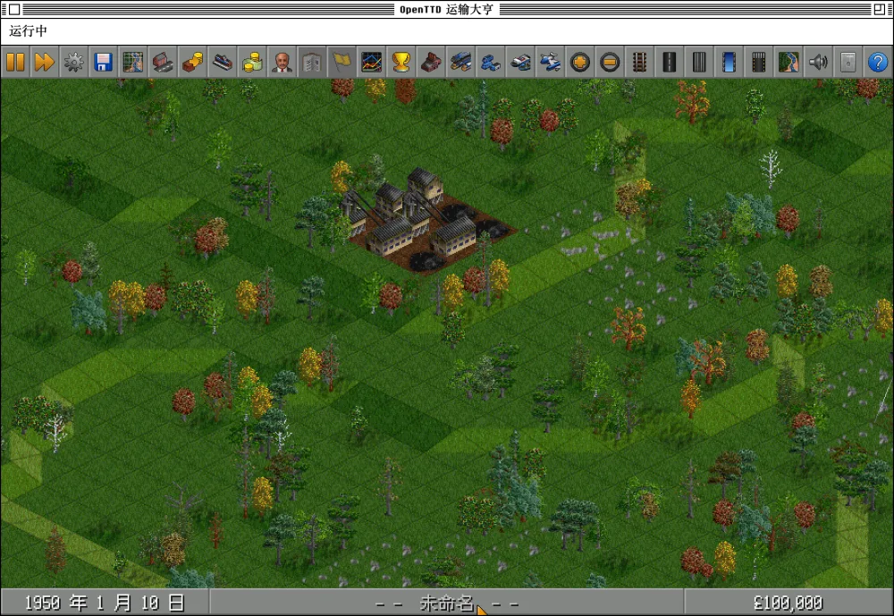<br><sub><b>OpenTTD</b> · 1950 年，中文，中局</sub></td>
    <td width="33%">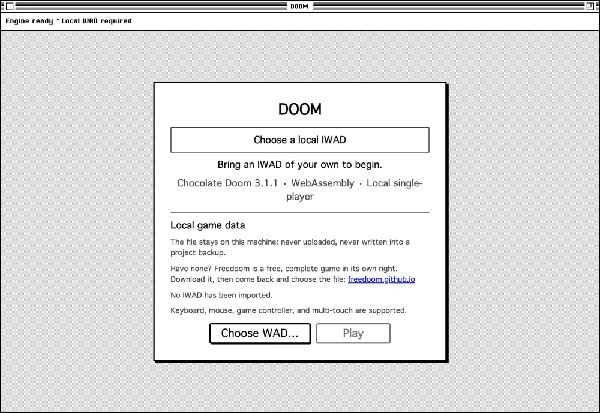<br><sub><b>DOOM</b> · 引擎就绪，恶魔自带</sub></td>
  </tr>
</table>

它们不是游戏的动图。它们就是那些游戏，编译成 WebAssembly，和 Searcher、审校台运行在
同一个 MultiFinder 里。它们证明这套约束装得下真正的软件；写作路线的可信，则来自可见对象、
明确保存，以及每一件真正发生过的事都有回执。

## 一张桌子。十二个系统。

文件和打开的窗口留在原地。整台计算机在它们周围换了时代。

<table>
  <tr>
    <td width="33%" align="center"><br><code>1988 / SYSTEM 6</code></td>
    <td width="33%" align="center">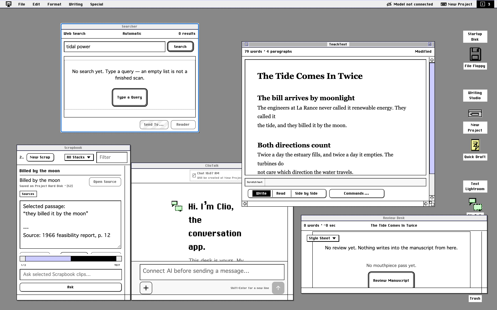<br><code>1991 / SYSTEM 7</code></td>
    <td width="33%" align="center">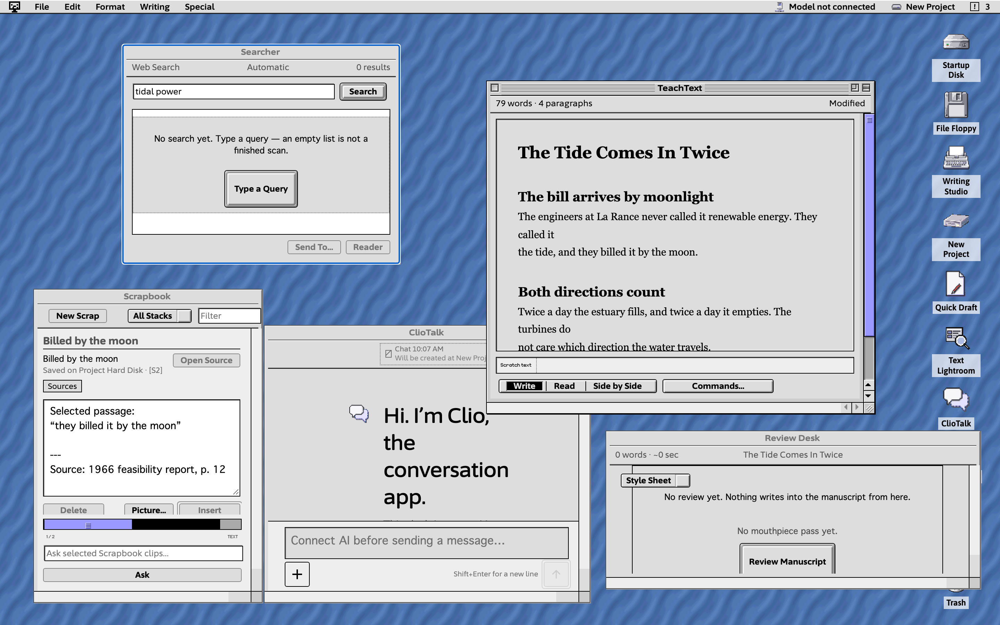<br><code>1999 / PLATINUM</code></td>
  </tr>
  <tr>
    <td width="33%" align="center">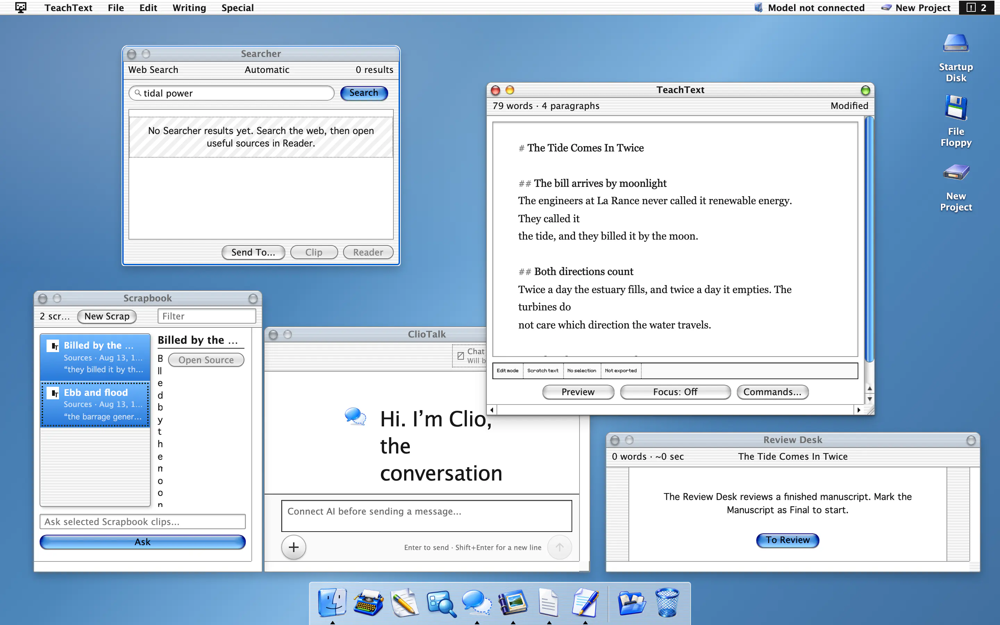<br><code>2002 / AQUA</code></td>
    <td width="33%" align="center">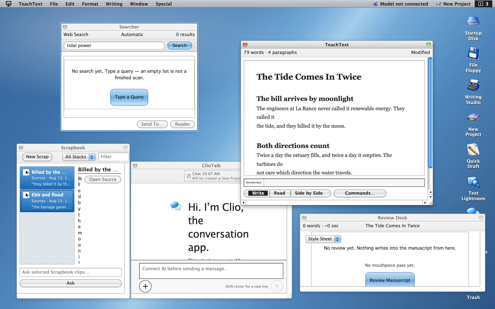<br><code>2005 / TIGER</code></td>
    <td width="33%" align="center">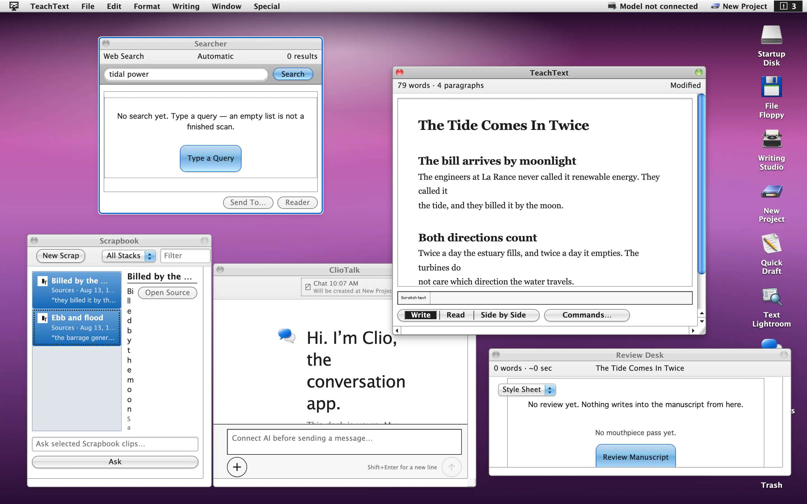<br><code>2009 / SNOW LEOPARD</code></td>
  </tr>
  <tr>
    <td width="33%" align="center">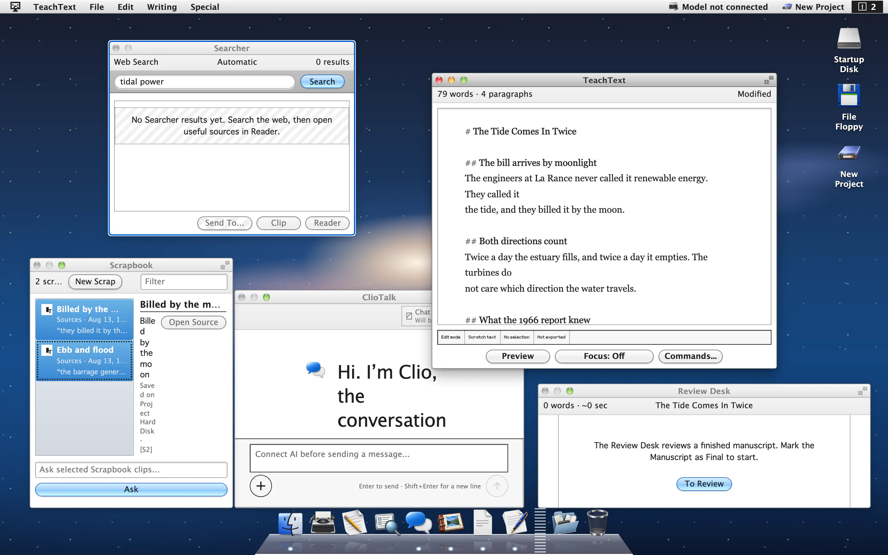<br><code>2011 / LION</code></td>
    <td width="33%" align="center">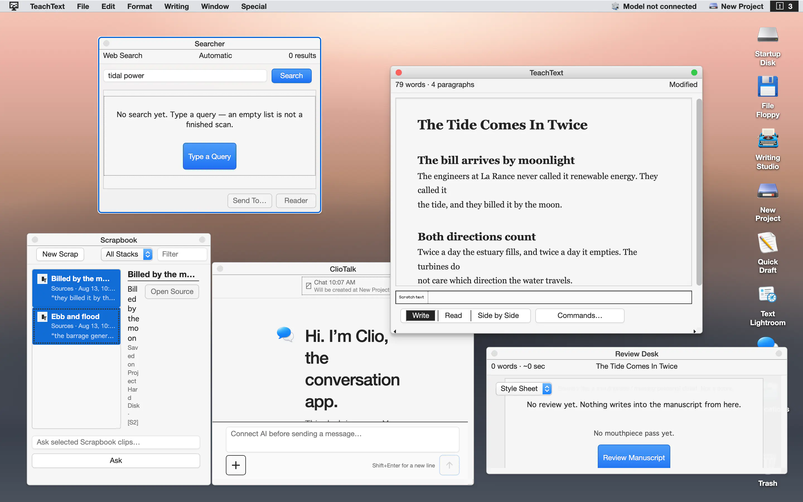<br><code>2014 / YOSEMITE</code></td>
    <td width="33%" align="center">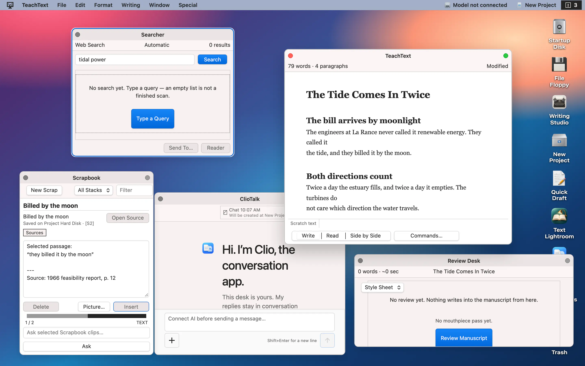<br><code>2020 / BIG SUR</code></td>
  </tr>
  <tr>
    <td width="33%" align="center">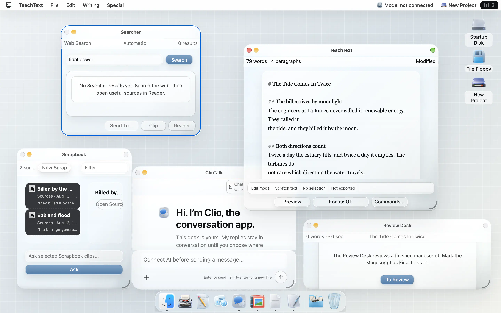<br><code>2026 / LIQUID GLASS</code></td>
    <td width="33%" align="center">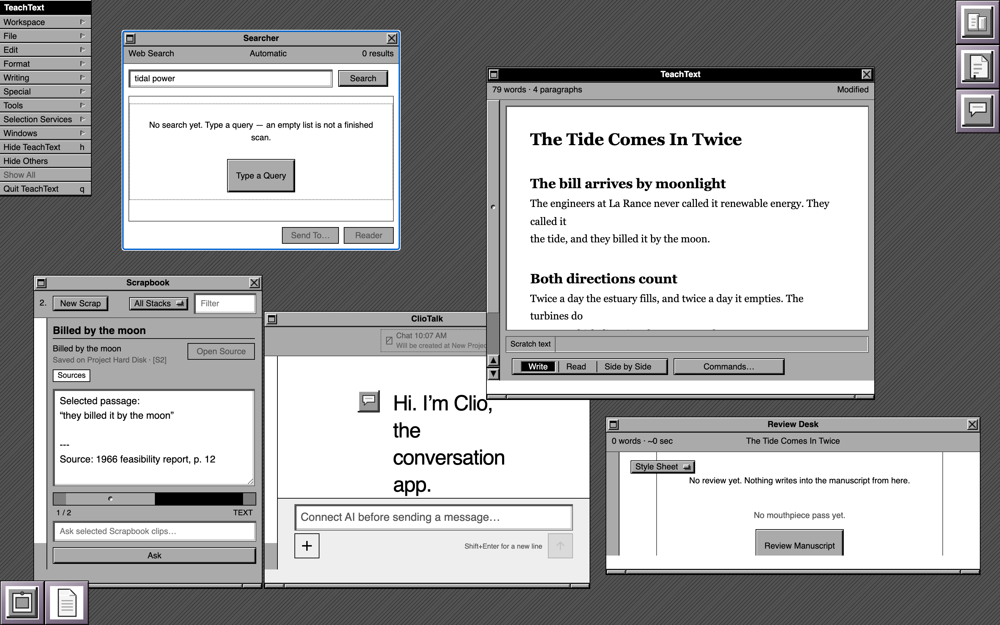<br><code>1995 / NEXTSTEP · 岔路</code></td>
    <td width="33%" align="center">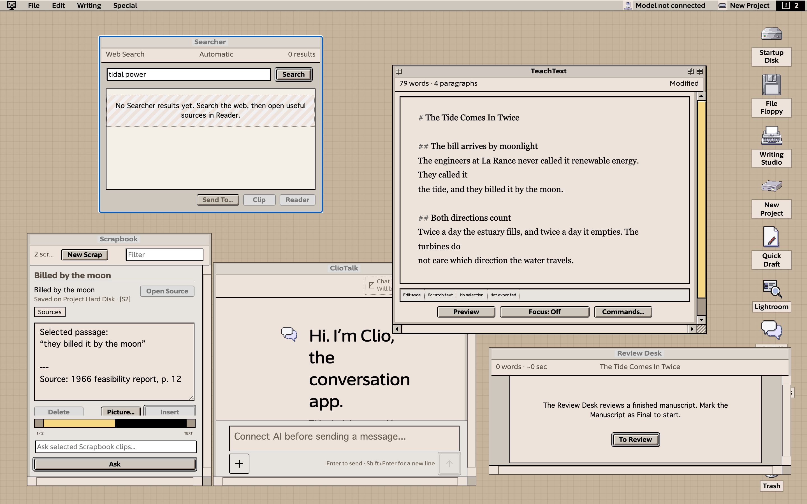<br><code>1998 / DRAWING BOARD · 岔路</code></td>
  </tr>
</table>

十二帧画面，一台活的桌面，由 `npm run site:capture-frames` 拍下。System 7 与 Lion
在 1988-2026 主时间轴上，与其他正史外观同列；NeXTSTEP 与 Drawing Board 仍是岔路
（官网「另一条路」场景可见，却不进入溶解时间轴）。System 6 从真实的 System 6.0.8
资源和实际观察到的 Macintosh 行为出发；后面几个时代各有独立的、适配 Retina 的
图标家族。这里没有一张是摆拍，因为有一个脚本会从运行中的应用里把它们全部重拍一遍。

<div align="center">

[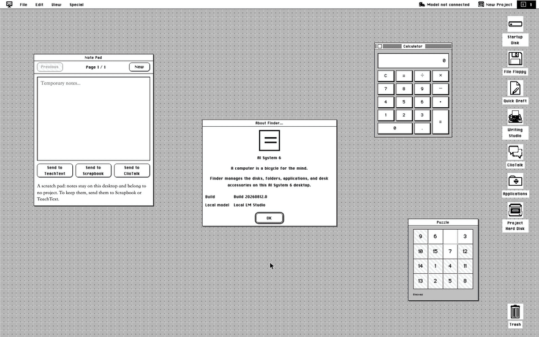](https://system6.aaronlau.me)

</div>

写作运行层独立处理作者、接收者、文体和媒介，共享研究并保留亲历归属，分别处理专栏文章与口播视频，重试保留明确作者锁，每次结果绑定各自的来源与提示词快照。外部评阅等待作者采纳，隐含修复也计入同一任务的有限调用预算。行为验收和证据边界见写作工程实施记录。

## 在一个 1988 年的约束下建造

```text
启动关键载荷            ▓▓▓▓▓▓▓▓▓▓▓▓▓▓▓▓▓▓▓▓▓▓▓▓▓░░  2,890,800 字节
两张 1.44 MB 软盘       ▓▓▓▓▓▓▓▓▓▓▓▓▓▓▓▓▓▓▓▓▓▓▓▓▓▓▓▓  2,949,120 字节
重型工具                按需懒加载，从第三张盘上来
```

当启动载荷超过两张软盘时，一道发布门禁会让构建失败。它装得下，第二张盘还空着一角。
每个功能都得在一条没人强迫我们设的限制面前挣够自己的字节；而上面那个数字是门禁自己
写下的，所以这句话不会悄悄变成假话。

## 自带模型

| 路线 | 用来做什么 |
| --- | --- |
| **LM Studio** | 本地对话、嵌入、发现、加载模型 |
| **Ollama** | 本地的 OpenAI 兼容服务 |
| **DeepSeek** | 内置的云端配置 |
| **自定义端点** | 任何兼容的提供方和模型 |
| **不用模型** | 桌面本身和所有不依赖 AI 的工具 |

持久的项目状态存在你浏览器的 IndexedDB 里。服务端是一座无状态的桥，没有应用数据库。
凭据不会进入项目文件、对话、备份或导出。

## 这个仓库如何让自己保持诚实

说法会烂掉。下面这些从一次全新克隆就能跑，并且会直接让构建失败。

| 门禁 | 它不允许发生什么 |
| --- | --- |
| `verify:floppy` | 启动载荷涨过两张 1.44&nbsp;MB 软盘 |
| `site:check` | 这个页面引用一个门禁从没量过的字节数 |
| `verify:docs` | 一份英文文档和它的中文镜像脱节 |
| `verify:public` | 这里宣传的命令在全新克隆里跑不通 |

上面那个载荷数字，是 `npm run verify:floppy` 自己写进
`site/data/floppy-budget.json` 的；官网去取它，这个页面引用它。这道门禁建好的当天，
它就抓到这份 README 在一个下午里三次引用了过期的数字。

这个页面和[产品官网](https://aisystem6.pages.dev)上的每一张产品截图，都由
`npm run site:capture-frames`、`npm run site:capture-route` 和
`tooling/capture-site-proofs.mjs` 从运行中的应用重新拍摄。它们每一个都会把应用启动起来、
拍下真实的窗口，所以不存在一个会过期的手工营销图目录 —— 因为根本没有手工营销图。

## 仓库是怎么摆的

```text
AI-System-6/
├── apps/
│   ├── desktop/       浏览器计算机：系统服务、应用、样式、资源
│   └── server/        无状态的 Node.js 桥与模型适配器
├── site/              可独立部署的产品官网
├── platform/          macOS 外壳与 web 发布契约
├── tooling/           构建、校验、采集、打包、发布
├── tests/             可执行的产品与架构契约
├── docs/              架构、开发、设计证据
└── internal/          维护者的证据、计划、运维
```

这些是归属边界，不是好看的文件夹：有一个布局测试会在退役的根目录副本和兼容软链接
回来之前就把它们拒掉。

三十六块演示用项目硬盘是一份登记表，不是三十六个各写各的文件：要加第三十七块，
就登记进 `tooling/build-shared-project-disks.mjs`；
登记表、Finder 里那一行和官网场景不一致时，守门的是
`tests/features/launch-intent.test.mjs`
和演示盘面板的契约测试。

请阅读[架构](docs/ARCHITECTURE.md)、[开发](docs/DEVELOPMENT.md)
和[设计契约](docs/design/DESIGN.md)。

## 参与贡献

从 [CONTRIBUTING.md](CONTRIBUTING.md) 开始，用一条可复现的产品契约开 issue，
或通过 [SECURITY.md](SECURITY.md) 报告安全问题。这里宣传的每一条命令都必须在全新克隆里
能跑通；公开仓库是一份可独立验证的源码快照。

## 许可证

[MIT](LICENSE)。独立项目，与 Apple Inc. 无从属或背书关系。

<div align="center">

   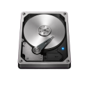 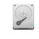 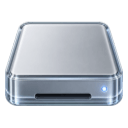

<sub>一块硬盘。八个时代。同一份工作。</sub>

如果 AI 写作工具应该放过你的嗓音，就 **[★ 给 AI System 6 加星](https://github.com/surfine/AI-System-6)**。

[**线上桌面**](https://system6.aaronlau.me)&nbsp;&nbsp;·&nbsp;&nbsp;[**哔哩哔哩影片**](https://www.bilibili.com/video/BV1ht3m6UEDb/)&nbsp;&nbsp;·&nbsp;&nbsp;[**产品官网**](https://aisystem6.pages.dev)&nbsp;&nbsp;·&nbsp;&nbsp;[**最新版本**](https://github.com/surfine/AI-System-6/releases/latest)

</div>
