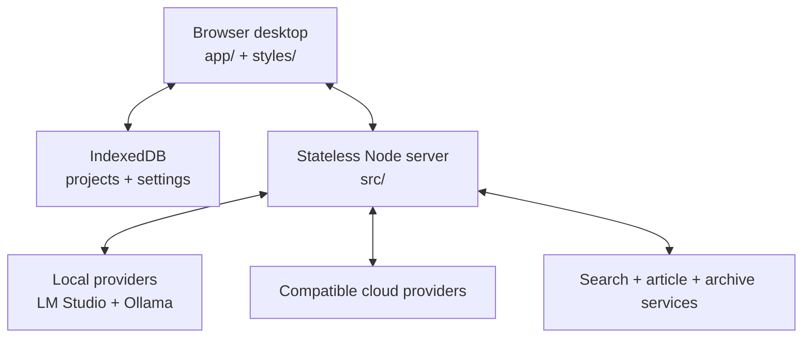

# Architecture

AI System 6 is a local-first browser desktop with a small stateless Node.js
server. Its architecture favors visible state, plain source, deterministic
builds, and narrow boundaries over framework machinery.

## System boundary



The browser owns durable application state. The server adapts network and model
protocols, streams responses, and performs bounded local utilities; it does not
own projects or an application database.

## Source layout

```text
app/
  core/          desktop services and shared runtime primitives
  features/      user-facing applications and workflows
  data/          static registries and product data
  generated/     deterministic build outputs consumed by the browser
src/             server, provider adapters, and server-local types
styles/          base object grammar plus named appearance layers
assets/          runtime media and heavyweight lazy payloads
shell/           native Apple-silicon wrapper around the local web runtime
scripts/         builders, audits, verification, and repository gates
tests/           feature contracts and optional browser diagnostics
docs/            public architecture, development, and design evidence
```

Root-level `index.html`, `app.js`, and `styles.css` are deliberate entry points,
not miscellaneous files. They make the browser boot path inspectable. Generated
`app.bundle.js` and `styles.bundle.css` are local build artifacts and are not
source-authoritative.

## Runtime layers

### Browser OS

`app/` implements the desktop, object model, window manager, persistence,
applications, and writing route. Features communicate through explicit shared
services and durable objects instead of importing an application framework.

### Appearance system

`styles/` applies one semantic object grammar through six supported appearances:
System 6, Platinum, Aqua, Snow Leopard, Yosemite, and Liquid Glass. Appearances
may change material and historically grounded geometry; they must not invent a
second product structure or silently change application state.

### Server

`src/` exposes a bounded HTTP and streaming surface for model providers, web
reading, OCR or transcription adapters, and version identity. It is stateless
with respect to projects. Credentials are supplied at runtime and must never be
serialized into project files, chats, backups, or exports.

### Heavy tools

OCR models, 3D rendering, presentation libraries, and other large capabilities
load only when invoked. The boot-critical bundle is guarded by a floppy-disk
budget; size is an architectural contract, not a late optimization.

## Data and persistence

- IndexedDB owns projects, references, scraps, documents, and user settings.
- Exported project artifacts are explicit user actions.
- AI output is temporary until a user saves, clips, inserts, or exports it.
- Model and embedding providers can be replaced without migrating project data.
- The server can restart without losing project state.

These rules keep the writing route usable without a model and prevent a cloud
provider from becoming the hidden owner of the workspace.

## Product budgets

Every system-level change must answer three questions:

- Does it make first success shorter or clearer?
- Does it make existing work safer?
- Does it make returning to work clearer and easier to resume?

A feature that cannot improve one of these without damaging another should not
become default chrome or a new mandatory step.

## Build and verification

The source is plain JavaScript with a deterministic concatenation and vendor
build. Verification is layered:

1. feature contracts pin product behavior and architectural boundaries;
2. checkJs and the `src/` typecheck guard the JavaScript/TypeScript surfaces;
3. CSS, design, data, version, and bundle gates guard cross-cutting budgets;
4. optional browser diagnostics inspect rendered behavior;
5. the public-tree gate proves a fresh clone contains every advertised command
   and no internal publishing machinery.

See [Development](DEVELOPMENT.md) for commands.

## Public-source boundary

The GitHub repository is a curated source snapshot, not a mirror of the
maintainer workspace. It includes the complete browser runtime, server, runtime
icons, tests, and public documentation. It intentionally excludes deployment
hosts, signing infrastructure, private working archives, editorial prompt
sources, accepted-source icon duplicates, and internal release orchestration.

The boundary is an allowlist in the maintainer source and is fail-closed:
publishing a new path or removing a previously public path requires explicit
acknowledgement. The generated public `package.json` removes commands whose
inputs are not public, so a fresh clone never advertises a knowingly broken
workflow.

## Decisions that require discussion

Open an architecture issue before introducing:

- a frontend framework or transpiler;
- an application database or mandatory account service;
- a second persistence owner for project data;
- a background agent that can save or publish without explicit user action;
- a new appearance that changes product semantics instead of presentation;
- an eager dependency that threatens the boot budget.

The point is not to freeze the system. It is to make architectural cost visible
before it becomes maintenance debt.
