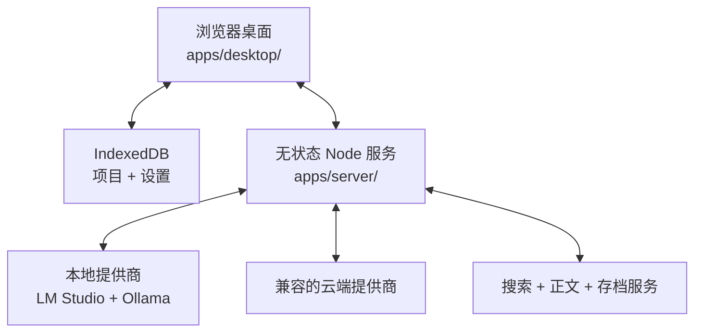

<!-- canonical-source: docs/ARCHITECTURE.md -->
<!-- source-sha256: 3bdbd242dfb70640137147ce3dce6d61d2fd755a835f9a574af28e6770b1390b -->

> 英文版为准 ・ 仅供人类参考

# 架构

AI System 6 是一个本地优先的浏览器桌面，配有小型、无状态的 Node.js 服务。它优先
选择可见状态、直接源码、确定性构建和狭窄边界，而不是框架机械。

## 系统边界



浏览器拥有持久应用状态。服务端适配网络与模型协议、流式返回结果并执行有边界的本地
工具；它不拥有项目，也没有应用数据库。

## 源码布局

```text
apps/
  desktop/       完整浏览器产品：入口、应用、样式、数据与资产
  server/        无状态 Node.js 桥接服务与提供商适配器
site/            可独立部署的产品官网
platform/
  macos/         原生重写与 WebView 壳
  web/           Web 发布与部署契约
tooling/         构建器、审计、验证与发布编排
tests/           可执行产品契约与可选浏览器诊断
docs/            公开架构、开发与设计证据
internal/        维护者证据、实验、归档与 vendored 源
```

`apps/desktop/index.html`、`apps/desktop/app.js` 与 `apps/desktop/styles.css` 是浏览器
产品的明确入口。源码物理位置已经按产品边界收拢，但浏览器 URL 仍稳定保持为 `/app`、
`/assets` 与 `/data`。生成的 `apps/desktop/app.bundle.js` 与 `apps/desktop/styles.bundle.css` 是本地构建产物，
不是规范源码。

### 物理路径与浏览器 URL

仓库路径表达所有权；浏览器 URL 表达稳定的运行时契约。两者有意不同：

| 运行时 URL | 所属源码路径 |
| --- | --- |
| `/`、`/index.html`、`/app.bundle.js` | `apps/desktop/` |
| `/app/*` | `apps/desktop/app/` |
| `/assets/*` | `apps/desktop/assets/` |
| `/data/*` | `apps/desktop/data/` |
| 仅服务器使用的 OCR 模型 | `apps/server/assets/ocr/` |

根目录不保留任何兼容副本或符号链接。`app/`、`assets/`、`data/`、`src/`、
`styles/`、`ocr/` 等已退役的单体仓库路径均受可执行的仓库布局契约禁止。
因此局部迁回或误迁会在合并、发版之前失败，而不会悄悄为同一产品面制造两个所有者。

## 运行时分层

### 浏览器操作系统

`apps/desktop/app/` 实现桌面、对象模型、窗口管理、持久化、应用与写作路线。功能通过明确的共享
服务与持久对象协作，不依赖应用框架互相导入。

### 外观系统

`apps/desktop/styles/` 用同一套语义对象语法实现六套正式外观：System 6、Platinum、Aqua、
Snow Leopard、Yosemite 与 Liquid Glass。外观可以改变材质与有历史依据的几何，
但不能建立第二套产品结构，也不能悄悄改变应用状态。

### 服务端

`apps/server/` 为模型提供商、网页阅读、OCR 或转写适配器与版本身份提供有边界的 HTTP 和
流式接口。对项目而言它是无状态的。凭证在运行时提供，绝不能序列化进项目文件、对话、
备份或导出。

### 重型工具

OCR 模型、3D 渲染、演示库与其他大型能力只在被调用时加载。启动关键 bundle 受到
软盘预算保护；大小是架构契约，而不是最后才做的优化。

## 数据与持久化

- IndexedDB 拥有项目、引用、剪贴、文档与用户设置。
- 项目成品只有在用户明确操作后才导出。
- AI 输出在用户保存、剪贴、插入或导出前都是临时的。
- 更换模型或 embedding 提供商不需要迁移项目数据。
- 服务端重启不会丢失项目状态。

这些规则让写作路线在没有模型时仍可使用，也防止云端提供商成为工作空间的隐形所有者。

## 产品预算

每一项系统级改动都必须回答三个问题：

- 它是否让第一次成功更短或更清晰？
- 它是否让已有工作更安全？
- 它是否让返回工作时更清楚、更容易继续？

若一项功能不能改善其中一项而又不损害另一项，就不应成为默认 chrome 或新的必经步骤。

## 构建与验证

源码使用原生 JavaScript，并采用确定性的拼接与 vendor 构建。验证分层如下：

1. 功能契约固定产品行为与架构边界；
2. checkJs 与 `apps/server/` 类型检查保护 JavaScript/TypeScript 表面；
3. CSS、设计、数据、版本与 bundle 门禁保护跨领域预算；
4. 可选浏览器诊断检查渲染行为；
5. 公开树门禁证明全新 clone 拥有所有宣传的命令，且不含内部发布机械。

命令见[开发指南](DEVELOPMENT.zh-CN.md)。

## 公开源码边界

GitHub 仓库是经过整理的源码快照，不是维护者工作区的镜像。它包含完整浏览器运行时、
服务端、运行时图标、测试与公开文档；刻意排除部署主机、签名基础设施、私有工作档案、
编辑型提示词源、重复的图标 accepted-source 档案，以及内部发布编排。

维护者源码用 allowlist 定义边界，并采用 fail-closed 策略：首次公开路径或删除既有公开
路径都需要明确确认。生成后的公开 `package.json` 会移除输入不公开的命令，因此全新
clone 不会宣传已知不可运行的工作流。

## 需要先讨论的决定

引入以下内容前请开架构 issue：

- 前端框架或转译器；
- 应用数据库或强制账号服务；
- 项目数据的第二持久化所有者；
- 可在没有用户明确操作时保存或发布的后台 agent；
- 改变产品语义而不仅是呈现的新外观；
- 威胁启动预算的 eager 依赖。

目的不是冻结系统，而是在架构成本变成维护债之前让它可见。
