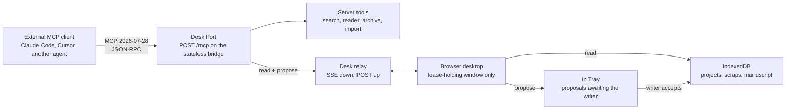

# Desk Port: MCP for AI System 6

Status: design proposal, not implemented. This document exists so the
architecture cost is visible before any code lands, as
[Architecture](ARCHITECTURE.md) requires for a background agent that could save
without explicit user action or for a second persistence owner.

## The one-line answer

Yes, AI System 6 can speak the Model Context Protocol, and it can do so
without breaking its own promises. The design below is a **Desk Port**: an
MCP server, hosted by the existing stateless bridge, through which any MCP
client (Claude Code, Claude Desktop, Cursor, another agent) can **read** the
writing route, **bring evidence**, and **propose** changes. It cannot hold the
pen. A proposal becomes project content only when the writer accepts it in a
visible window, exactly as AI output already stays temporary until the writer
saves, clips, inserts, or exports it.

The metaphor is the SCSI port on the back of a Macintosh: external devices
plug in and become visible objects on the desk. The desk stays the desk.

## What already shapes the design

These facts come from the current source, not from wishes.

| Fact | Where | Consequence |
| --- | --- | --- |
| Projects live in browser IndexedDB; the server owns no project state | `docs/ARCHITECTURE.md`, `apps/desktop/app/features/project-disk.js` | An MCP server in `apps/server/` cannot read a Question Sheet by itself. Project tools need the running desktop to answer. |
| One writer at a time: a lease plus a durable write fence, verified at transaction time | `apps/desktop/app/core/write-lease.js`, `core/storage-transactions.js` | An external agent is a second would-be writer. It must act through the lease-holding window or be refused. |
| The Writing Agent runtime already defines tool effects `read`, `proposal`, `commit`, and refuses `commit` when `invokedBy === "model"` | `apps/desktop/app/shared/writing-agent-runtime.js` | MCP tools map onto this registry. `commit` is never exported over the port. |
| Read and proposal tools already exist: source search, DocMap, scraps, draft structure, citations, terms, `proposeManuscriptPatch` | `apps/desktop/app/core/writing-agent-coordinator.js` | Phase 1 is mostly plumbing, not new product behavior. |
| State stores commit through a mutable draft and roll back on persistence failure | `apps/desktop/app/core/state-stores.js` | Accepting a proposal is one `commit()` call under the lease. |
| The route table is a literal `Map`, filtered for public deployments | `apps/server/server/router.js` | The port is a local-only route. The public desktop never exposes it. |
| External local clients already have a door: loopback by default, LAN only with `AI_SYSTEM6_ALLOW_LAN=1` and a token header | `apps/server/server/security/local-request.js` | The port reuses this policy instead of inventing another. |
| Credentials never enter project files, chats, backups, or exports | `apps/server/server/credential-vault.js` | The port never returns credentials, credential ids, or model access on the writer's key. |
| The boot payload must fit two floppy disks | `tooling/verify-floppy-budget.mjs` | The desktop side of the port loads lazily, only when the writer turns it on. |

## Architecture



Three planes, each with one owner.

1. **Server tools** run entirely in `apps/server/`. They wrap what the bridge
   already does for the desktop: bounded web search, reader extraction,
   archived captures, and file-to-text import. No desktop is needed.
2. **Desk relay** carries project reads and proposals to the running desktop.
   The server keeps only an in-flight request map and the identity of the one
   connected desk, both ephemeral. If the desk is closed, project tools return
   a tool error that says so. The server can restart without losing anything.
3. **In Tray** is a desk accessory in the browser. Every proposal arrives as a
   card: who sent it, which stop of the route it targets, a diff preview, and
   its provenance. Accept runs the matching `commit` tool with the explicit
   user confirmation the runtime already demands. Reject discards it. Pending
   proposals are a floppy, not a disk: they are not project content and are
   not part of Project Hard Disk backups.

### Why the relay runs in the browser

The alternative, letting the server open IndexedDB-equivalent state of its
own, would create a second persistence owner and an application database.
Both are listed in Architecture as decisions that require discussion, and
both would break the promise that the server can restart without losing
project state. The relay keeps the browser as the only owner and the only
writer. The cost is that project tools work only while the desk is open,
which is also the honest answer: there is no desk to write on otherwise.

## Protocol choices

- **MCP revision 2026-07-28.** Requests are stateless and carry
  `io.modelcontextprotocol/protocolVersion` and `clientCapabilities` in
  `_meta`. This matches a stateless bridge exactly; no session table is
  needed.
- **Transport: Streamable HTTP** at `POST /mcp`, registered as a local-only
  exact route. A thin **stdio shim** (`ai-system-6-mcp`) forwards to that
  endpoint for clients that only launch processes.
- **Implementation:** the official `@modelcontextprotocol/server` package,
  loaded with a dynamic import inside the route handler so it never touches
  the boot path. If it cannot run under the CommonJS bridge, a hand-rolled
  dispatcher for the eight methods the port uses is acceptable; the contract
  test must then drive it with the official client package.
- **Tasks extension** (`io.modelcontextprotocol/tasks`) for proposals. A
  proposal is a human-in-the-loop wait, which is precisely what Tasks model:
  `working` until the writer decides, then `completed` with
  `{ decision: "accepted" | "rejected" }`. Clients that do not declare the
  extension receive a proposal handle and poll `proposal.status`.
- **Subscriptions** (`subscriptions/listen`) forward state-store change
  events as resource update notifications, so a visiting agent learns that the
  outline changed without polling.
- **Deterministic tool order, `outputSchema` and `structuredContent` on every
  tool, `isError` with an actionable sentence on every failure.** These are
  what make a port agent-friendly: predictable, honest, and refusable.

## Tool surface

Names are dotted so a host aggregating several servers can disambiguate.

### Read tools (`readOnlyHint: true`, `idempotentHint: true`)

| Tool | Returns | Backed by |
| --- | --- | --- |
| `desk.status` | desk open or closed, active project, workflow state, app version | relay presence, `AISystem6StateStores.writing` |
| `project.list` | project ids, names, updated timestamps | `AISystem6StateStores.projects` |
| `project.read` | Question Sheet, outline sections, draft index, flow state | `projects.get`, `getProjectOutlineSections` |
| `route.read` | one stop as Markdown: `questionSheet`, `outline`, `sectionDrafts`, `manuscript`, `reviewDesk`, `projectCd` | writing surfaces |
| `scrapbook.list` | scraps with provenance fields | `scraps` store |
| `source.search` | ranked passages from mounted sources | `searchProjectSources` |
| `source.docmap` | structure of one source | `readSourceDocMap` |
| `terms.read` | dictionary terms the writer fixed | `readProjectTerms` |
| `citation.check` | whether a claim already has a citation | `checkExistingCitation` |
| `proposal.status` | state of one proposal handle | In Tray |

### Proposal tools (`readOnlyHint: false`, `destructiveHint: false`)

| Tool | Lands in the tray as | Backed by |
| --- | --- | --- |
| `propose.scrap` | a Scrapbook clip with `sourceKind: "agent"` and the sender's `clientInfo` | scrap shape in `features/scrapbook.js` |
| `propose.question_sheet_note` | a note under one Question Sheet section | `core/question-sheet.js` section keys |
| `propose.outline_patch` | a diff against the outline Markdown | `setProjectOutlineMarkdown` |
| `propose.section_draft` | a candidate draft for one `##` section | `project.drafts[]` |
| `propose.manuscript_patch` | a patch against the manuscript | `proposeManuscriptPatch` |
| `propose.review_note` | a Review Desk finding from another reader | review sections |
| `proposal.withdraw` | removes the sender's own pending card | In Tray |

### Server tools (`openWorldHint: true`)

`web.search`, `web.read`, `web.archive_read`, `file.import_text`. These wrap
`/api/search`, `/api/reader`, `/api/time-machine`, and `/api/import-text` with
the same bounds and SSRF guards those routes already apply.

### Never exported

- Any `commit` effect, including saving, inserting, replacing, or burning to
  Project CD. The runtime refuses model-invoked commits today; the port keeps
  that line.
- Delete, trash, settings, appearance, or lease operations.
- Credentials, credential ids, or chat and embedding calls on the writer's
  keys. Bring your own model applies to visiting agents too; the desk is not
  a proxy.

## Resources and prompts

Resources give agents a stable, cacheable view of the route without calling
tools. URIs are `ais6://` and read-only:

```text
ais6://desk/status
ais6://project/{id}/question-sheet        text/markdown
ais6://project/{id}/outline               text/markdown
ais6://project/{id}/drafts/{n}            text/markdown
ais6://project/{id}/manuscript            text/markdown
ais6://project/{id}/scrapbook/{scrapId}   application/json
ais6://project/{id}/cd/{itemId}           text/markdown or text/html
```

Prompts teach a visiting agent how this desk works, in the writer's favor:

- `route.brief`: the route, the ownership rules, and the fact that proposals
  are the only way in.
- `evidence.clip`: how to write a scrap with a source, a location, and the
  exact quoted span.
- `review.second_reader`: a public-safe scaffold for reading a manuscript for
  drift into a model's voice. The editorial prompt sources stay private, as
  the public-source boundary already requires.

## Provenance and consent

Every proposal records the sender from `_meta.io.modelcontextprotocol/clientInfo`
and the tool that produced it. The runtime's `validateToolProvenance` already
rejects items that escape the active project or the allowed source scope; the
port runs proposals through it before they reach the tray. Client-reported
identity is for display and audit, never for authorization.

Consent is layered:

1. The port is off by default. The writer turns it on in the Control Panel.
2. Turning it on mounts nothing. The writer mounts one project on the port,
   the way a File Floppy is mounted, and can eject it.
3. Read tools see only mounted projects. Proposal tools only ever fill the
   tray.
4. Accept is a click in a window, under the write lease, with the one-use
   confirmation token the runtime already requires.

## Security

- Local-only route: absent from `publicExactRouteKeys`, so the hosted desktop
  at system6.aaronlau.me never exposes it.
- Loopback by default. LAN access requires `AI_SYSTEM6_ALLOW_LAN=1` and the
  existing `X-AI-System-6-Token` header, also accepted as a bearer token for
  MCP clients that only speak `Authorization`.
- Origin check on every request to defeat DNS rebinding from a browser tab.
- Rate limit per client, as the MCP tool specification requires of servers.
- Payload bounds on every proposal, and the same SSRF guards as the wrapped
  routes for `web.*` tools.
- Tool annotations are advisory to clients; the port enforces its own
  effect rules regardless of what a client believes.

## Gates the port must pass

- A route registration pair in `router.js`, a handler in `routes/`, and a
  feature contract in `tests/features/` that drives the endpoint with the
  official MCP client: `tools/list` order is stable, every tool has an
  `outputSchema`, no tool carries a `commit` effect, and `desk.status`
  reports closed when no desk is connected.
- An entry in `tests/feature-manifest.mjs` once the port is a public feature.
- `credential-boundary`: a test that the port's responses never contain a
  credential id or key, even when asked.
- `verify:floppy`: `app/features/desk-port.js` and the In Tray load lazily;
  the Control Panel switch is the only boot-time cost.
- `verify:docs`: this document and its mirror stay in step.

## Phases

1. **Server tools only.** `POST /mcp`, the stdio shim, `web.*` and
   `file.import_text`. Useful on its own and proves the transport.
2. **Desk relay and reads.** Control Panel switch, project mount, SSE relay,
   read tools, resources, subscriptions.
3. **Proposals.** In Tray, `propose.*`, Tasks extension, provenance cards.
4. **The other direction.** ClioTalk and the File Floppy as an MCP client, so
   a Zotero, filesystem, or note server can be mounted as a source. Server
   holds the client connections; credentials stay in the vault.

## Open questions to settle before code

- Should mounted-project reads include the working session (cursor, open
  windows) or only durable route content? The proposal here is durable
  content only.
- Does a rejected proposal leave a trace in the project for later audit, or
  vanish with the tray? The proposal here is vanish, matching temporary AI
  output.
- Does the hosted desktop ever get a port? It would need a public relay with
  per-visitor sessions, which is the Mac shared relay's territory and out of
  scope here.
