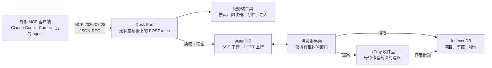

<!-- canonical-source: docs/MCP.md -->
<!-- source-sha256: 79516c3d4a1bae7b896a7c5cac9acbf9e6373c922d19108893b565a23f8013ce -->

> 英文版为准 ・ 仅供人类参考

# Desk Port：AI System 6 的 MCP 设计

状态：设计提案，尚未实现。按照[架构](ARCHITECTURE.zh-CN.md)的要求，任何"可能在没有
用户明确操作的情况下保存"的后台代理、任何"第二个持久化所有者"，都必须先把架构成本
摆到台面上再动代码。这份文档就是为此存在的。

## 一句话回答

可以。AI System 6 能说 Model Context Protocol，而且不用违背自己的任何承诺。下面的设计
叫 **Desk Port（桌面端口）**：由现有的无状态桥接服务托管一个 MCP 服务，任何 MCP 客户端
（Claude Code、Claude Desktop、Cursor、别的 agent）都可以通过它**读取**写作路线、**带来
证据**、**提出修改建议**。但它握不住笔。一条建议只有在作者于可见窗口里点下"接受"之后，
才会变成项目内容——这和现在"AI 输出在你保存、剪藏、插入或导出之前始终是临时的"完全
是同一条规则。

比喻就是 Macintosh 背后的 SCSI 口：外设插上来，变成桌面上可见的对象；桌面还是那张桌面。

## 已经决定了设计形状的事实

下面这些来自当前源码，不是愿望。

| 事实 | 出处 | 后果 |
| --- | --- | --- |
| 项目存在浏览器 IndexedDB 里；服务端不拥有任何项目状态 | `docs/ARCHITECTURE.md`、`apps/desktop/app/features/project-disk.js` | 放在 `apps/server/` 里的 MCP 服务自己读不到 Question Sheet。项目类工具必须由正在运行的桌面来应答。 |
| 同一时刻只有一个写者：租约 + 持久化写围栏，在事务时再次校验 | `apps/desktop/app/core/write-lease.js`、`core/storage-transactions.js` | 外部 agent 是第二个想写的人。它要么通过持有租约的窗口行动，要么被拒绝。 |
| Writing Agent 运行时已经定义了工具效果 `read`、`proposal`、`commit`，并在 `invokedBy === "model"` 时拒绝 `commit` | `apps/desktop/app/shared/writing-agent-runtime.js` | MCP 工具直接映射到这套注册表。`commit` 永远不会通过端口导出。 |
| 读取与提案工具已经存在：来源检索、DocMap、剪藏、草稿结构、引用、术语、`proposeManuscriptPatch` | `apps/desktop/app/core/writing-agent-coordinator.js` | 第一阶段大多是接线，不是新的产品行为。 |
| 状态仓库通过可变草稿提交，持久化失败即回滚 | `apps/desktop/app/core/state-stores.js` | 接受一条建议就是租约之下的一次 `commit()`。 |
| 路由表是字面量 `Map`，公开部署时会被过滤 | `apps/server/server/router.js` | 端口是仅本地路由。公开桌面永远不暴露它。 |
| 外部本地客户端已经有门：默认只回环，局域网需要 `AI_SYSTEM6_ALLOW_LAN=1` 加令牌头 | `apps/server/server/security/local-request.js` | 端口复用这套策略，不再发明一套。 |
| 凭据永远不进项目文件、聊天、备份或导出 | `apps/server/server/credential-vault.js` | 端口永远不返回凭据、凭据 id，也不用作者的密钥代跑模型。 |
| 启动载荷必须装进两张软盘 | `tooling/verify-floppy-budget.mjs` | 端口的桌面侧按需加载，只在作者打开它时才装入。 |

## 架构



三个平面，各有一个所有者。

1. **服务端工具**完全运行在 `apps/server/` 里，包装桥接已经为桌面做的事：有界的网页
   搜索、阅读器抽取、存档快照、文件转文本导入。不需要桌面在场。
2. **桌面中继**把项目读取和提案送到正在运行的桌面。服务端只保留一张在途请求表和那唯一
   一个已连接桌面的身份，两者都是临时的。桌面关着时，项目类工具返回一条明说"桌面未打开"
   的工具错误。服务端可以随时重启，不丢任何东西。
3. **In Tray 收件盘**是浏览器里的一个桌面附件。每条建议以卡片到达：谁发的、瞄准路线上
   哪一站、diff 预览、出处。"接受"会带着运行时本来就要求的用户明确确认去执行对应的
   `commit` 工具；"拒绝"直接丢弃。待裁决的建议是软盘，不是硬盘：它们不是项目内容，也
   不进 Project Hard Disk 备份。

### 为什么中继跑在浏览器里

另一条路——让服务端自己打开一份等价于 IndexedDB 的状态——会造出第二个持久化所有者和一个
应用数据库。这两项在《架构》里都列为"必须先讨论"，而且都会打破"服务端重启不丢项目状态"
的承诺。中继让浏览器继续做唯一的所有者和唯一的写者。代价是项目类工具只在桌面打开时可用，
而这恰恰也是诚实的答案：桌面不在，本来就没有可以写的地方。

## 协议选择

- **MCP 2026-07-28 修订版。** 请求无状态，`_meta` 里带
  `io.modelcontextprotocol/protocolVersion` 和 `clientCapabilities`。这与无状态桥接严丝
  合缝，不需要会话表。
- **传输：Streamable HTTP**，挂在 `POST /mcp`，注册为仅本地的精确路由。为只会拉起进程的
  客户端另备一个薄的 **stdio 转发壳**（`ai-system-6-mcp`），转发到该端点。
- **实现：**官方 `@modelcontextprotocol/server` 包，在路由处理器内部用动态 import 加载，
  从不触碰启动路径。若它无法在 CommonJS 桥接下运行，可接受为端口用到的八个方法手写一个
  分发器；届时契约测试必须用官方客户端包来驱动它。
- **Tasks 扩展**（`io.modelcontextprotocol/tasks`）用于提案。一条提案就是一次"等人
  决定"，而这正是 Tasks 建模的对象：作者裁决前是 `working`，之后 `completed`，结果为
  `{ decision: "accepted" | "rejected" }`。没有声明该扩展的客户端拿到提案句柄，轮询
  `proposal.status`。
- **订阅**（`subscriptions/listen`）把状态仓库的变更事件转发为资源更新通知，来访的
  agent 不用轮询就知道大纲变了。
- **确定性的工具顺序、每个工具都有 `outputSchema` 和 `structuredContent`、每次失败都带一句
  可执行的 `isError` 说明。** 这些才是让端口"对 agent 友好"的东西：可预测、诚实、可拒绝。

## 工具面

名字用点号分隔，方便同时聚合多个服务的宿主消歧义。

### 读取工具（`readOnlyHint: true`，`idempotentHint: true`）

| 工具 | 返回 | 背后 |
| --- | --- | --- |
| `desk.status` | 桌面开/关、当前项目、工作流状态、应用版本 | 中继在线状态、`AISystem6StateStores.writing` |
| `project.list` | 项目 id、名称、更新时间 | `AISystem6StateStores.projects` |
| `project.read` | Question Sheet、大纲分节、草稿索引、流程状态 | `projects.get`、`getProjectOutlineSections` |
| `route.read` | 某一站的 Markdown：`questionSheet`、`outline`、`sectionDrafts`、`manuscript`、`reviewDesk`、`projectCd` | 写作表面 |
| `scrapbook.list` | 带出处字段的剪藏 | `scraps` 存储 |
| `source.search` | 已挂载来源里的排序段落 | `searchProjectSources` |
| `source.docmap` | 单个来源的结构 | `readSourceDocMap` |
| `terms.read` | 作者定下的术语 | `readProjectTerms` |
| `citation.check` | 某个论断是否已有引用 | `checkExistingCitation` |
| `proposal.status` | 某个提案句柄的状态 | In Tray |

### 提案工具（`readOnlyHint: false`，`destructiveHint: false`）

| 工具 | 在收件盘里呈现为 | 背后 |
| --- | --- | --- |
| `propose.scrap` | 一条 `sourceKind: "agent"` 且带发送方 `clientInfo` 的 Scrapbook 剪藏 | `features/scrapbook.js` 里的剪藏形状 |
| `propose.question_sheet_note` | Question Sheet 某一节下的一条备注 | `core/question-sheet.js` 的分节键 |
| `propose.outline_patch` | 针对大纲 Markdown 的 diff | `setProjectOutlineMarkdown` |
| `propose.section_draft` | 某个 `##` 小节的候选草稿 | `project.drafts[]` |
| `propose.manuscript_patch` | 针对稿件的补丁 | `proposeManuscriptPatch` |
| `propose.review_note` | 来自另一位读者的 Review Desk 发现 | 审阅分节 |
| `proposal.withdraw` | 撤回发送方自己的待裁决卡片 | In Tray |

### 服务端工具（`openWorldHint: true`）

`web.search`、`web.read`、`web.archive_read`、`file.import_text`。它们包装 `/api/search`、
`/api/reader`、`/api/time-machine` 和 `/api/import-text`，沿用这些路由已有的边界和 SSRF
防护。

### 永不导出

- 任何 `commit` 效果，包括保存、插入、替换、刻录到 Project CD。运行时今天就拒绝模型发起
  的提交；端口守住这条线。
- 删除、废纸篓、设置、外观或租约操作。
- 凭据、凭据 id，或用作者密钥发起的聊天与嵌入调用。"自带模型"对来访的 agent 同样适用；
  桌面不是代理。

## 资源与提示词

资源让 agent 不调用工具也能拿到路线的稳定、可缓存视图。URI 使用 `ais6://`，只读：

```text
ais6://desk/status
ais6://project/{id}/question-sheet        text/markdown
ais6://project/{id}/outline               text/markdown
ais6://project/{id}/drafts/{n}            text/markdown
ais6://project/{id}/manuscript            text/markdown
ais6://project/{id}/scrapbook/{scrapId}   application/json
ais6://project/{id}/cd/{itemId}           text/markdown 或 text/html
```

提示词教来访的 agent 这张桌子怎么用，且站在作者一边：

- `route.brief`：路线、所有权规则，以及"提案是唯一入口"这一事实。
- `evidence.clip`：怎样写一条带来源、位置和精确引用片段的剪藏。
- `review.second_reader`：一份公开安全的脚手架，用来读稿件是否滑向模型腔。编辑提示词
  的源文件继续保持私有，这是公开源码边界本来就要求的。

## 出处与同意

每条提案都记录来自 `_meta.io.modelcontextprotocol/clientInfo` 的发送方和产出它的工具。
运行时的 `validateToolProvenance` 已经会拒绝逃出当前项目或允许来源范围的条目；端口在提案
进入收件盘之前先过这一关。客户端自报的身份只用于展示和审计，从不用于授权。

同意是分层的：

1. 端口默认关闭。作者在 Control Panel 里打开它。
2. 打开不等于挂载。作者像挂载 File Floppy 那样把一个项目挂到端口上，也能随时弹出。
3. 读取工具只看得到已挂载的项目。提案工具永远只能填收件盘。
4. "接受"是窗口里的一次点击，在写租约之下，带着运行时本来就要求的一次性确认令牌。

## 安全

- 仅本地路由：不在 `publicExactRouteKeys` 里，所以 system6.aaronlau.me 上的托管桌面永远
  不暴露它。
- 默认只回环。局域网访问需要 `AI_SYSTEM6_ALLOW_LAN=1` 和现有的 `X-AI-System-6-Token`
  头；对只会说 `Authorization` 的 MCP 客户端，同一令牌也接受为 bearer。
- 每个请求都做 Origin 校验，防止浏览器标签页发起的 DNS 重绑定。
- 按客户端限流，这是 MCP 工具规范对服务端的要求。
- 每条提案有载荷上限；`web.*` 工具沿用被包装路由的 SSRF 防护。
- 工具注解对客户端只是建议；无论客户端怎么认为，端口都执行自己的效果规则。

## 端口必须通过的门禁

- `router.js` 里一对路由注册、`routes/` 里一个处理器，以及 `tests/features/` 里一条用官方
  MCP 客户端驱动端点的特性契约：`tools/list` 顺序稳定、每个工具都有 `outputSchema`、没有
  工具带 `commit` 效果、无桌面连接时 `desk.status` 报告"关闭"。
- 端口成为公开特性后，在 `tests/feature-manifest.mjs` 里登记。
- `credential-boundary`：一条测试证明端口的响应即使被索要也绝不包含凭据 id 或密钥。
- `verify:floppy`：`app/features/desk-port.js` 和 In Tray 按需加载；Control Panel 的开关是
  唯一的启动期成本。
- `verify:docs`：本文与其镜像保持同步。

## 阶段

1. **只有服务端工具。** `POST /mcp`、stdio 转发壳、`web.*` 和 `file.import_text`。本身就
   有用，也验证了传输层。
2. **桌面中继与读取。** Control Panel 开关、项目挂载、SSE 中继、读取工具、资源、订阅。
3. **提案。** In Tray、`propose.*`、Tasks 扩展、出处卡片。
4. **反方向。** ClioTalk 和 File Floppy 作为 MCP 客户端，让 Zotero、文件系统或笔记服务
   可以作为来源挂载。客户端连接由服务端持有；凭据留在保险库里。

## 动代码之前要定下来的问题

- 已挂载项目的读取是否包含工作会话（光标、打开的窗口），还是只包含持久化的路线内容？
  这里的提案是只包含持久化内容。
- 被拒绝的提案是否在项目里留下痕迹供日后审计，还是随收件盘一起消失？这里的提案是消失，
  与临时 AI 输出保持一致。
- 托管桌面要不要端口？那需要一个按访客分会话的公开中继，属于 Mac 共享中继的地盘，不在
  本文范围内。
